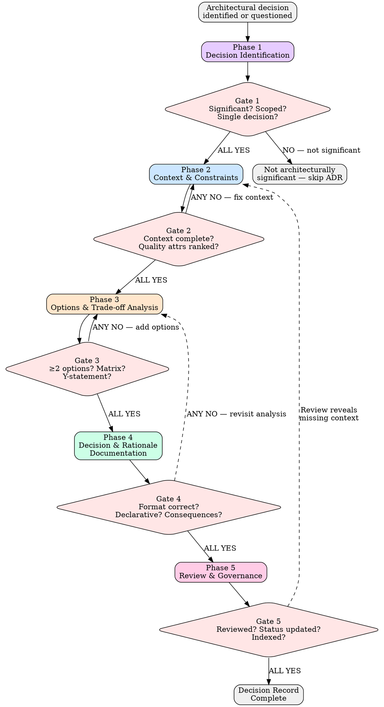

# Architecture Decisions

## Overview

Capture architectural decisions when they are made, not after they are forgotten. Code shows what was built — only decision records explain why.

**Core principle:** Every significant architectural decision must be captured as a decision record with full context, evaluated alternatives, and explicit trade-offs — so future readers (human or AI) can understand the reasoning without archeology. (Nygard, "Documenting Architecture Decisions", 2011)

**Authorities:** Michael Nygard (Documenting Architecture Decisions), Bass, Clements & Kazman (Software Architecture in Practice, 4th ed.), Ford, Parsons & Kua (Building Evolutionary Architectures)

**About This Skill:** This skill serves as both an AI enforcement guide (with mandatory gates and verification checks) and a human reference for architectural decision processes. AI agents follow the phased gates during design review. Humans can use it as a checklist, learning guide, or team onboarding reference.

**This skill produces decision records and evaluation artifacts. It does NOT produce code.**

## Quick Reference — Phases at a Glance

| Phase | What You Do | Gate Question |
|---|---|---|
| 1 — Decision Identification | Recognize architecturally significant decisions; write trigger statement; classify scope | Can you state the decision in one sentence? Is it hard to reverse or cross-cutting? |
| 2 — Context & Constraints | Document business/technical context, quality attributes, constraints vs preferences, assumptions | Would a reader in 2 years understand why this decision matters? |
| 3 — Options & Trade-off Analysis | Enumerate >=2 options, evaluate against quality attributes, define fitness criteria, draft Y-statement | At least 2 options with pros AND cons per quality attribute? |
| 4 — Decision & Rationale Documentation | Write ADR in Nygard/MADR/Y-statement format with all mandatory sections | Declarative decision? Consequences include positive, negative, neutral? |
| 5 — Review & Governance | Review with stakeholders, integrate into decision log, maintain superseding chain | ADR reviewed, status updated, indexed in decision log? |

**Each step has a mandatory gate. ALL gate checks must pass before proceeding.**

## Key Concepts

- **ADR (Architecture Decision Record)** — A short document capturing one architectural decision, its context, and its consequences. The standard format was proposed by Michael Nygard in 2011.
- **Fitness Function** — An objective measure used to evaluate how well an architecture meets a quality attribute. Can be automated (latency < 200ms) or manual (junior dev understands component in < 1 hour). (Ford, Building Evolutionary Architectures)
- **Quality Attribute** — A measurable or testable property of a system — performance, security, maintainability, scalability, deployability, testability — used to judge how well the system satisfies stakeholder needs. (Bass/Clements/Kazman, SAiP)
- **Y-statement** — A lightweight ADR variant: "In the context of [context], facing [concern], we decided [decision] to achieve [quality attribute], accepting [tradeoff]." (Zdun et al.)
- **MADR (Markdown Any Decision Record)** — A structured ADR template with explicit sections for options considered, pros/cons, and decision outcome. More detailed than Nygard format. (adr.github.io/madr)
- **Superseded** — An ADR status indicating the decision has been replaced by a newer ADR. The old ADR is never deleted — it retains historical value.
- **Architecturally Significant Decision** — A decision that is hard to reverse, affects multiple components, involves quality-attribute trade-offs, or constrains future decisions. Not every design choice qualifies.

## The Iron Law

```
EVERY SIGNIFICANT ARCHITECTURAL DECISION MUST HAVE A WRITTEN RECORD.
EVERY RECORD MUST CAPTURE CONTEXT, ALTERNATIVES, AND CONSEQUENCES.
NO DECISION IS JUSTIFIED BY "WE ALWAYS DO IT THIS WAY."
```

If a decision has no written record, future developers (and AI agents) will reverse-engineer it from code — incorrectly. Write it down. (Nygard, "Documenting Architecture Decisions")

If an ADR lists only one option, no decision was made — the outcome was assumed. Document at least two evaluated alternatives. (Bass/Clements/Kazman, SAiP Ch. 21)

If consequences are not listed, the decision is incomplete. Every choice has trade-offs; pretending otherwise is dishonest. (Ford, Building Evolutionary Architectures Ch. 2)

If a decision cannot be connected to a quality attribute, it is either not architecturally significant or the analysis is incomplete. (Bass/Clements/Kazman, SAiP Ch. 4)

**This gate is falsifiable at every level.** Point at any ADR and ask: "Does it capture context, at least two options with trade-offs, and explicit consequences?" Yes or No. No ambiguity.

## When to Use

**Always:**
- Making a technology selection (framework, database, language, protocol)
- Defining system boundaries or integration patterns
- Choosing between architectural styles (monolith, microservices, event-driven)
- Establishing cross-cutting conventions (error handling, authentication, logging strategy)
- Overriding or revising a previous architectural decision

**Especially when:**
- The decision is hard or expensive to reverse
- Multiple stakeholders disagree on the approach
- The team has been debating the same question in multiple meetings
- A new team member asks "why did we do it this way?" and nobody remembers
- An AI agent needs to understand constraints before generating code

**Exceptions (require explicit justification for skipping):**
- Variable naming or code formatting (use clean-code skill)
- Individual function or class design (use design-patterns or solid-principles)
- Choices already dictated by constraints with zero degrees of freedom

## Process Flow



Announce at the start: **"Using architecture-decisions skill — running 5-phase ADR enforcement."**

---

## Phase 1: Decision Identification

**Purpose:** Recognize when an architectural decision is being made (often implicitly) and classify whether it warrants a formal record.

### Rules

**1. Architecturally Significant** — A decision is architecturally significant if it is hard to reverse, affects multiple components, involves a trade-off between quality attributes, or constrains future decisions. If none of these apply, skip the ADR.
*(Bass/Clements/Kazman, SAiP Ch. 4)*

**2. Implicit Decisions Are Still Decisions** — Choosing NOT to use a cache, NOT to split a service, or NOT to add authentication is an architectural decision. Document the non-choice if it is significant.
*(Nygard)*

**3. One Decision Per Record** — Each ADR captures exactly one decision. If two decisions are entangled, write two ADRs and cross-reference them. Bundled decisions are impossible to supersede individually.
*(Nygard)*

**4. Decision Trigger Statement** — Write a one-sentence statement: "We need to decide [what] because [why now]." If you cannot write this sentence, the decision is not yet crystallized.
*(Bass/Clements/Kazman)*

**5. Scope Classification** — Classify as: System-wide, Subsystem/Bounded Context, or Component. Scope determines who must review.
*(Bass/Clements/Kazman, SAiP Ch. 21)*

**6. Urgency Assessment** — Is this blocking implementation? Can it be deferred? A deferred decision should still get a "Proposed" ADR to prevent drift. Last responsible moment principle.
*(Ford, Building Evolutionary Architectures)*

**7. Check for Existing ADR** — Before writing a new ADR, search for existing decisions on the same topic. You may need to supersede rather than create.

### Gate 1 — Mandatory Checkpoint

```
GATE 1 — Decision Identification

[] Can you state the decision in one sentence ("We need to decide X because Y")?  YES / NO
[] Is it architecturally significant (hard to reverse, cross-cutting, or quality-attribute trade-off)?  YES / NO
[] Is it a single decision (not bundled)?  YES / NO
[] Have you checked for existing ADRs on this topic?  YES / NO

-> ALL YES: proceed to Phase 2
-> ANY NO (significance): Not an ADR — use appropriate skill instead
-> ANY NO (other): Fix before proceeding
```

**How to verify:** Read the trigger statement aloud. If it requires "and" to describe two different decisions, split it. If the decision could be trivially reversed in an afternoon with no ripple effects, it may not need a full ADR.

---

## Phase 2: Context & Constraints Capture

**Purpose:** Document everything a future reader needs to understand why this decision matters, without requiring them to have been in the room.

### Rules

**1. Business Context** — What business capability, user need, or organizational constraint drives this decision? A purely technical decision without business justification is suspect.
*(Bass/Clements/Kazman, SAiP Ch. 16)*

**2. Technical Context** — What is the current system state? What existing decisions constrain this one? What technologies are already in play?
*(Nygard: Context section)*

**3. Quality Attribute Identification** — List the quality attributes at stake (performance, scalability, maintainability, security, deployability, testability). Rank them by stakeholder priority. These become evaluation criteria in Phase 3.
*(Bass/Clements/Kazman, SAiP Ch. 4)*

**4. Constraints vs Preferences** — Separate constraints (we MUST use PostgreSQL because of licensing) from preferences (we PREFER PostgreSQL because of experience). Constraints narrow options; preferences weight them.
*(Bass/Clements/Kazman)*

**5. Document Assumptions** — Every assumption underlying the decision must be explicit. Assumptions are the most common source of ADR invalidation.
*(Ford, Building Evolutionary Architectures Ch. 6)*

**6. Stakeholder Concerns** — Who cares about this decision and why? List the stakeholders and their primary concerns. Different stakeholders prioritize different quality attributes.
*(Bass/Clements/Kazman, SAiP Ch. 3)*

**7. The Archaeology Test** — If someone reads this context section in two years with no other information, can they understand the forces at play? If not, add more context.
*(Nygard)*

### Gate 2 — Mandatory Checkpoint

```
GATE 2 — Context & Constraints

[] Does the context section explain the business driver?  YES / NO
[] Are quality attributes identified and ranked?  YES / NO
[] Are constraints separated from preferences?  YES / NO
[] Are assumptions explicitly documented?  YES / NO
[] Would a reader in 2 years understand why this decision matters?  YES / NO

-> ALL YES: proceed to Phase 3
-> ANY NO: enrich context before proceeding
```

**How to verify:** Hand the context section to someone not involved in the decision. Can they explain back to you why a decision is needed and what the main forces are?

---

## Phase 3: Options & Trade-off Analysis

**Purpose:** Enumerate genuine alternatives, evaluate each against quality attributes from Phase 2, and make trade-offs explicit.

### Rules

**1. Minimum Two Options** — Every ADR must evaluate at least two genuine options. "Do nothing" counts as an option and is often underrated. If only one option exists, challenge your assumptions.
*(Bass/Clements/Kazman, SAiP Ch. 21)*

**2. Quality Attribute Evaluation Matrix** — Create a table: options as rows, quality attributes as columns. Rate each option against each attribute. This makes trade-offs visible.
*(Bass/Clements/Kazman, SAiP Ch. 21)*

**3. Fitness Function Criteria** — For each quality attribute, define how you would measure whether the chosen option satisfies it. Even qualitative measures count ("maintainability: can a junior developer understand the component in < 1 hour").
*(Ford, Building Evolutionary Architectures Ch. 2)*

**4. Honest Pros and Cons** — Every option has both. An option with only pros is marketing, not analysis. An option with only cons should not be listed as a genuine alternative.
*(Nygard: Consequences section)*

**5. Consider Reversibility** — How hard is each option to undo? A reversible decision can be made faster with less ceremony. An irreversible decision demands thorough analysis.
*(Ford, Building Evolutionary Architectures)*

**6. No Golden Hammer** — If the same technology/pattern is selected for every decision, the analysis is likely biased. Challenge familiarity bias explicitly.
*(Bass/Clements/Kazman)*

**7. Y-Statement Draft** — After analysis, draft a Y-statement: "In the context of [context], facing [concern], we decided [option] to achieve [quality attribute], accepting [trade-off]." If you cannot complete this sentence, the analysis is incomplete.
*(Zdun et al.)*

### Gate 3 — Mandatory Checkpoint

```
GATE 3 — Options & Trade-off Analysis

[] Are at least 2 genuine options evaluated?  YES / NO
[] Is there a quality-attribute evaluation matrix?  YES / NO
[] Does each option have documented pros AND cons?  YES / NO
[] Are fitness function criteria defined for key quality attributes?  YES / NO
[] Can you complete a Y-statement for the leading option?  YES / NO

-> ALL YES: proceed to Phase 4
-> ANY NO: expand analysis before proceeding
```

**How to verify:** Look at the evaluation matrix. If any cell is empty, the analysis is incomplete. If any option has only pros or only cons, the analysis is dishonest.

---

## Phase 4: Decision & Rationale Documentation

**Purpose:** Write the ADR in the chosen format with all mandatory sections. The record must stand alone — no tribal knowledge required.

### Rules

**1. Choose a Format** — Use Nygard format (Title, Status, Context, Decision, Consequences) as the default. MADR for complex decisions with many alternatives. Y-statement for lightweight decisions that still warrant a record. State which format you are using.
*(Nygard; adr.github.io/madr)*

**2. Title Is a Noun Phrase** — ADR titles follow the pattern "ADR-NNN: Use [technology/approach] for [purpose]" or "ADR-NNN: [Noun phrase describing the decision]". The title communicates the decision, not the problem.
*(Nygard)*

**3. Status Is Explicit** — Every ADR has a status: Proposed, Accepted, Deprecated, or Superseded. New ADRs start as Proposed. Status changes require a date.
*(Nygard)*

**4. Context From Phase 2** — Incorporate the context captured in Phase 2 verbatim or refined. Do not summarize away the forces.
*(Nygard)*

**5. Decision Is Declarative** — "We will use X" or "We will not use Y." Active voice, present tense. No hedging ("we might consider"). The decision must be unambiguous.
*(Nygard)*

**6. Consequences Are Exhaustive** — List all known consequences: positive, negative, and neutral. Include operational impact, team skill requirements, migration effort, and effects on future decisions.
*(Nygard; Bass/Clements/Kazman)*

**7. Cross-References** — Link to related ADRs (supersedes, superseded by, related to, constrained by). ADRs form a decision graph, not isolated documents.
*(Nygard)*

### Gate 4 — Mandatory Checkpoint

```
GATE 4 — Decision & Rationale Documentation

[] Does the ADR use a recognized format (Nygard/MADR/Y-statement)?  YES / NO
[] Is the title a noun phrase that communicates the decision?  YES / NO
[] Does it have an explicit status (Proposed/Accepted/Deprecated/Superseded)?  YES / NO
[] Is the Decision section declarative and unambiguous?  YES / NO
[] Are consequences listed (positive, negative, and neutral)?  YES / NO
[] Are related ADRs cross-referenced?  YES / NO

-> ALL YES: proceed to Phase 5
-> ANY NO: complete the ADR before proceeding
```

**How to verify:** Read only the Title and Decision section. Can you understand what was decided without reading Context? If yes, the title and decision are well-written. Then read Consequences — does each entry trace to a quality attribute from Phase 2?

---

## Phase 5: Review & Governance

**Purpose:** Ensure the ADR has been reviewed by appropriate stakeholders, integrated into the decision log, and linked into the superseding chain.

### Rules

**1. Scope-Appropriate Review** — System-wide decisions require cross-team review. Subsystem decisions require team lead review. Component decisions require peer review. Match review breadth to decision scope from Phase 1.
*(Bass/Clements/Kazman, SAiP Ch. 21)*

**2. Status Transition** — After review: Proposed becomes Accepted (approved), remains Proposed (needs revision), or is Rejected (with documented reason). No ADR stays Proposed indefinitely.
*(Nygard)*

**3. Decision Log Integration** — Add the ADR to the project's decision log (e.g., `docs/decisions/` directory with a README index). ADRs that are not discoverable are useless.
*(Nygard)*

**4. Superseding Chain** — If this ADR supersedes a previous one, mark the old ADR as "Superseded by ADR-NNN" and the new one as "Supersedes ADR-NNN". Never delete old ADRs — they are historical records.
*(Nygard)*

**5. Review Triggers** — Establish when existing ADRs should be reviewed: when assumptions change, when fitness functions fail, when the technology landscape shifts. Document review triggers in the ADR itself.
*(Ford, Building Evolutionary Architectures Ch. 6)*

**6. Immutability of Accepted ADRs** — Once Accepted, an ADR is not edited. If the decision changes, write a new ADR that supersedes the old one. The historical record must remain intact.
*(Nygard)*

**7. Living Decision Log** — The decision log is reviewed periodically (e.g., quarterly architecture review). Stale ADRs with violated assumptions are flagged for superseding.
*(Ford, Building Evolutionary Architectures)*

### Gate 5 — Mandatory Checkpoint

```
GATE 5 — Review & Governance

[] Has the ADR been reviewed by stakeholders appropriate to its scope?  YES / NO
[] Has the status been updated (no longer Proposed if review is complete)?  YES / NO
[] Is the ADR indexed in the decision log and discoverable?  YES / NO
[] Is the superseding chain intact (old ADRs marked, cross-references in place)?  YES / NO
[] Are review triggers documented for future invalidation?  YES / NO

-> ALL YES: Decision Record Complete
-> ANY NO: complete governance before marking done
```

**How to verify:** Search the decision log for this ADR. Verify the status is not "Proposed" if review is complete. Check that any ADR it supersedes is marked accordingly.

---

## Red Flags — STOP and Revisit

**Phase 1 (Identification):**
- Making a technology choice without recognizing it as an architectural decision
- Bundling multiple decisions into one conversation or document
- "We already decided this" with no written record

**Phase 2 (Context):**
- Context section is a single sentence
- No quality attributes listed
- Constraints and preferences mixed together
- Assumptions are unstated

**Phase 3 (Trade-offs):**
- Only one option evaluated ("there's really only one choice")
- An option listed with only pros and no cons
- No evaluation against quality attributes — just "gut feel"
- Same technology selected for every decision (golden hammer)

**Phase 4 (Documentation):**
- Decision section uses hedging language ("we might", "we could consider")
- No consequences listed, or only positive consequences
- ADR has no title number or is not in a recognized format
- Missing cross-references to related decisions

**Phase 5 (Governance):**
- ADR stays in "Proposed" indefinitely with no review
- Old ADR edited in place rather than superseded
- ADR exists but is not in the decision log
- Superseding chain is broken (old ADR not marked)

**Universal — ALL PHASES:**
- "This decision is too obvious to document" — if it is obvious, the ADR will be short. Write it anyway.
- "We don't have time for ADRs" — An ADR takes 15-30 minutes. Reversing an undocumented decision takes days.
- "The code is the documentation" — Code shows WHAT. Only ADRs explain WHY.

## Rationalization Table

| Excuse | Reality | Phase |
|---|---|---|
| "This decision is obvious, no need to write it down" | Obvious decisions still need records. What's obvious today is mysterious in 6 months. An obvious decision produces a short ADR. | 1 |
| "We'll remember why we chose this" | No, you won't. Turnover, context-switching, and time guarantee the rationale will be lost. | 1 |
| "There's really only one option" | There is always "do nothing" or "defer." If truly one option, the ADR is short. Challenge the assumption. | 3 |
| "We chose X because it's what we always use" | Familiarity is a factor, not a justification. Evaluate against quality attributes like any other option. | 3 |
| "The pros/cons are obvious, listing them is busywork" | Writing forces precision. "Obvious" trade-offs often reveal surprises when documented. | 3 |
| "ADRs are too bureaucratic" | Nygard ADRs are 1-2 pages. Y-statements are one sentence. Choose the right weight. | 4 |
| "We can just update the old ADR" | Editing an accepted ADR destroys the historical record. Supersede it instead. | 5 |
| "Nobody reads these anyway" | If nobody reads them, the decision log is not discoverable. Fix the process, not the practice. | 5 |
| "We're moving fast, we'll document later" | Later never comes. Decision context is freshest now. 15 minutes now saves days later. | All |
| "AI can figure out the architecture from the code" | AI reads structure, not intent. Without ADRs, agents guess at constraints and make conflicting decisions. | All |

## Verification Checklist

- [ ] Decision identified as architecturally significant with trigger statement (Gate 1)
- [ ] Decision is single and unbundled (Gate 1)
- [ ] Existing ADRs checked for same topic (Gate 1)
- [ ] Business and technical context documented (Gate 2)
- [ ] Quality attributes identified and ranked (Gate 2)
- [ ] Constraints separated from preferences (Gate 2)
- [ ] Assumptions explicitly documented (Gate 2)
- [ ] At least 2 genuine options evaluated (Gate 3)
- [ ] Quality-attribute evaluation matrix exists (Gate 3)
- [ ] Each option has documented pros AND cons (Gate 3)
- [ ] Fitness function criteria defined (Gate 3)
- [ ] Y-statement completable for leading option (Gate 3)
- [ ] ADR follows recognized format (Gate 4)
- [ ] Decision section is declarative and unambiguous (Gate 4)
- [ ] Consequences include positive, negative, and neutral (Gate 4)
- [ ] Related ADRs cross-referenced (Gate 4)
- [ ] ADR reviewed by scope-appropriate stakeholders (Gate 5)
- [ ] Status updated (not stuck in Proposed) (Gate 5)
- [ ] ADR indexed in decision log (Gate 5)
- [ ] Superseding chain intact (Gate 5)
- [ ] Review triggers documented (Gate 5)

**Cannot check all boxes? Return to the failing gate. Fix before proceeding. No exceptions.**

## Related Skills

- **ddd-planning** — Strategic design decisions (Bounded Context boundaries, Context Maps) are architectural decisions that warrant ADRs. Use this skill for the ADR process; use ddd-planning for the domain analysis that informs the decision.
- **design-patterns** — Pattern selection is often an architectural decision when it affects system structure. Document pattern choices that cross component boundaries as ADRs.
- **solid-principles** — SOLID violations often surface during ADR review as signs a previous architectural decision needs superseding.
- **domain-driven-design** — DDD enforcement validates that the code implements the architectural decisions made during planning.
- **clean-code** — Code-level decisions (naming, function structure) are NOT architectural decisions. Use clean-code skill for those.

**Reading order:** This is skill 6 of 8. Prerequisites: clean-code, solid-principles, design-patterns. Next: ddd-planning.
