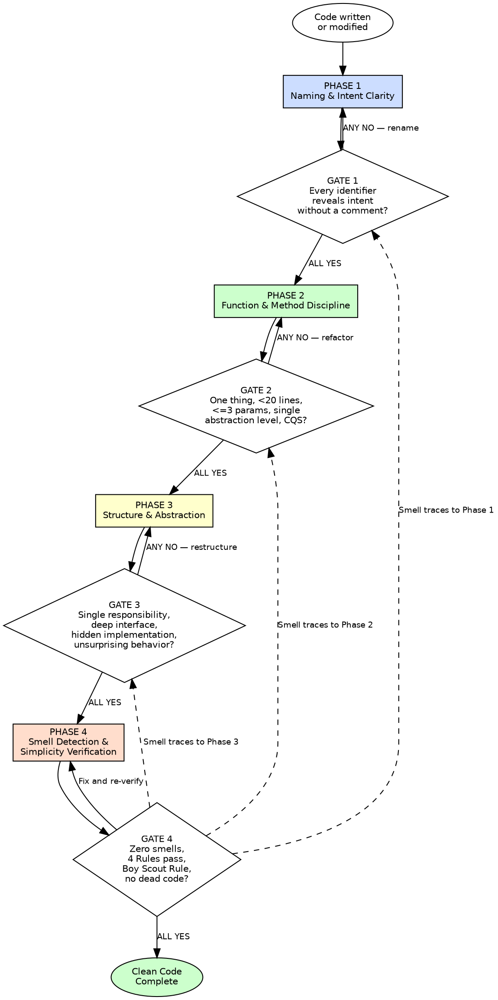

# Clean Code

## Overview

Write code that communicates. Every name, function, and structure must reveal intent to a reader who has never seen it before.

**Core principle:** Code is read far more than it is written. Optimize every decision for the reader, not the writer.

**About this skill:** This skill serves as both an AI enforcement guide (with mandatory gates and verification checks) and a human reference for clean code practices. AI agents follow the phased gates during code review and generation. Humans can use it as a checklist, learning guide, or team onboarding reference.

**Violating the letter of these rules is violating the spirit of clean code.**

## Quick Reference — Phases at a Glance

| Phase | What You Do | Gate Question |
|---|---|---|
| 1 — Naming & Intent Clarity | Every identifier communicates role and purpose without needing a comment | Can a developer unfamiliar with this code understand its purpose from the name alone? |
| 2 — Function & Method Discipline | Every function does one thing, at one abstraction level, ≤20 lines, ≤3 params | Can you describe the function without using "and"? |
| 3 — Structure & Abstraction | Modules/classes have clear boundaries, deep interfaces, minimal coupling | Exactly one reason to change? Interface simpler than implementation? |
| 4 — Smell Detection & Simplicity | Systematic audit for code smells, verify Beck's Four Rules of Simple Design | Zero code smells? Passes Beck's Four Rules? Cleaner than before? |

**Each phase has a mandatory gate. ALL gate checks must pass before proceeding to the next phase.**

## Key Concepts

- **Code Smell** — A surface-level indicator of a deeper structural problem in the code. Smells are not bugs — the code works — but they signal design issues that will cause pain later. (Martin, Clean Code Ch. 17; Fowler, Refactoring Ch. 3)
- **YAGNI (You Aren't Gonna Need It)** — Don't build for speculative future requirements. Implement what is needed now. Speculative code is dead weight that increases complexity without delivering value. (Beck, Extreme Programming Explained)
- **CQS (Command-Query Separation)** — A method either changes state (command) or returns data (query), never both. Commands return void; queries have no side effects. This makes code predictable and testable. (Meyer, Object-Oriented Software Construction)
- **Deep Module** — A module whose interface is much simpler than its implementation. Deep modules hide complexity behind simple abstractions. The opposite — a shallow module — exposes nearly as much complexity as it encapsulates. (Ousterhout, A Philosophy of Software Design)
- **Beck's Four Rules of Simple Design** — In priority order: (1) Passes all tests, (2) Reveals intention, (3) No duplication, (4) Fewest elements. Code that satisfies all four is as simple as it can be. (Beck, Extreme Programming Explained)

## The Iron Law

```
EVERY NAME, FUNCTION, AND MODULE MUST REVEAL ITS INTENT WITHOUT A COMMENT
```

If a name requires a comment to explain it, the name is wrong — rename it. (Martin, Clean Code Ch. 2)
If a function requires a comment to explain what it does, the function does too much — split it. (Martin, Clean Code Ch. 3)
If a module's purpose is unclear from its interface, the abstraction boundary is wrong — restructure it. (Ousterhout, A Philosophy of Software Design Ch. 4)

Comments explaining **what** code does are failure markers, not documentation. Comments explaining **why** a business rule exists are acceptable.

**This gate is falsifiable at every level.** Point at any identifier, function, or module and ask: "Does a new reader understand this without a comment?" Yes or No. No ambiguity.

## When to Use

**Always:**
- Writing new functions, classes, or modules
- Modifying existing code (any change, any size)
- Reviewing code (your own or others')
- Refactoring

**Especially when:**
- Under time pressure — messy code slows you down within hours, not weeks (Martin, Clean Code Ch. 1)
- "Just this once" feels reasonable — that is rationalization speaking
- Code "works" but feels hard to read
- Adding to existing messy code — the Boy Scout Rule applies now, not later

**Exceptions (require explicit human approval):**
- Throwaway prototypes explicitly marked for deletion
- Generated code from tools (but review the generated output through these gates)
- Vendored third-party code you do not own

## Process Flow



Announce at the start: **"Using clean-code skill — running 4-phase enforcement."**

---

## Phase 1: Naming & Intent Clarity

**Purpose:** Every identifier must communicate its role, type-hint its content, and eliminate ambiguity. Names are the primary vehicle of code communication.

### Rules

**1. Intention-Revealing Names** — A name must answer: why it exists, what it does, and how it is used. If a name requires a comment, replace the name.
*(Martin, Clean Code Ch. 2)*

```
BAD:  d = 7           # elapsed time in days
GOOD: elapsed_days = 7
```

**2. No Disinformation** — Do not use `account_list` if it is not a list. Do not use abbreviations that carry unintended meaning (`hp`, `aix`, `sco`). A name must not lie about what it holds.
*(Martin, Clean Code Ch. 2)*

**3. Meaningful Distinctions** — `a1`/`a2`, `data`/`info`, `the_product`/`product` are noise. If two names exist in the same scope, they must differ in meaning, not just spelling.
*(Martin, Clean Code Ch. 2)*

**4. Pronounceable and Searchable** — No `gen_ymdhms`. No single-letter names except loop counters in a scope of three lines or fewer. A name you cannot speak aloud in a code review is a bad name.
*(Martin, Clean Code Ch. 2; McConnell, Code Complete Ch. 11)*

**5. Optimum Length** — Name length must be proportional to scope. A loop variable `i` is fine in 3 lines. A module-level name like `customer_account_balance_validator` is fine at module scope. Short scope, short name. Wide scope, descriptive name.
*(McConnell, Code Complete Ch. 11)*

**6. Newspaper Metaphor** — A file reads top-down like a newspaper article. Public interface first, high-level functions next, implementation details last. A reader grasps the module's intent from the first screenful.
*(Martin, Clean Code Ch. 5)*

**7. Domain Vocabulary** — Use the Ubiquitous Language from the domain model. If the domain says "Policy", the code says `Policy`, not `Rule` or `Validator`. The code and the domain experts must speak the same language.
*(Evans, Domain-Driven Design; Beck, Implementation Patterns)*

### Gate 1 — Mandatory Checkpoint

```
For EVERY new or modified identifier (variable, function, class, module):
  Can a developer unfamiliar with this code understand its purpose from the name alone?
  YES → proceed to Phase 2
  NO  → rename until it passes
```

**How to verify:** Read each name out of context. If you must look at the implementation to understand what the name means, the name fails.

---

## Phase 2: Function & Method Discipline

**Purpose:** Every function must do one thing, at one level of abstraction, with a clear contract. Functions are the verbs of your program — they must be precise verbs.

### Rules

**1. Do One Thing** — A function performs one action. If the function name contains "and", or you can extract another function from it that is not merely a restatement, it does too many things.
*(Martin, Clean Code Ch. 3)*

```
BAD:  def validate_and_save_order(order): ...
GOOD: def validate_order(order): ...
      def save_order(order): ...
```

**2. One Level of Abstraction** — A function must not mix high-level orchestration with low-level detail. `render_page()` should not contain HTML string concatenation. High-level calls high-level; details live in extracted functions. Follow the **Stepdown Rule**: each function introduces the next level of abstraction.
*(Martin, Clean Code Ch. 3)*

**3. Small Functions** — Ideal: 4-10 lines. Maximum: 20 lines. If a function exceeds 20 lines, extract. No exceptions.
*(Martin, Clean Code Ch. 3; Fowler, Refactoring: "Extract Function")*

**4. Few Arguments** — Zero is ideal. One is good. Two is acceptable. Three requires strong justification. More than three: introduce a parameter object. Arguments are hard to understand; each one forces the reader to interpret its role.
*(Martin, Clean Code Ch. 3; McConnell, Code Complete Ch. 7)*

```
BAD:  def create_user(name, email, age, role, department, manager): ...
GOOD: def create_user(registration: UserRegistration): ...
```

**5. Command-Query Separation (CQS)** — A function either changes state (command) or returns a value (query). Never both. `set_attribute()` returns void. `get_attribute()` returns a value and changes nothing.
*(Martin, Clean Code Ch. 3; Meyer, Object-Oriented Software Construction)*

**6. No Side Effects** — A function named `check_password` must not initialize a session. A function named `validate_input` must not modify the input. Functions must do **only** what their name promises.
*(Martin, Clean Code Ch. 3)*

**7. Law of Demeter** — A method `m` of class `C` should only call methods on: `C` itself, objects created within `m`, objects passed as parameters to `m`, objects held in instance variables of `C`. No `a.get_b().get_c().do_thing()` chains.
*(Martin, Clean Code Ch. 6; Lieberherr, Demeter Project)*

```
BAD:  total = order.get_customer().get_account().get_balance()
GOOD: total = order.get_customer_balance()
```

**8. DRY / Rule of Three** — If you see the same 3+ lines in two places, extract. Once is fine. Twice is suspicious. Three times means extract. Duplication is the root of all software evil.
*(Hunt/Thomas, The Pragmatic Programmer; Beck, Extreme Programming)*

**9. Deep Modules** — A function's interface should be simpler than its implementation. If the function signature is more complex than the body, the abstraction is wrong — you have created a **shallow function** that adds complexity rather than hiding it.
*(Ousterhout, A Philosophy of Software Design Ch. 4)*

### Gate 2 — Mandatory Checkpoint

```
For EVERY new or modified function/method:
  1. Can you describe what it does WITHOUT using "and"?     YES/NO
  2. Is it under 20 lines?                                   YES/NO
  3. Does it have 3 or fewer parameters?                     YES/NO
  4. Does it operate at a single level of abstraction?        YES/NO
  5. Does it obey Command-Query Separation?                   YES/NO
  ALL YES → proceed to Phase 3
  ANY NO  → refactor until all pass
```

**How to verify:** Write a one-sentence description of each function. If the sentence requires "and", "then", or "also", the function does too many things.

---

## Phase 3: Structure & Abstraction

**Purpose:** Modules, classes, and packages must have clear boundaries, deep interfaces, and minimal coupling. Structure exists to hide complexity, not to add layers.

### Rules

**1. Single Responsibility Principle (SRP)** — A class or module has one, and only one, reason to change. If two different stakeholders would request changes to the same class for different reasons, it violates SRP.
*(Martin, Clean Code Ch. 10)*

**2. Deep Modules** — The best modules provide powerful functionality behind simple interfaces. A shallow module — complex interface, trivial implementation — adds complexity rather than reducing it. Measure depth: interface simplicity relative to implementation power.
*(Ousterhout, A Philosophy of Software Design Ch. 4)*

**3. Information Hiding** — Each module encapsulates a design decision that could change. If implementation details leak through the interface, you have created coupling that will resist change. The consumer must never need to know how the module works internally.
*(Ousterhout, A Philosophy of Software Design Ch. 5; McConnell, Code Complete Ch. 5)*

**4. Tell, Don't Ask** — Do not interrogate an object about its state to make decisions on its behalf. Tell the object what to do and let it decide how. Asking violates encapsulation; telling respects it.
*(Freeman/Pryce, Growing OO Software; Hunt/Thomas, The Pragmatic Programmer)*

```
BAD:  if order.status == "paid":
          order.ship()
GOOD: order.process_next_step()  # Order knows its own state machine
```

**5. No Feature Envy** — If a method uses more data from another class than from its own, it belongs in that other class. Move it. Methods should live where their data lives.
*(Fowler, Refactoring Ch. 3)*

**6. No Data Clumps** — If the same group of 3+ fields appears together repeatedly (in parameters, in constructors, in multiple classes), extract them into their own object. Data that travels together belongs together.
*(Fowler, Refactoring Ch. 3)*

**7. Minimize Coupling, Maximize Cohesion** — Things that change together should live together. Things that change for different reasons should be separate. Coupling is the enemy of change; cohesion is the ally.
*(McConnell, Code Complete Ch. 5; Hunt/Thomas, The Pragmatic Programmer)*

**8. Four Rules of Simple Design** — In priority order:
   1. Passes all tests
   2. Reveals intent
   3. No duplication
   4. Fewest elements

If it passes all tests, reveals intent, has no duplication, and uses the fewest possible elements, it is as simple as it can be. Do not add more.
*(Beck; Martin, Clean Code Ch. 12)*

**9. Principle of Least Astonishment** — A component must behave the way its name, type, and context lead a reader to expect. Surprising behavior is a bug in communication, even if the code is technically correct.
*(Hunt/Thomas, The Pragmatic Programmer)*

### Gate 3 — Mandatory Checkpoint

```
For EVERY new or modified class/module:
  1. Does it have exactly ONE reason to change?                       YES/NO
  2. Is its interface simpler than its implementation?                 YES/NO
  3. Does it hide its implementation details from consumers?           YES/NO
  4. Would a new team member find its behavior unsurprising?           YES/NO
  ALL YES → proceed to Phase 4
  ANY NO  → restructure until all pass
```

**How to verify:** State the module's single responsibility in one sentence without "and". Check that consumers depend only on the interface, never on internal structure. Ask: "If I change this module's internals, does any consumer break?"

---

## Phase 4: Smell Detection & Simplicity Verification

**Purpose:** Final sweep. Actively search for code smells and verify the code passes Beck's Four Rules of Simple Design. This is not a casual review — it is a systematic audit of every changed line.

### Systematic Smell Check

Walk through every changed file and check for these smells:

| Smell | Signal | Source |
|-------|--------|--------|
| **Rigidity** | One change requires cascading changes elsewhere | Martin, Agile Principles |
| **Fragility** | A change in one place breaks something unrelated | Martin, Agile Principles |
| **Immobility** | Code cannot be reused because it is entangled | Martin, Agile Principles |
| **Needless Complexity** | YAGNI violation — code handles cases that do not exist yet | Beck, XP |
| **Needless Repetition** | DRY violation missed in Phase 2 | Hunt/Thomas |
| **Opacity** | Code is hard to understand despite passing Phase 1 | Martin, Clean Code Ch. 17 |
| **Dead Code** | Commented-out code, unreachable branches, unused imports | Martin, Clean Code Ch. 17 |

### Four Rules of Simple Design — Final Verification

In priority order:
1. **Does all code pass its tests?** — If no tests exist, stop. Invoke `superpowers:test-driven-development`.
2. **Does the code reveal intent?** — Phase 1 and Phase 2 checks should have caught this. Verify again.
3. **Is there zero duplication?** — DRY across all changed files, not just within each file.
4. **Does it use the fewest elements?** — No unnecessary classes, methods, variables, or parameters. If you can remove something without breaking the code or losing clarity, remove it.

### Additional Rules

**Boy Scout Rule** — Code you touched must be cleaner than when you found it. If you read a poorly named variable during implementation, rename it. If you found a long function while making a change, extract it. This is not optional — it is a professional obligation.
*(Martin, Clean Code Ch. 1; Hunt/Thomas, The Pragmatic Programmer)*

**Remove All Dead Code** — Commented-out code, unused variables, unreachable branches: delete them. Version control remembers everything. Dead code is disinformation — it suggests relevance where none exists.
*(Martin, Clean Code Ch. 17)*

**No TODO/FIXME Without Ticket** — If a TODO must exist, it must reference a tracking issue. Untracked TODOs are dead code that pretends to be alive. They never get done.

### Gate 4 — Mandatory Checkpoint

```
Final sweep of ALL changed code:
  1. Zero code smells from the systematic check above?               YES/NO
  2. Passes Beck's Four Rules of Simple Design (all four)?           YES/NO
  3. Code is cleaner than before you touched it (Boy Scout Rule)?    YES/NO
  4. Zero dead code, zero untracked TODOs?                           YES/NO
  ALL YES → implementation complete
  ANY NO  → trace the smell to its originating phase, return there, fix, re-verify
```

**How to verify:** Review the diff. Every changed line must pass scrutiny. If you cannot explain why a line exists and why it is the simplest correct expression of its intent, it fails.

---

## Red Flags — STOP and Revisit

If you see any of these, STOP. Return to the indicated phase and fix before proceeding.

**Phase 1 (Naming):**
- Writing a comment that explains WHAT code does (not WHY a business rule exists)
- A name that requires reading the implementation to understand
- Using `data`, `info`, `temp`, `result`, `val`, `item` as a name (unless scope is 3 lines or fewer)
- A name that contains abbreviations only the author would recognize

**Phase 2 (Functions):**
- A function description that requires "and"
- A function longer than 20 lines
- A function with more than 3 parameters
- A function that both changes state and returns a value
- Chained method calls: `a.get_b().get_c().do_thing()`
- Duplicated logic across two or more functions

**Phase 3 (Structure):**
- A class or module you cannot describe in one sentence without "and"
- Changing one module forces changes in multiple unrelated modules
- A method that uses more data from another class than its own
- The same group of 3+ fields appearing in multiple places
- A consumer that depends on a module's internal implementation

**Phase 4 (Smells):**
- Commented-out code anywhere in the diff
- A TODO without a tracking reference
- Speculative generality — code that handles cases that do not exist yet
- Unused imports, variables, or functions

**Universal — ALL PHASES:**
- **"I'll clean it up later"** — No. Clean it now. The Boy Scout Rule is per-change, not per-sprint.
- **"The code works, that's what matters"** — Working code that is hard to read is technical debt that compounds within hours.
- **"We're under time pressure"** — Messy code is the slowest path. Clean code is faster.

**All of these mean: return to the indicated phase, fix the violation, re-verify the gate.**

---

## Rationalization Table

| Excuse | Reality | Phase |
|--------|---------|-------|
| "The name is clear enough in context" | Context changes. Names must stand alone. If it needs context, it needs a better name. (Martin, Ch. 2) | 1 |
| "A comment explains it fine" | A comment is an apology for unclear code. Fix the code, not the comment. (Martin, Ch. 4) | 1 |
| "Everyone knows what `tmp` means" | `tmp` tells you nothing about what it holds. `unparsed_response` takes 2 seconds longer to type and saves minutes of reading. (McConnell, Ch. 11) | 1 |
| "Short names are faster to type" | You type a name once. You read it hundreds of times. Optimize for reading. (Martin, Ch. 2) | 1 |
| "This function is only 25 lines, close enough" | 25 lines means it does too much. Extract. The limit exists because it works, not because it is arbitrary. (Martin, Ch. 3) | 2 |
| "It needs all 5 parameters" | Introduce a parameter object. If 5 things always travel together, they are one thing. (Martin, Ch. 3; Fowler: Data Clumps) | 2 |
| "Splitting this function makes it harder to follow" | If extracting a function makes things harder, the extracted function has a bad name. Fix the name, not the structure. (Martin, Ch. 3) | 2 |
| "Command-Query Separation is pedantic" | Functions that do two things are functions you cannot trust. Callers must read the implementation to know what happens. That is the opposite of clean. (Martin, Ch. 3) | 2 |
| "This class is small, it can handle one more responsibility" | That is how every large class started. SRP is a gate, not a guideline. One reason to change, ever. (Martin, Ch. 10) | 3 |
| "Adding another layer of abstraction is over-engineering" | The question is not whether to abstract but whether the abstraction is deep. Shallow abstractions are over-engineering. Deep abstractions are simplification. (Ousterhout, Ch. 4) | 3 |
| "The consumer only uses it this one way" | Today. Tomorrow someone else reads the interface and assumes they can use it any way the interface permits. Hide what should be hidden. (Ousterhout, Ch. 5) | 3 |
| "I'll refactor later when the pattern is clear" | Later never comes. The pattern is clear now — you are looking at a smell. The Boy Scout Rule is now, not tomorrow. (Martin, Ch. 1; Hunt/Thomas) | 4 |
| "This dead code might be useful" | Version control exists. Delete it. Dead code is disinformation — it implies relevance where there is none. (Martin, Ch. 17) | 4 |
| "YAGNI doesn't apply here, we'll definitely need this" | If you will need it, you will write it when you need it — with a test. Speculative code is untested code. (Beck, XP) | 4 |
| "The code works, that's what matters" | Working code that is hard to read is technical debt. It will cost more to change than to write correctly now. (Ousterhout, Ch. 2) | All |
| "We're under time pressure" | Messy code slows you down within hours, not weeks. Clean code is the fastest path, especially under pressure. (Martin, Ch. 1) | All |

---

## Verification Checklist

Before marking implementation complete, every box must be checked:

- [ ] Every identifier reveals intent without requiring a comment (Gate 1)
- [ ] Every function does one thing, under 20 lines, with 3 or fewer parameters (Gate 2)
- [ ] Every function obeys Command-Query Separation (Gate 2)
- [ ] No Law of Demeter violations in the diff (Gate 2)
- [ ] No duplicated logic across functions (Gate 2)
- [ ] Every class/module has exactly one reason to change (Gate 3)
- [ ] Every module interface is simpler than its implementation (Gate 3)
- [ ] No Feature Envy, no Data Clumps (Gate 3)
- [ ] Zero code smells in systematic sweep (Gate 4)
- [ ] Passes Beck's Four Rules of Simple Design (Gate 4)
- [ ] Boy Scout Rule: code is cleaner than before you touched it (Gate 4)
- [ ] Zero dead code, zero untracked TODOs (Gate 4)

**Cannot check all boxes? Return to the failing gate. Fix before proceeding. No exceptions.**

---

## Related Skills

- **superpowers:test-driven-development** — Gate 4 requires all tests pass. Use TDD for writing them.
- **superpowers:systematic-debugging** — When a smell reveals a deeper structural problem, debug systematically.
- **superpowers:verification-before-completion** — Final verification after Gate 4 passes. Run it.

**Reading order:** This is skill 1 of 8. Prerequisites: none. Next: solid-principles. See `skills/READING_ORDER.md` for the full path.
