# DDD Project Planning

## Overview

Plan the domain model before writing domain code. Every implementation decision flows from discovery, not from assumptions. The plan is the bridge between business knowledge and software structure.

**Core principle:** Discover the domain through structured collaboration with domain experts. Derive boundaries from domain evidence. Design the model before coding it. Every tactical decision traces back to a strategic decision. (Evans, DDD Ch. 1; Vernon, IDDD Ch. 2; Brandolini, EventStorming)

**Authorities:** Evans (Domain-Driven Design, 2003 — the Blue Book), Vernon (Implementing Domain-Driven Design, 2013 — the Red Book; Domain-Driven Design Distilled, 2016), Brandolini (Introducing EventStorming), Conway's Law

**This skill produces planning documents and design artifacts. It does NOT produce code. Code comes later, governed by the `domain-driven-design` enforcement skill.**

**About this skill:** This skill serves as both an AI enforcement guide (with mandatory gates and verification checks) and a human reference for DDD project planning. AI agents follow the phased gates during domain analysis and planning. Humans can use it as a checklist, learning guide, or team onboarding reference.

## Planning Steps — Quick Reference

| Step | Phase | What You Do | Key Deliverable |
|---|---|---|---|
| 1 | **Discovery — Knowledge Crunching** | Talk to domain experts, extract vocabulary, capture business scenarios | Ubiquitous Language Glossary, Domain Narratives, Ambiguity Register |
| 2 | **Event Storming** | Collaboratively map the entire business process with sticky notes (Domain Events, Commands, Aggregates, Policies, Hot Spots) | Event Storming Wall, Artifact Catalog, Hot Spot Register |
| 3 | **Strategic Design** | Identify Bounded Contexts from domain evidence, draw Context Map, classify subdomains, write Domain Vision Statement | Context Map, Bounded Context Definitions, Domain Vision Statement |
| 4 | **Tactical Design (per BC)** | Classify Entities vs Value Objects, design Aggregates (Vernon's 4 rules), plan Domain Events, Domain Services (verb-based), Repositories, Factories, Specifications | Aggregate Design Sheets, Concept Classification Table, Event Catalog |
| 5 | **Architecture Planning** | Plan Evans' 4 layers per BC with DIP, package structure by BC, integration patterns, CQRS/ES/Saga decisions | Layer Architecture, Package Structure, CQRS/ES Decision Records, Saga Designs |
| 6 | **Implementation Roadmap** | Prioritize Core Domain first, align teams to BCs, plan incremental delivery, define testing strategy, handoff to enforcement | Delivery Schedule, Team Ownership Map, Testing Strategy |

**Each step has a mandatory gate. ALL gate checks must pass before proceeding to the next step.**

**Violating the letter of these rules is violating the spirit of DDD Planning.**

## Key Concepts

- **Knowledge Crunching** — Evans' iterative process of distilling domain knowledge through conversation with domain experts. Not a single meeting — it is an ongoing cycle of modeling, questioning, and refining until the model captures the essential complexity. (Evans, DDD Ch. 1)
- **Event Storming** — Brandolini's collaborative workshop technique using colored sticky notes to map business processes. Participants place Domain Events (orange), Commands (blue), Aggregates (yellow), Policies (lilac), Read Models (green), External Systems (pink), and Hot Spots (red) on a timeline wall. (Brandolini, Introducing EventStorming)
- **Ubiquitous Language** — A shared vocabulary between developers and domain experts, used consistently in code, documentation, and conversation. If the code uses different words than the experts, the model is wrong. (Evans, DDD Ch. 2)
- **Domain Vision Statement** — A short document (1 page max) that describes the Core Domain's value proposition and how it differs from supporting/generic subdomains. It answers: "What makes this system worth custom-building?" (Evans, DDD Ch. 15)
- **Context Map** — A visual diagram showing all Bounded Contexts and the relationships between them (Partnership, Customer-Supplier, Conformist, ACL, Open Host Service, Published Language, Shared Kernel, Separate Ways). The map reveals integration complexity. (Evans, DDD Ch. 14)

## The Iron Law

```
DISCOVER THE DOMAIN BEFORE DESIGNING THE MODEL.
DESIGN THE MODEL BEFORE WRITING THE CODE.
EVERY BOUNDED CONTEXT BOUNDARY COMES FROM DOMAIN EVIDENCE, NOT TECHNICAL CONVENIENCE.
EVERY TACTICAL DECISION TRACES BACK TO A STRATEGIC DECISION.
THE PLAN MUST BE FALSIFIABLE — EVERY ARTIFACT HAS A VERIFICATION CRITERION.
```

If you are designing Aggregates before identifying Bounded Contexts — you are building without a foundation. Do strategic design first. (Evans, DDD Ch. 14)
If Bounded Context boundaries come from team structure rather than domain analysis — you have Conway's Law in reverse. Fix the boundaries, then align teams. (Vernon, IDDD Ch. 2)
If there is no Event Storming or equivalent discovery session — the model is built on developer assumptions. Stop and discover. (Brandolini)
If the Core Domain is not identified — you cannot prioritize. Classify subdomains first. (Evans, DDD Ch. 15)
If the plan contains no Domain Vision Statement — there is no shared understanding of what matters most. Write one. (Evans, DDD Ch. 15)

**This gate is falsifiable at every level.** Point at any boundary, any name, any design decision and ask: "Where is the domain evidence?" Yes or No. No ambiguity.

## When to Use

**Always:**
- Starting a new project with domain complexity
- Redesigning an existing system's boundaries
- Adding a new Bounded Context to an existing system
- Onboarding a team to DDD for an existing codebase
- Preparing for a strategic design review
- Decomposing a monolith into Bounded Contexts

**Especially when:**
- Business rules are complex and poorly understood
- Multiple teams will own different parts of the system
- An existing monolith is being decomposed
- Domain experts are available for workshops
- The domain vocabulary is inconsistent across teams
- Previous attempts to model the domain produced anemic models

**Exceptions (require explicit human approval):**
- Simple CRUD applications with no business rules beyond validation
- Prototypes explicitly marked for deletion before production
- Single-developer scripts under 200 lines with no domain model
- Generic subdomains where you are adopting an off-the-shelf solution

## Process Flow

```dot
digraph ddd_planning {
    rankdir=TB;
    node [fontname="Helvetica", fontsize=10];
    edge [fontname="Helvetica", fontsize=9];

    start [label="Business problem\nidentified", shape=ellipse];

    phase1 [label="PHASE 1\nDiscovery —\nKnowledge Crunching", shape=box, style=filled, fillcolor="#ccddff"];
    gate1 [label="GATE 1\nDomain experts engaged?\nUL glossary created?\nNarratives captured?\nAmbiguities documented?", shape=diamond];

    phase2 [label="PHASE 2\nEvent Storming", shape=box, style=filled, fillcolor="#ccffcc"];
    gate2 [label="GATE 2\nFull process mapped?\nCommands & Aggregates identified?\nHot Spots documented?\nDomain experts validated?", shape=diamond];

    phase3 [label="PHASE 3\nStrategic Design\nPlanning", shape=box, style=filled, fillcolor="#ddccff"];
    gate3 [label="GATE 3\nBCs from domain evidence?\nContext Map complete?\nSubdomains classified?\nCore Domain identified?\nDomain Vision Statement?", shape=diamond];

    phase4 [label="PHASE 4\nTactical Design\nPlanning (per BC)", shape=box, style=filled, fillcolor="#ffffcc"];
    gate4 [label="GATE 4\nAll concepts classified?\nAggregates follow Vernon's 4 rules?\nServices verb-named?\nRepos per Aggregate Root?\nVOs maximized?", shape=diamond];

    phase5 [label="PHASE 5\nArchitecture\nPlanning", shape=box, style=filled, fillcolor="#ffddcc"];
    gate5 [label="GATE 5\nEvans' 4 layers per BC?\nDIP direction correct?\nDomain layer pure?\nCQRS/ES justified?\nSagas for long processes?", shape=diamond];

    phase6 [label="PHASE 6\nImplementation\nRoadmap", shape=box, style=filled, fillcolor="#ccffee"];
    gate6 [label="GATE 6\nCore Domain first?\nBCs independent increments?\nTeams aligned to BCs?\nTesting strategy defined?\nHandoff to enforcement?", shape=diamond];

    done [label="Plan complete —\nHandoff to\ndomain-driven-design\nskill", shape=doubleoctagon, style=filled, fillcolor="#dddddd"];

    start -> phase1;
    phase1 -> gate1;
    gate1 -> phase2 [label="ALL YES"];
    gate1 -> phase1 [label="ANY NO", style=dashed];

    phase2 -> gate2;
    gate2 -> phase3 [label="ALL YES"];
    gate2 -> phase2 [label="ANY NO", style=dashed];

    phase3 -> gate3;
    gate3 -> phase4 [label="ALL YES"];
    gate3 -> phase3 [label="ANY NO", style=dashed];

    phase4 -> gate4;
    gate4 -> phase5 [label="ALL YES"];
    gate4 -> phase4 [label="ANY NO", style=dashed];

    phase5 -> gate5;
    gate5 -> phase6 [label="ALL YES"];
    gate5 -> phase5 [label="ANY NO", style=dashed];

    phase6 -> gate6;
    gate6 -> done [label="ALL YES"];
    gate6 -> phase6 [label="ANY NO", style=dashed];
}
```



---

## Phase 1: Discovery — Knowledge Crunching

**Purpose:** Extract domain knowledge from experts. Build a shared vocabulary. Understand the business problem space before any design.

**Deliverables:** Ubiquitous Language Glossary, Domain Narratives, Ambiguity Register

### Rule 1.1 — Evans' Knowledge Crunching Process

Domain knowledge lives in the heads of domain experts, not in requirements documents. Knowledge Crunching is the iterative process of extracting, distilling, and testing domain knowledge through direct conversation. (Evans, DDD Ch. 1)

The process is cyclical:
1. **Talk** — Have conversations with domain experts about specific business scenarios
2. **Model** — Sketch a domain model that captures what you heard (on whiteboard, not in code)
3. **Challenge** — Walk the model through the scenario with the expert. Where does it break?
4. **Refine** — Modify the model based on the gaps
5. **Repeat** — Each cycle deepens understanding

This is NOT a one-time workshop. It is a continuous practice throughout the project.

### Rule 1.2 — Modeling Out Loud

Speak domain scenarios using the domain vocabulary. If a sentence sounds awkward when spoken aloud, the model is wrong. (Evans, DDD Ch. 2)

```
BAD:
"The system creates a record in the order table and sets the status field to 1."

GOOD:
"The Customer places an Order. The Order starts in a pending state.
When the Warehouse confirms availability, the Order is approved."
```

Every participant — developer and domain expert — must be able to speak the same sentences. If developers are translating between "system language" and "business language," the Ubiquitous Language is not established.

### Rule 1.3 — Model Exploration Whirlpool (Vernon, Distilled)

Domain exploration is non-linear. Vernon's Whirlpool captures the natural rhythm:

```
┌─────────────────────────────────────────────────┐
│                                                   │
│    Scenario ──→ Modeling ──→ Challenging           │
│       ↑                          │                │
│       └──── Harvesting ←────────┘                 │
│                  │                                │
│                  ↓                                │
│             Document                              │
│                                                   │
└─────────────────────────────────────────────────┘
```

- **Scenario exploration:** Walk through concrete business scenarios with domain experts
- **Modeling:** Sketch candidate models (on whiteboard, not in code)
- **Challenging:** Stress-test the model against edge cases and alternative scenarios
- **Harvesting:** Capture the insights that survived challenge
- **Document:** Record validated knowledge for the team

Do NOT linearize this process. The Whirlpool can jump back to any step at any time.

### Rule 1.4 — Building the Ubiquitous Language Glossary

The Ubiquitous Language is a living artifact — a shared vocabulary between developers and domain experts used in speech, in writing, and in code. (Evans, DDD Ch. 2)

**Glossary entry template:**

```
Term:            [The domain term]
Definition:      [What it means in the business — one to three sentences]
Bounded Context: [Which context owns this term]
Examples:        [Usage examples in domain sentences]
Synonyms:        [Alternate terms people use — documented to prevent confusion]
NOT synonymous:  [Terms that seem similar but mean something different]
Source:          [Domain expert name and date: "Jane Smith, 2024-01-15"]
```

**Example glossary entry:**

```
Term:            Order
Definition:      A Customer's confirmed intent to purchase one or more Products
                 at agreed prices. An Order has a lifecycle from Pending through
                 Approved to Fulfilled or Cancelled.
Bounded Context: Ordering
Examples:        "The Customer places an Order."
                 "The Order is approved when inventory is confirmed."
Synonyms:        Purchase Request (used by Finance team — document both)
NOT synonymous:  Invoice (Invoices are issued AFTER an Order is fulfilled)
Source:          Maria Chen, 2024-02-10
```

**Rules for the glossary:**
- Every term has ONE definition per Bounded Context (the same word may mean different things in different contexts — that is a sign of separate contexts)
- The source of every term is a domain expert, not a developer
- The glossary is updated every time a Knowledge Crunching session reveals a correction
- Synonyms and anti-terms are documented to prevent vocabulary drift
- The glossary is the single source of truth for all naming in code

### Rule 1.5 — Capturing Domain Narratives

Document business scenarios as narratives in the Ubiquitous Language, not as technical specifications. (Evans, DDD Ch. 1-2)

```
BAD (technical specification):
"POST /api/orders → validate payload → insert into orders table
 → publish event to message queue → return 201"

GOOD (domain narrative):
"A Customer places an Order for one or more Products.
 The Order checks that all Products are available in the requested quantities.
 If availability is confirmed, the Order is accepted and an OrderPlaced event
 is recorded. If any Product is unavailable, the Order is rejected with a
 reason for each unavailable item."
```

**Domain narrative template:**

```
Narrative:       [Short title in Ubiquitous Language]
Actor:           [Who triggers this scenario]
Preconditions:   [What must be true before this can happen]
Main Flow:       [Step-by-step in domain language — WHAT happens, not HOW]
Alternate Flows: [Branches, exceptions, edge cases]
Outcome:         [What is true after this scenario completes]
Domain Events:   [What facts are recorded — past tense]
Validated By:    [Domain expert name and date]
```

Domain narratives:
- Use Ubiquitous Language terms (capitalized when they are formal domain concepts)
- Describe WHAT the business does, not HOW the system implements it
- Include the triggering actor, the action, the outcome, and the failure cases
- Are validated by domain experts who confirm "yes, that is how the business works"

### Rule 1.6 — Documenting Ambiguities

Every unresolved ambiguity is a risk. Document them explicitly. (Evans, DDD Ch. 1)

**Ambiguity register template:**

```
Question:          [What is unclear]
Discovered During: [Which session or context]
Conflicting Views: [Different opinions from different experts]
Status:            [Unresolved / Resolved / Accepted Risk]
Resolution:        [How it was resolved, if resolved]
Resolved By:       [Who provided the authoritative answer]
Impact If Wrong:   [What breaks if we guess wrong]
```

Ambiguities are NOT bugs to be fixed later. They are design decisions waiting to be made. Track them from the first discovery session. Every unresolved ambiguity with high impact must be resolved before that area of the model is designed.

### Gate 1 — Discovery Checkpoint

| Check | Question |
|---|---|
| Domain experts engaged | Have domain experts participated in at least one structured Knowledge Crunching session? |
| Ubiquitous Language glossary | Is there a written glossary with domain terms, definitions, examples, and sources? |
| Domain narratives captured | Are there business scenario narratives written in domain language (not technical language)? |
| Modeling Out Loud | Can developers and domain experts speak the same sentences about the domain? |
| Ambiguities documented | Are terms with multiple meanings or unresolved questions explicitly tracked? |
| No developer assumptions | Does every term and concept trace back to a domain expert, not a developer's guess? |

**ALL must be YES before proceeding to Phase 2.**

---

## Phase 2: Event Storming (Brandolini)

**Purpose:** Collaboratively discover Domain Events, Commands, Aggregates, Policies, Read Models, External Systems, and Hot Spots using Brandolini's Event Storming methodology.

**Deliverables:** Event Storming Wall (physical or digital), Artifact Catalog, Hot Spot Register, Bounded Context Candidates

### Rule 2.1 — Big Picture Event Storming

The first Event Storming session maps the entire business process end-to-end at a high level. (Brandolini)

**Setup:**
- Long wall or digital whiteboard (unlimited horizontal space)
- Orange sticky notes (Domain Events only at this stage)
- All participants: developers AND domain experts (both are mandatory)

**Process:**
1. Ask: "What happens in the business?" — everyone writes Domain Events on orange stickies
2. Place events on the timeline left-to-right (past → future)
3. No filtering, no debating — every event goes on the wall
4. After the initial burst, organize chronologically
5. Identify gaps: "What happens BETWEEN these two events?"
6. Mark the pivotal events — the moments that change the state of the business

**Domain Events at this level:**
- Named in past tense: `OrderPlaced`, `PaymentReceived`, `ShipmentDispatched`
- Represent facts that happened in the business — not technical events
- Written in Ubiquitous Language

```
BAD: "RecordInserted", "APICallMade", "QueueMessageSent"
GOOD: "OrderPlaced", "InventoryReserved", "InvoiceSent"
```

### Rule 2.2 — Process Level Event Storming

After the Big Picture, zoom into specific processes and add the full set of sticky note types. (Brandolini)

**Sticky note types and their colors:**

| Color | Type | Description | Naming Convention |
|---|---|---|---|
| **Orange** | Domain Event | Something that happened in the business | Past tense: `OrderPlaced` |
| **Blue** | Command | An action requested by someone/something | Imperative: `PlaceOrder` |
| **Yellow** | Aggregate | The domain object that handles the command and produces the event | Noun: `Order` |
| **Lilac/Purple** | Policy | An automated reaction: "When X happens, do Y" | "When [event], then [command]" |
| **Green** | Read Model | A view or projection that someone needs to make a decision | Descriptive: `OrderSummaryView` |
| **Pink** | External System | A system outside the domain that sends or receives events | Name of the system: `PaymentGateway` |
| **Red** | Hot Spot | A question, disagreement, ambiguity, or risk | Free-form description |

**Process flow on the wall:**

```
[Actor/External System]
        │
        ↓
   ┌─────────┐     ┌───────────┐     ┌──────────────┐
   │ Command  │────→│ Aggregate │────→│ Domain Event │
   │  (blue)  │     │ (yellow)  │     │   (orange)   │
   └─────────┘     └───────────┘     └──────┬───────┘
                                             │
                                    ┌────────┴────────┐
                                    │                  │
                              ┌─────────┐       ┌──────────┐
                              │ Policy  │       │Read Model│
                              │(lilac)  │       │ (green)  │
                              └────┬────┘       └──────────┘
                                   │
                                   ↓
                              [Next Command]
```

### Rule 2.3 — Design Level Event Storming

Zoom into a single Aggregate. Detail the command parameters, event payloads, aggregate state, and invariants. (Brandolini)

**Command detail template:**

```
Command:          [Imperative name: "PlaceOrder"]
Actor:            [Who issues it: "Customer" or "SchedulerPolicy"]
Target Aggregate: [Which aggregate handles it: "Order"]
Parameters:       [Key data: customer_id, product_ids, quantities]
Preconditions:    [What must be true: "Customer exists", "Products available"]
```

**Domain Event detail template:**

```
Event:            [Past tense name: "OrderPlaced"]
Produced By:      [Aggregate: "Order"]
Payload:          [Key data carried: order_id, customer_id, total_amount]
Triggers:         [Policies/reactions: "NotifyWarehouse", "SendConfirmation"]
Consumed By:      [BCs or aggregates that react to this event]
```

**Policy detail template:**

```
Policy:           [Name: "When OrderPlaced, then ReserveInventory"]
Trigger Event:    [Which event activates it: "OrderPlaced"]
Resulting Command:[What command it issues: "ReserveInventory"]
Conditions:       [Guards: "Only for physical products"]
```

**Hot Spot template:**

```
Description:      [What is unclear or disputed]
Category:         [Ambiguity / Disagreement / Unknown Rule / Risk]
Discovered During:[Which process or aggregate discussion]
Resolution:       [How it was resolved — blank if unresolved]
Owner:            [Who is responsible for resolving it]
```

### Rule 2.4 — Facilitation Rules

Event Storming is a collaborative workshop, not a presentation. (Brandolini)

1. **Everyone writes** — developers AND domain experts put stickies on the wall. No spectators.
2. **Chronological flow** — events go left-to-right on the timeline.
3. **No wrong stickies** — every sticky is valid. Disagreements become Hot Spots (red stickies), not deletions.
4. **Hot Spots are first-class citizens** — a red sticky is not a failure; it is the most valuable discovery. It marks where the domain knowledge is incomplete.
5. **Domain experts validate** — at the end of each session, domain experts review the wall and confirm: "Yes, this is how the business works" or "No, this is wrong because..."
6. **Diverge then converge** — first, flood the wall with everything. Then, organize and consolidate.
7. **Physical or digital, but never a document** — Event Storming is spatial. A written list of events is not Event Storming.

### Rule 2.5 — Artifact Extraction

After Event Storming sessions, extract structured artifacts for the next phase.

**Event Storming output catalog:**

```
DOMAIN EVENTS:    [List all discovered events — past tense names]
COMMANDS:         [List all commands — imperative names, with actors]
AGGREGATES:       [List all aggregates — nouns that handle commands]
POLICIES:         [List all policies — "When X, then Y" rules]
READ MODELS:      [List all views/projections someone needs]
EXTERNAL SYSTEMS: [List all systems outside the domain boundary]
HOT SPOTS:        [List all unresolved questions, with owners]
BC CANDIDATES:    [Preliminary Bounded Context groupings]
```

**Bounded Context candidates emerge naturally** from Event Storming:
- Clusters of events/commands/aggregates that share vocabulary = one BC candidate
- A term that means different things in different clusters = a boundary between two BCs
- An External System = a candidate for a separate BC or an ACL boundary

### Gate 2 — Event Storming Checkpoint

| Check | Question |
|---|---|
| Big Picture complete | Is the full business process mapped end-to-end with Domain Events? |
| Process Level complete | Are Commands, Aggregates, Policies, and Read Models identified for each process? |
| Commands have actors | Is every Command triggered by an explicit actor (person, system, or policy)? |
| Aggregates identified | Is every Command handled by a named Aggregate? |
| Hot Spots documented | Are all disagreements, ambiguities, and unknowns captured as Hot Spots? |
| Hot Spots tracked | Is each Hot Spot either resolved or assigned to an owner for resolution? |
| Domain experts validated | Have domain experts reviewed and approved the Event Storming output? |
| BC candidates identified | Are preliminary Bounded Context groupings visible from event/language clusters? |

**ALL must be YES before proceeding to Phase 3.**

---

## Phase 3: Strategic Design Planning

**Purpose:** Derive Bounded Context boundaries from Event Storming output. Draw the Context Map. Classify subdomains. Distill the Core Domain.

**Deliverables:** Bounded Context Definitions, Context Map Diagram, Subdomain Classifications, Domain Vision Statement

### Rule 3.1 — Bounded Context Identification from Event Storming

Bounded Contexts are NOT arbitrary groupings. They emerge from domain evidence. (Evans, DDD Ch. 14; Vernon, IDDD Ch. 2)

**How to identify BC boundaries from Event Storming output:**

1. **Language boundaries** — When the same word means different things in different clusters, that is a Bounded Context boundary. "Account" in Banking (money) vs. "Account" in Authentication (credentials) = two Bounded Contexts.

2. **Event clusters** — Groups of Domain Events that share vocabulary, aggregate types, and policies belong to the same BC.

3. **Consistency requirements** — Events that MUST be consistent with each other (within a single transaction) belong to the same BC. Events that can tolerate eventual consistency may belong to different BCs.

4. **Domain expert ownership** — Different domain experts own different parts of the business. Each expert's area of authority is a candidate BC.

**Bounded Context definition template:**

```
Name:             [Domain name, NOT technical — e.g., "Ordering", not "Order Service"]
Subdomain Type:   [Core / Supporting / Generic]
UL Terms:         [Terms owned by this context — from the glossary]
Aggregates:       [Aggregates belonging to this BC — from Event Storming]
Domain Events:    [Events produced by this BC]
Commands:         [Commands handled by this BC]
Policies:         [Policies within this BC]
Domain Expert:    [Who owns domain knowledge here]
Team Owner:       [Team responsible for this BC]
Evidence:         [WHY this is a separate BC — language boundary, consistency requirement, etc.]
```

**Critical test:** For every BC boundary, answer: "Why is this a separate context and not part of an adjacent one?" If the answer is "because it's a different team" or "because it's a different database" — the boundary is technical, not domain-driven. Fix it.

### Rule 3.2 — Context Map with All 9 Relationship Types

The Context Map is the definitive diagram of how Bounded Contexts relate to each other. Every BC pair with any interaction MUST have an explicitly typed relationship. (Evans, DDD Ch. 14; Vernon, IDDD Ch. 3)

**The 9 relationship types:**

| Relationship | Direction | Description | When to Use |
|---|---|---|---|
| **Partnership** | Bidirectional | Two BCs co-evolve together. Teams coordinate releases and changes. | Two BCs that cannot succeed independently — failure of one fails both. Joint planning required. |
| **Shared Kernel** | Bidirectional | Two BCs share a small, explicitly defined subset of the domain model. Both teams must agree on changes to the shared part. | When a small, well-defined set of types/events is genuinely shared and co-owned. Minimize the kernel — it is a coupling point. |
| **Customer-Supplier** | Upstream → Downstream | Upstream (Supplier) provides what Downstream (Customer) needs. Downstream has some influence over the upstream API. | When the downstream BC depends on the upstream and the upstream team is willing to accommodate downstream needs. |
| **Conformist** | Upstream → Downstream | Downstream conforms to the upstream model with no influence. No translation layer. | When the upstream team will not accommodate changes and the downstream team accepts the upstream model as-is. |
| **Anti-Corruption Layer (ACL)** | Upstream → Downstream | Downstream creates a translation layer that converts upstream concepts into its own model. | When the upstream model is incompatible with the downstream model, or when the upstream is a legacy/external system. This is the default for external systems. |
| **Open Host Service (OHS)** | Upstream publishes | Upstream defines a well-documented protocol/API that any downstream can consume. | When multiple downstream BCs need access to the same upstream data. The OHS is a public contract. |
| **Published Language (PL)** | Shared format | A well-documented, shared data format (schema, protocol) used for integration. | Often paired with OHS. Examples: JSON Schema, Protocol Buffers, industry-standard formats. |
| **Separate Ways** | None | Two BCs have no integration. They are completely independent. | When integration would be more costly than duplication or manual processes. |
| **Big Ball of Mud** | N/A | A BC with no clear internal structure. A legacy system or a system that has degraded. | When representing the reality of an existing system. The goal is to contain the mess behind an ACL, not to pretend it doesn't exist. |

**Context relationship template:**

```
Upstream BC:      [BC name, or "N/A" for Separate Ways]
Downstream BC:    [BC name, or "N/A" for Separate Ways]
Relationship:     [One of the 9 types above]
Integration:      [Mechanism: "REST API", "Domain Events via message bus", "Shared package", etc.]
Rationale:        [WHY this relationship type was chosen]
```

### Rule 3.3 — Subdomain Classification

Every area of the domain belongs to exactly one subdomain type. This classification drives investment decisions. (Evans, DDD Ch. 15; Vernon, Distilled Ch. 2)

| Subdomain Type | Investment | Build or Buy | Talent | Example |
|---|---|---|---|---|
| **Core** | Maximum — this is your competitive advantage | Build in-house, highest quality | Best developers, domain experts heavily engaged | Pricing engine for a trading platform |
| **Supporting** | Moderate — necessary but not differentiating | Build simply, or customize a package | Competent developers, occasional expert input | User notifications, reporting |
| **Generic** | Minimal — solved problem | Buy off-the-shelf, adopt open-source, wrap in ACL | Can outsource or use generic solutions | Email delivery, identity management, payment processing |

**Critical test:** If your Core Domain is "everything" — you have not done the analysis. Most systems have 1-2 Core subdomains, several Supporting, and many Generic. (Evans, DDD Ch. 15)

### Rule 3.4 — Distillation of the Core Domain

Distillation extracts and highlights the most valuable part of the domain. (Evans, DDD Ch. 15)

**Distillation techniques, in order of increasing separation:**

1. **Domain Vision Statement** — A one-page document (NOT code) that states: What is the Core Domain? Why does it matter? What value does it provide? How does it differ from Supporting and Generic subdomains? Every team member should be able to paraphrase this.

**Domain Vision Statement template:**

```
DOMAIN VISION STATEMENT
=======================

Core Domain:     [Name of the Core Domain]

What It Is:      [One paragraph: what the Core Domain does for the business]

Why It Matters:  [One paragraph: why this is the competitive advantage]

What It Is NOT:  [One paragraph: what is explicitly outside the Core Domain
                  and belongs to Supporting or Generic subdomains]

Success Metric:  [How do we know the Core Domain model is right?]

Written By:      [Name and date]
Validated By:    [Domain expert name and date]
```

2. **Highlighted Core** — Mark the Core Domain within the existing model. In documentation, make it explicit which parts are Core. A reader should immediately see what is most important.

3. **Cohesive Mechanisms** — Extract supporting computations or complex algorithms into separate modules. The Core Domain delegates to Cohesive Mechanisms but retains the policy decisions.

4. **Segregated Core** — Physically separate the Core Domain into its own module or package. Supporting concepts are refactored out. The Core is a clean, isolated module.

5. **Abstract Core** — Define the Core Domain as a set of abstract interfaces. Concrete implementations live in separate modules. The abstract layer IS the Core — it captures the essential domain concepts without implementation details.

### Rule 3.5 — Large-Scale Structure (Evans, DDD Ch. 16)

For systems with many Bounded Contexts, a Large-Scale Structure provides system-wide organization.

| Structure | Description | When to Use |
|---|---|---|
| **Evolving Order** | Let structure emerge over time. Impose minimal structure early; refine as understanding deepens. | Default. Start here unless you have strong evidence for a specific structure. |
| **Responsibility Layers** | Organize Bounded Contexts into broad layers by responsibility (e.g., Policy, Operations, Capabilities, Decision Support). | When BCs have clear hierarchical dependencies based on business responsibility. |
| **Knowledge Level** | Separate the level that defines rules/policies (knowledge level) from the level that applies them (operational level). | When the domain has configurable rules that change independently of operations. |
| **Pluggable Component Framework** | Define an abstract framework with stable interfaces; individual BCs plug in as components. | Mature domains with stable patterns where new components frequently join. |

**Default:** Start with Evolving Order. Impose structure only when the pain of no structure exceeds the cost of adding it.

### Rule 3.6 — Context Map Diagram

Draw the Context Map as a visual artifact showing all BCs, their subdomain types, and their relationships.

**Notation:**

```
┌──────────────────┐         ┌──────────────────┐
│   Ordering (C)   │─── CS ──│  Pricing (C)     │
│   [Core]         │         │  [Core]          │
└────────┬─────────┘         └──────────────────┘
         │
        ACL
         │
┌────────┴─────────┐         ┌──────────────────┐
│  Fulfillment (S) │── PL ──│  Shipping (G)    │
│  [Supporting]    │         │  [Generic]       │
└──────────────────┘         └──────────────────┘

Legend: C = Core, S = Supporting, G = Generic
CS = Customer-Supplier, ACL = Anti-Corruption Layer, PL = Published Language
```

Every BC on the map must have: a name (from UL), a subdomain classification, and labeled relationships to every BC it interacts with.

### Gate 3 — Strategic Design Checkpoint

| Check | Question |
|---|---|
| BCs from domain evidence | Does every Bounded Context boundary trace back to Event Storming clusters and language boundaries? |
| No technical BCs | Are all Bounded Contexts named after domain concepts (not "API Gateway", "Database Service", "Auth Module")? |
| Context Map complete | Is every inter-BC relationship explicitly typed (one of the 9 relationship types)? |
| No orphan BCs | Does every BC with external interactions have at least one Context Map relationship? |
| Subdomains classified | Is every subdomain classified as Core, Supporting, or Generic? |
| Core Domain identified | Is exactly one (or a small, focused set of) Core subdomain(s) identified with maximum investment? |
| Domain Vision Statement written | Is there a written statement (1 page or less) articulating the Core Domain's value? |
| Integration patterns chosen | For each Context Map relationship, is the integration mechanism specified? |
| No orphan aggregates | Does every aggregate from Event Storming belong to exactly one BC? |

**ALL must be YES before proceeding to Phase 4.**

---

## Phase 4: Tactical Design Planning (Per Bounded Context)

**Purpose:** For each Bounded Context (starting with Core), plan the Entities, Value Objects, Aggregates, Domain Events, Domain Services, Repositories, Factories, and Specifications.

**Deliverables:** Concept Classification Table, Aggregate Design Sheets, Domain Event Catalog, Domain Service List, Repository Plan, Factory Plan, Specification Plan

### Rule 4.1 — Entity vs Value Object Decision

Every domain concept is classified as Entity, Value Object, or neither. This is the most fundamental tactical decision. (Evans, DDD Ch. 5)

| Question | If YES → | If NO → |
|---|---|---|
| Does it have a unique identity that persists across state changes? | Entity | Value Object |
| Is it defined solely by its attributes (two instances with same attributes are equal)? | Value Object | Entity |
| Does it need to be tracked and distinguished from other instances? | Entity | Value Object |
| Is it a measurement, quantity, description, or characteristic? | Value Object | — |

**Maximize Value Objects.** Most domain concepts are Value Objects. Entities are expensive — they require identity management, lifecycle handling, and more complex equality. Default to Value Object unless identity is genuinely required. (Evans, DDD Ch. 5; Vernon, IDDD Ch. 6)

**Concept classification table template:**

| Domain Concept | Classification | Identity Strategy | Immutable? | Bounded Context | Rationale |
|---|---|---|---|---|---|
| Order | Entity | UUID | No | Ordering | Tracked across lifecycle, unique identity |
| Money | Value Object | N/A (attribute equality) | Yes | Shared Kernel | Measurement — $10 USD == $10 USD |
| Address | Value Object | N/A (attribute equality) | Yes | Shipping | Descriptive — same street = same address |
| Customer | Entity | UUID | No | Ordering | Tracked, has lifecycle and history |
| OrderLine | Entity (internal) | Composite (order_id + product_id) | No | Ordering | Internal to Order aggregate |

### Rule 4.2 — Aggregate Design with Vernon's 4 Rules

Aggregates are consistency boundaries. Design them using Vernon's 4 rules (IDDD Ch. 10):

**Rule 1: Protect true invariants within consistency boundaries.**
An Aggregate encloses the domain objects that MUST be consistent together within a single transaction. If two objects do not share an invariant — they do not belong in the same Aggregate.

**Rule 2: Design small Aggregates.**
Start with one Entity (the Aggregate Root) and the Value Objects it needs. Add internal entities ONLY when they share an invariant with the root. If in doubt, make it a separate Aggregate.

**Rule 3: Reference other Aggregates by identity only.**
Never hold a direct object reference to another Aggregate. Use the Aggregate Root's ID. This prevents transactional coupling across Aggregate boundaries.

**Rule 4: Use eventual consistency outside the boundary.**
Between Aggregates (even within the same BC), use Domain Events and eventual consistency. Only enforce immediate consistency WITHIN an Aggregate.

**Aggregate design sheet template:**

```
AGGREGATE DESIGN SHEET
======================
Aggregate Root:     [Entity name — this is the only entry point]
Bounded Context:    [Which BC this belongs to]

Internal Entities:  [Entities inside this boundary that share invariants with the root]
Value Objects:      [VOs used within this aggregate]

Invariants Protected:
  - [Business rule #1 that must be consistent within this boundary]
  - [Business rule #2]

Commands Handled:
  - [Command from Event Storming → what it does]

Events Produced:
  - [Domain Event → when it is raised]

References By ID:
  - [Other Aggregates referenced by identity only — never by object]

Size Assessment:    [Small (preferred) / Medium — justify if medium]
```

**Critical test:** For every entity inside an Aggregate, ask: "Does this entity share a true invariant with the Aggregate Root that requires transactional consistency?" If NO — extract it into its own Aggregate.

### Rule 4.3 — Domain Event Planning

Plan every significant state change as a Domain Event. (Evans, DDD Ch. 8; Vernon, IDDD Ch. 8)

**Domain Event catalog template:**

| Event Name | Produced By | Trigger | Key Payload | Reactions | Consumed By | Cross-Boundary? |
|---|---|---|---|---|---|---|
| OrderPlaced | Order | PlaceOrder command | order_id, customer_id, total | NotifyWarehouse, SendConfirmation | Fulfillment, Notification | Yes |
| PaymentReceived | Payment | ReceivePayment command | payment_id, order_id, amount | ApproveOrder | Ordering | Yes |
| InventoryReserved | Inventory | ReserveInventory command | reservation_id, product_ids | ConfirmOrder | Ordering | Yes |

**Rules for Domain Events:**
- Always past tense — they represent facts that already happened
- Immutable — once recorded, an event cannot be changed
- Carry enough data for consumers to react without querying back
- Name them in Ubiquitous Language, not technical language

### Rule 4.4 — Domain Service Planning (Verb-Based per Evans)

Domain Services are for domain logic that does NOT naturally belong to any single Entity or Value Object. (Evans, DDD Ch. 5)

**Verb-based naming is mandatory.** A Domain Service is an operation, not an object.

```
BAD — noun-based (objects that "do things"):
PricingService, ShippingCalculator, InventoryManager, OrderValidator

GOOD — verb-based (operations that describe what happens):
CalculateOrderTotal, CalculateShippingCost, AllocateInventory, ValidateOrderEligibility
```

**Domain Service planning table:**

| Service Name (Verb) | Operation Description | Inputs | Output | Bounded Context | Why Not on an Entity? |
|---|---|---|---|---|---|
| CalculateOrderTotal | Calculates total including taxes, discounts | Order, applicable discounts | Money (total amount) | Ordering | Involves discount rules external to Order |
| AllocateInventory | Assigns stock to a reservation | Product IDs, quantities | Allocation result | Warehouse | Spans multiple Product aggregates |

**Domain Services are:**
- Stateless
- Named as verbs in the Ubiquitous Language
- Defined in the Domain layer (no infrastructure dependencies)
- Expressed as ABCs when the implementation requires infrastructure

### Rule 4.5 — Repository Planning

Plan one Repository per Aggregate Root. (Evans, DDD Ch. 6; Vernon, IDDD Ch. 12)

**Repository planning table:**

| Aggregate Root | Repository Style | Query Methods (Domain Language) | Bounded Context |
|---|---|---|---|
| Order | Collection-Oriented | add, remove, find_by_id, find_active_orders, find_by_customer | Ordering |
| Product | Persistence-Oriented | save, find_by_id, find_by_category, find_available | Catalog |
| Payment | Collection-Oriented | add, find_by_id, find_by_order | Billing |

**Two styles** (Vernon, IDDD Ch. 12):

| Style | Interface Metaphor | Methods |
|---|---|---|
| **Collection-Oriented** | Like an in-memory collection | `add()`, `remove()`, `find_by_*()` — changes tracked automatically |
| **Persistence-Oriented** | Like a save/load interface | `save()`, `load()`, `find_by_*()` — explicit save required |

**Rules:**
- Repository ABCs are defined in the Domain layer
- Repository implementations are in the Infrastructure layer
- Method names use domain vocabulary: `find_active_orders()`, NOT `select_where_status_equals()`
- One Repository per Aggregate Root — never per Entity inside an Aggregate
- Specifications can be passed to repository methods for complex queries

### Rule 4.6 — Factory Planning

Plan Factories for complex Aggregate creation. (Evans, DDD Ch. 6)

**Factory planning table:**

| Factory | Creates | Invariants Enforced at Creation | Parameters | Type |
|---|---|---|---|---|
| create_order | Order | Customer must exist, at least one line item, all products available | customer_id, line items | Method on Customer aggregate |
| reconstitute_order | Order | All fields present, valid state | Persisted fields | Standalone (used by Repository) |

**When to plan a Factory:**
- Aggregate creation requires more than simple construction (multiple internal entities, cross-object invariants at creation time)
- Reconstituting an Aggregate from persistence requires assembling multiple parts
- The creation logic is complex enough to obscure the Aggregate's own responsibilities

**Factory types:**
- **Factory Method on Aggregate Root** — When one Aggregate creates another (e.g., `Customer.place_order()`)
- **Standalone Factory** — When creation does not naturally belong to an existing Aggregate

### Rule 4.7 — Specification Planning

Plan Specifications for domain-level query predicates and business rule validation. (Evans, DDD Ch. 9)

**Specification planning table:**

| Specification Name | Purpose | Domain Rule (Natural Language) | Composable With |
|---|---|---|---|
| IsEligibleForDiscount | Validation | "Customer has placed 5+ orders in the last 12 months" | IsActiveCustomer |
| IsOverdue | Selection | "Order was placed more than 30 days ago and has not been fulfilled" | IsNotCancelled |
| HasSufficientStock | Validation | "Warehouse has enough units of the product to fill the order" | — |

**Three uses of Specifications:**
1. **Validation** — Does this object satisfy a business rule?
2. **Selection** — Query for objects matching a domain predicate
3. **Creation** — Build objects that satisfy a predicate (rare, advanced)

Specifications express domain rules as composable, reusable predicates. They can be combined with AND, OR, NOT operations.

### Gate 4 — Tactical Design Checkpoint

| Check | Question |
|---|---|
| Every concept classified | Is every domain concept classified as Entity, Value Object, Aggregate, Domain Event, Domain Service, Specification, or "out of scope"? |
| Aggregates follow Vernon's 4 rules | Is each Aggregate small, protecting true invariants, referencing others by ID, using eventual consistency externally? |
| No large Aggregates | Does each Aggregate contain only the entities that share a true invariant with the root? |
| Domain Events planned | Is every significant state change paired with a named Domain Event? |
| Domain Services verb-named | Are ALL Domain Services named as verbs/operations, not nouns? |
| One Repository per Aggregate Root | Does each Aggregate Root (and only Aggregate Roots) have a planned Repository? |
| Factories for complex creation | Is complex Aggregate assembly delegated to a Factory? |
| Specifications for domain queries | Are implicit business rule checks expressed as Specifications? |
| Value Objects maximized | Are primitives replaced with Value Objects wherever domain meaning exists? |
| Tactical traces to strategic | Does every tactical design decision connect back to a Bounded Context and Event Storming artifact? |

**ALL must be YES before proceeding to Phase 5.**

---

## Phase 5: Architecture Planning

**Purpose:** Plan the physical architecture: Evans' 4 layers per BC, dependency direction, module/package structure, integration patterns, and CQRS/ES/Saga decisions.

**Deliverables:** Layer Architecture per BC, Package Structure Diagram, Integration Pattern Map, CQRS/ES Decision Records, Saga Designs

### Rule 5.1 — Evans' Four Layers Per Bounded Context

Every Bounded Context is structured using Evans' four layers with DIP-evolved dependency direction. (Evans, DDD Ch. 4; Vernon, IDDD Ch. 4)

```
User Interface ──→ Application ──→ Domain
                      ↑               ↑
                      └───────────────┘
                    Infrastructure
              (implements ABCs from both)
```

| Layer | Contains | Depends On | Forbidden |
|---|---|---|---|
| **User Interface** | Controllers, API endpoints, CLI, presenters, serializers, input validation | Application | Domain directly, Infrastructure |
| **Application** | Application Services, Use Cases, Commands, Queries, DTOs, UoW ABC, Event Dispatcher ABC | Domain | UI, Infrastructure, ANY framework |
| **Domain** | Aggregates, Entities, VOs, Domain Services, Repo ABCs, Events, Specs, Factories | Python stdlib, `abc` only | Everything else |
| **Infrastructure** | Repo implementations, ORM, DB, message brokers, external API clients, DI, Composition Root | Domain AND Application (implements ABCs from both) | — |

### Rule 5.2 — Module and Package Structure by Bounded Context

Organize the project by Bounded Context first, then by layer within each BC. (Evans, DDD Ch. 5; Vernon, IDDD Ch. 2)

```
src/
├── ordering/                          # Bounded Context: Ordering [Core]
│   ├── domain/
│   │   ├── model/                     # Aggregates, Entities, Value Objects
│   │   ├── service/                   # Domain Services (verb-based)
│   │   ├── event/                     # Domain Events
│   │   ├── repository/                # Repository ABCs only
│   │   ├── specification/             # Specification predicates
│   │   └── factory/                   # Factories
│   ├── application/
│   │   ├── command/                   # Commands + Handlers
│   │   ├── query/                     # Queries + Handlers
│   │   ├── service/                   # Application Services / Use Cases
│   │   └── port/                      # UoW ABC, Event Dispatcher ABC
│   ├── infrastructure/
│   │   ├── persistence/               # Repository implementations
│   │   ├── messaging/                 # Event Dispatcher implementations
│   │   └── unit_of_work/              # UoW implementations
│   └── user_interface/
│       ├── api/                       # API endpoints
│       └── schema/                    # Request/response schemas
│
├── pricing/                           # Bounded Context: Pricing [Core]
│   ├── domain/
│   ├── application/
│   ├── infrastructure/
│   └── user_interface/
│
├── fulfillment/                       # Bounded Context: Fulfillment [Supporting]
│   ├── domain/
│   ├── application/
│   ├── infrastructure/
│   └── user_interface/
│
├── shared_kernel/                     # Shared Kernel (if any — keep minimal)
│   └── domain/
│       └── model/                     # Shared Value Objects only
│
└── composition_root.py               # Single place that wires all implementations
```

**Critical rules:**
- Top-level directories are Bounded Contexts, NOT layers
- The Domain layer inside each BC imports ONLY Python stdlib and `abc`
- Shared Kernel is explicit and minimal — every type in it is co-owned
- Cross-BC communication goes through Integration Events, not direct imports

### Rule 5.3 — Integration Pattern Mapping

Map every Context Map relationship to a concrete integration pattern.

| Context Map Relationship | Integration Pattern |
|---|---|
| **Partnership** | Shared message bus or API, joint release cadence |
| **Shared Kernel** | Shared package/module co-owned by both teams |
| **Customer-Supplier** | Downstream consumes upstream API; upstream team accepts feature requests |
| **Conformist** | Downstream directly uses upstream model/types |
| **ACL** | Translation layer (adapter) in downstream that converts upstream models |
| **OHS** | Upstream publishes a well-documented API (REST, gRPC, GraphQL) |
| **Published Language** | Shared schema (JSON Schema, Protobuf, Avro) for integration events |
| **Separate Ways** | No integration — independent systems |
| **Big Ball of Mud** | ACL in front of the mess; do not let it leak |

### Rule 5.4 — CQRS Decision

CQRS (Command Query Responsibility Segregation) is NOT the default. It is justified only when read and write models have genuinely divergent needs. (Vernon, IDDD Ch. 4)

**Apply CQRS when:**
- Read models require complex joins across multiple aggregates
- Query load is orders of magnitude higher than write load
- Read model needs denormalized views that differ significantly from write model
- The domain has distinct Command handling and Query serving paths

**Do NOT apply CQRS when:**
- Read and write models are essentially the same
- The added complexity is not justified by real requirements
- "Best practice" is the only argument

**CQRS decision record template:**

```
Bounded Context:       [Name]
Apply CQRS:            [Yes / No]
Justification:         [REQUIRED — specific reason why or why not]
Read Model Strategy:   [Projection / Materialized View / Separate Store — if Yes]
Separate Read Store:   [Yes / No — if queries go to a different data store]
```

### Rule 5.5 — Event Sourcing Decision

Event Sourcing stores state as a sequence of Domain Events rather than current state snapshots. It is a powerful but complex pattern. (Vernon, IDDD Ch. 8)

**Apply Event Sourcing when:**
- Full audit trail is a business requirement (not just "nice to have")
- Temporal queries are needed (what was the state at time T?)
- Event-driven projections drive the read side (pairs well with CQRS)
- The domain naturally thinks in terms of events (financial transactions, legal processes)

**Do NOT apply Event Sourcing when:**
- Simple CRUD with no audit requirements
- The domain is naturally state-based (current state is all that matters)
- The team has no experience with event-sourced systems (training cost)

**Event Sourcing decision record template:**

```
Bounded Context:       [Name]
Apply Event Sourcing:  [Yes / No]
Justification:         [REQUIRED — specific reason why or why not]
Event Store:           [Technology choice — if Yes]
Snapshot Strategy:     [Every N events / On demand — if Yes]
```

### Rule 5.6 — Saga and Process Manager Planning

Any long-running process that spans multiple Aggregates or Bounded Contexts needs a Saga or Process Manager. (Vernon, IDDD Ch. 8)

**Choreography vs Orchestration:**

| Approach | How it Works | When to Use |
|---|---|---|
| **Choreography** | Each participant reacts to events and publishes its own events. No central coordinator. | Simple processes with few steps. Each step is independent. |
| **Orchestration** | A central Process Manager receives events and issues commands. Maintains process state. | Complex processes with many steps, conditional branching, or timeout handling. |

**Compensating Transactions:** Every saga step that changes state must have a compensating action that undoes it. If step 3 fails, steps 2 and 1 must be compensated in reverse order.

**Saga design template:**

```
SAGA DESIGN
============
Name:              [e.g., "Order Fulfillment Saga"]
Type:              [Choreography / Orchestration]
Trigger Event:     [Domain Event that starts the saga]
Success Event:     [Domain Event when saga completes successfully]
Failure Event:     [Domain Event when saga fails]

Steps:
  Step 1: [Action]
    Aggregate:           [Which aggregate]
    Bounded Context:     [Which BC]
    Compensating Action: [What undoes this step]
    Timeout:             [When to compensate if no response]

  Step 2: [Action]
    Aggregate:           [Which aggregate]
    Bounded Context:     [Which BC]
    Compensating Action: [What undoes this step]
    Timeout:             [When to compensate if no response]

  Step N: ...
```

### Gate 5 — Architecture Planning Checkpoint

| Check | Question |
|---|---|
| Evans' 4 layers per BC | Does each Bounded Context plan include all four layers (User Interface, Application, Domain, Infrastructure)? |
| Dependency direction correct | Does the plan show Infrastructure depending on Domain AND Application (DIP), not Domain depending on Infrastructure? |
| Domain layer pure | Does the Domain layer plan contain ZERO infrastructure dependencies (only Python stdlib + `abc`)? |
| ABCs at every boundary | Is every cross-layer interaction planned through an ABC? |
| Package structure by BC | Is the top-level project structure organized by Bounded Context, not by layer? |
| CQRS justified | If CQRS is chosen, is there a documented justification? If not chosen, is "not needed" explicitly stated? |
| Event Sourcing justified | If ES is chosen, is there a documented justification? If not chosen, is "not needed" explicitly stated? |
| Sagas for long processes | Is every cross-Aggregate long-running process assigned a Saga or Process Manager with compensating transactions? |
| Integration patterns match Context Map | Does every Context Map relationship have a corresponding architectural integration mechanism? |
| Composition Root planned | Is there a single Composition Root that wires all concrete implementations to ABCs? |

**ALL must be YES before proceeding to Phase 6.**

---

## Phase 6: Implementation Roadmap

**Purpose:** Sequence the implementation: prioritize Core BCs, define team topology, plan incremental delivery, and define the testing strategy.

**Deliverables:** Prioritized BC Delivery Schedule, Team Ownership Map, Testing Strategy Document, Enforcement Handoff Plan

### Rule 6.1 — Core Domain First

The Core Domain gets the best developers, the most domain expert time, and ships first. (Evans, DDD Ch. 15)

**Implementation order:**
1. **Core subdomains** — Build first, invest the most, iterate the most
2. **Supporting subdomains** — Build second, with simpler implementations
3. **Generic subdomains** — Buy or adopt off-the-shelf, wrap in ACLs, integrate last

**Why Core first:** The Core Domain IS the reason the software exists. If it fails, everything else is irrelevant. Starting with Generic or Supporting subdomains delays the most important and risky part.

### Rule 6.2 — Incremental Delivery by Bounded Context

Each Bounded Context is a deployable increment. (Vernon, Distilled Ch. 4)

**Delivery schedule template:**

| Priority | Bounded Context | Subdomain | Team | Dependencies | Delivery Milestone |
|---|---|---|---|---|---|
| P0 | Ordering | Core | Team Alpha | None (first) | MVP — core order flow |
| P0 | Pricing | Core | Team Alpha | None | MVP — pricing engine |
| P1 | Fulfillment | Supporting | Team Beta | Ordering (events) | Post-MVP — warehouse integration |
| P2 | Shipping | Generic | Team Beta | Fulfillment (events) | Adopt third-party, wrap in ACL |
| P2 | Notification | Generic | Team Gamma | All (events) | Adopt email/SMS service, wrap in ACL |

**Rules:**
- Never implement "all Aggregates across all BCs" in one phase
- Each BC should be deployable independently (even if it requires stubs for missing BCs)
- Deliver the thinnest useful slice of each BC first, then iterate
- Inter-BC integration is a separate delivery step after each BC works independently

### Rule 6.3 — Team Topology Alignment (Conway's Law)

One team owns one Bounded Context end-to-end. (Conway's Law; Vernon, IDDD Ch. 2)

**Team ownership map template:**

| Bounded Context | Owning Team | Domain Expert | Scope (all 4 layers) | Cross-BC Interface |
|---|---|---|---|---|
| Ordering | Team Alpha | Maria Chen | Domain, Application, Infrastructure, UI | Publishes: OrderPlaced, OrderCancelled |
| Pricing | Team Alpha | Maria Chen | Domain, Application, Infrastructure, UI | Publishes: PriceCalculated |
| Fulfillment | Team Beta | John Park | Domain, Application, Infrastructure, UI | Consumes: OrderPlaced. Publishes: ShipmentDispatched |

**Rules:**
- One team per BC — the team owns Domain, Application, Infrastructure, and User Interface for their BC
- No shared Aggregate ownership — if two teams need to modify the same Aggregate, the BC boundaries are wrong
- Cross-BC collaboration happens through Context Map relationships, not shared code ownership
- If a team owns multiple BCs, the boundaries between those BCs will erode over time. Minimize this.

### Rule 6.4 — Testing Strategy Per Layer

Each layer has a distinct testing approach:

| Layer | Test Type | Dependencies | What to Test |
|---|---|---|---|
| **Domain** | Unit tests | No mocks, no infrastructure, no framework. Pure domain objects only. | Aggregate invariants, Entity behavior, VO equality/immutability, Domain Service logic, Specification predicates |
| **Application** | Integration tests | In-memory implementations of Repository ABCs and UoW ABCs. No real DB. | Use case orchestration, command handling, event dispatching, DTO assembly |
| **Infrastructure** | Integration tests | Real database, real message broker, real external services (or test containers). | Repository implementations, ORM mappings, message serialization, external API clients |
| **User Interface** | Contract/Acceptance tests | Full stack or API contract tests. | Endpoint contracts, input validation, serialization/deserialization, error responses |

**Critical rule:** Domain layer tests MUST pass with zero infrastructure. If a Domain test needs a database connection, the Domain is not properly isolated.

### Rule 6.5 — Handoff to Enforcement

When the plan is complete, the artifacts become inputs to the `domain-driven-design` enforcement skill:

| Planning Artifact | Enforcement Phase |
|---|---|
| Ubiquitous Language glossary | Phase 1 — UL & Strategic Design (naming validation) |
| Context Map | Phase 1 — Strategic Design (boundary validation) |
| Aggregate designs | Phase 2 — Tactical Building Blocks (aggregate correctness) |
| Domain Event plans | Phase 2 — Tactical Building Blocks (event validation) |
| Architecture decisions | Phase 4 — Layer Structure & Dependency Direction |
| CQRS/ES/Saga decisions | Phase 6 — Integration & Advanced Patterns |

**The planning skill produces the "what should be." The enforcement skill validates that the code matches.**

### Rule 6.6 — Generic Subdomains: Buy, Don't Build

Generic subdomains are solved problems. Do not spend Core Domain talent on them. (Evans, DDD Ch. 15)

**Strategy for Generic subdomains:**
1. Identify an existing solution (open-source library, SaaS, off-the-shelf package)
2. Wrap it behind an Anti-Corruption Layer
3. Expose only the domain concepts your system needs (not the full vendor API)
4. If no existing solution fits — build the simplest possible implementation

Examples of Generic subdomains: email delivery, payment processing, identity management, file storage, notification dispatch.

### Gate 6 — Implementation Roadmap Checkpoint

| Check | Question |
|---|---|
| Core Domain first | Is the Core Domain scheduled for first implementation with the best resources? |
| BCs are independent increments | Can each Bounded Context be delivered independently? |
| Team-per-BC alignment | Is each BC assigned to one team that owns it end-to-end? |
| Testing strategy per layer | Is the testing approach specified for each architectural layer? |
| Dependencies mapped | Are inter-BC implementation dependencies identified and sequenced? |
| Generic subdomains buy-not-build | Are Generic subdomains planned as buy/adopt solutions wrapped in ACLs? |
| Handoff to enforcement defined | Does the plan explicitly reference the `domain-driven-design` skill for implementation validation? |

**ALL must be YES to mark planning complete.**

---

## Planning Artifact Summary

The complete DDD plan consists of these documents:

| Artifact | Produced In | Format |
|---|---|---|
| Ubiquitous Language Glossary | Phase 1 | Term entries with definitions, sources, context |
| Domain Narratives | Phase 1 | Business scenarios in UL |
| Ambiguity Register | Phase 1 | Questions with status and owners |
| Event Storming Wall | Phase 2 | Spatial diagram (physical or digital) |
| Event Storming Artifact Catalog | Phase 2 | Events, Commands, Aggregates, Policies, Read Models, Hot Spots |
| Bounded Context Definitions | Phase 3 | BC entries with evidence, classification, terms |
| Context Map Diagram | Phase 3 | Visual showing BCs, relationships, subdomain types |
| Domain Vision Statement | Phase 3 | One-page document |
| Concept Classification Table | Phase 4 | Entity/VO/Aggregate classification per concept |
| Aggregate Design Sheets | Phase 4 | One sheet per aggregate with invariants, commands, events |
| Domain Event Catalog | Phase 4 | Event table with producers, consumers, payloads |
| Domain Service List | Phase 4 | Verb-named services with rationale |
| Repository Plan | Phase 4 | One per Aggregate Root with style and query methods |
| Factory Plan | Phase 4 | Complex creation with invariants |
| Specification Plan | Phase 4 | Domain predicates with composition |
| Layer Architecture per BC | Phase 5 | 4-layer structure with dependency direction |
| Package Structure Diagram | Phase 5 | Directory tree organized by BC |
| CQRS/ES Decision Records | Phase 5 | Per-BC decisions with justifications |
| Saga Designs | Phase 5 | Step-by-step with compensating transactions |
| Delivery Schedule | Phase 6 | Prioritized BC delivery with dependencies |
| Team Ownership Map | Phase 6 | Team-per-BC with domain expert assignments |
| Testing Strategy | Phase 6 | Per-layer testing approach |

---

## Red Flags — STOP and Fix

### Phase 1 — Discovery
- No domain expert has been consulted — only developers in the room
- Ubiquitous Language glossary built entirely by developers without expert validation
- Terms have conflicting definitions across people with no documented resolution
- Developers speak in technical terms ("the service handles records") instead of domain terms
- Discovery sessions skipped because "we already understand the domain"
- No written artifacts from any Knowledge Crunching session

### Phase 2 — Event Storming
- Domain Events named in present or future tense instead of past tense
- Commands without a clear actor or trigger
- Aggregates assigned based on database tables instead of consistency boundaries
- Hot Spots swept under the rug or marked "not important" or "we'll figure it out"
- Only developers participated — no domain experts in the room
- Session run as a presentation or document review, not a collaborative workshop
- No Big Picture session — jumped directly to detailed design

### Phase 3 — Strategic Design
- Bounded Context boundaries drawn along team lines before domain analysis
- A single "Core" context containing everything — no real classification
- Context Map missing — BCs exist but relationships are implicit or undocumented
- Subdomain classification skipped — everything treated as equally important
- No Domain Vision Statement — nobody can articulate what the Core Domain is
- Technical Bounded Contexts: "API Gateway Context", "Database Service Context", "Auth Module"
- BC boundaries match microservice boundaries 1:1 without domain justification

### Phase 4 — Tactical Design
- Aggregates designed around a database table schema (data-centric, not domain-centric)
- Large Aggregate containing many entities that do not share invariants
- Aggregate references another Aggregate by direct object instead of by ID
- Domain Services named as nouns: `PricingService`, `ShippingCalculator`, `InventoryManager`
- No Repository planned — assuming direct ORM usage in the domain layer
- No Value Objects — all domain concepts represented as primitives (string, int, float)
- No Domain Events planned for significant state changes
- Tactical decisions made without reference to strategic design or Event Storming

### Phase 5 — Architecture Planning
- Domain layer planned with ORM, framework, or third-party imports
- No DIP — Infrastructure at the bottom of a top-down stack, Domain depending downward
- Missing Application layer — controllers calling domain objects directly
- CQRS chosen "because it's best practice" without a documented justification
- Event Sourcing chosen for all BCs without specific need per BC
- No Saga planned for processes that clearly span multiple Aggregates or BCs
- Package structure organized by layer (all domains together, all infra together) instead of by BC
- No Composition Root — concrete implementations wired in multiple places

### Phase 6 — Implementation Roadmap
- Generic subdomain scheduled before Core Domain
- Multiple teams sharing ownership of one Bounded Context
- No testing strategy — "we'll add tests later"
- Entire system planned for Big Bang delivery instead of incremental BC-by-BC
- No connection to the enforcement skill for implementation validation
- Core Domain assigned to junior developers or outsourced
- No compensating transactions planned for cross-BC processes

**All of these mean: Fix the plan now. No exceptions.**

---

## Rationalization Table

| Excuse | Reality |
|---|---|
| "We don't need Event Storming — we understand the domain" | If you have not done a structured discovery session with domain experts, you are building on developer assumptions. Event Storming surfaces what you don't know you don't know. (Brandolini) |
| "Bounded Context boundaries will emerge during coding" | Boundaries that emerge during coding are accidental, not intentional. They follow technical convenience, not domain structure. Plan them from domain evidence. (Evans, DDD Ch. 14) |
| "We can skip strategic design and go straight to Aggregates" | Tactical design without strategic design is building rooms without a floor plan. You cannot design correct Aggregate boundaries without knowing which Bounded Context they belong to. (Vernon, Distilled Ch. 1) |
| "The Core Domain is obvious — we don't need to classify subdomains" | If it is obvious, write it down. If you cannot write a Domain Vision Statement in one page, it is not as obvious as you think. (Evans, DDD Ch. 15) |
| "Event Storming is too time-consuming" | A 2-hour Event Storming session saves weeks of wrong architecture. The cost of not understanding the domain is measured in rewrites, not hours. (Brandolini) |
| "One team can own multiple Bounded Contexts" | One team owning multiple BCs will blur the boundaries between them. Conway's Law is not optional — your architecture will mirror your team structure. Align them intentionally. |
| "We should build the Generic subdomains first because they're easier" | Easy does not mean valuable. The Core Domain is the competitive advantage. Build it first. Generic subdomains can be bought or adopted off-the-shelf. (Evans, DDD Ch. 15) |
| "CQRS and Event Sourcing should be the default architecture" | CQRS and ES are advanced patterns for specific problems (read/write divergence, audit trails, temporal queries). Standard Evans layers with DIP handle most cases. Apply advanced patterns when the domain demands them, not as defaults. (Vernon, IDDD Ch. 4) |
| "We'll align teams to BCs later" | Team structure left unaligned to context boundaries creates cross-team coupling, shared ownership, and boundary erosion. Align from the start. Conway's Law applies whether you plan for it or not. |
| "Planning is waterfall — we should just start coding" | DDD planning is iterative, not waterfall. Discovery informs design, design informs coding, coding reveals deeper insight that feeds back into discovery. This is the Knowledge Crunching cycle. (Evans, DDD Ch. 1) |
| "We already have the database schema — let's derive the model from it" | The database schema represents a persistence concern, not the domain model. Deriving models from schemas produces anemic, data-centric designs. Start from the domain, not the database. (Evans, DDD Ch. 5) |
| "Hot Spots from Event Storming can be resolved during implementation" | Unresolved Hot Spots become architectural risks. Resolve them during planning or explicitly track them as risks with owners. They will not resolve themselves. |
| "We don't need a Context Map — our BCs are independent" | No BCs in a real system are truly independent. If there is data exchange, event flow, or shared concepts, there is a relationship. Make it explicit. The Context Map prevents implicit coupling. (Evans, DDD Ch. 14) |
| "Domain experts don't have time for workshops" | Without domain expert input, the model will be wrong. A wrong model costs more to fix than the expert's time. Schedule shorter, focused sessions if needed. No planning without domain experts. (Evans, DDD Ch. 1) |
| "All our subdomains are Core" | If everything is Core, nothing is Core. Core means competitive advantage — the thing that makes your business unique. Most subdomains are Supporting or Generic. If you cannot differentiate, you have not done the analysis. (Evans, DDD Ch. 15) |

---

## Verification Checklist

Before marking DDD planning complete, verify every item:

### Discovery
- [ ] Domain experts participated in structured Knowledge Crunching sessions
- [ ] Ubiquitous Language glossary created with terms, definitions, examples, and sources
- [ ] Domain narratives captured in domain language (not technical language)
- [ ] All ambiguities documented and either resolved or tracked with owners

### Event Storming
- [ ] Big Picture Event Storming completed — full business process mapped end-to-end
- [ ] Process Level Event Storming completed — Commands, Aggregates, Policies, Read Models identified
- [ ] Design Level Event Storming completed for Core Domain Aggregates
- [ ] All Hot Spots documented and either resolved or assigned to owners
- [ ] Domain experts validated the Event Storming output
- [ ] All Domain Events in past tense, all Commands in imperative

### Strategic Design
- [ ] Bounded Contexts derived from domain evidence (Event Storming clusters + language boundaries)
- [ ] No technical BCs (no "API Gateway Context", "Database Service Context")
- [ ] Context Map drawn with all inter-BC relationships typed (one of 9 types)
- [ ] Subdomains classified as Core, Supporting, or Generic
- [ ] Core Domain identified (small, focused set) with Domain Vision Statement
- [ ] Integration patterns chosen for each Context Map relationship

### Tactical Design
- [ ] Every domain concept classified as Entity, VO, Aggregate, Domain Event, or Domain Service
- [ ] Aggregates follow Vernon's 4 rules (small, invariant-protecting, ID references, eventual consistency)
- [ ] Domain Services named as verbs, not nouns
- [ ] Repository planned for each Aggregate Root (and only Aggregate Roots)
- [ ] Factories planned for complex Aggregate creation
- [ ] Specifications planned for domain-level queries and validation
- [ ] Value Objects used wherever domain meaning exists (no primitive obsession)

### Architecture
- [ ] Evans' 4 layers planned per Bounded Context with DIP dependency direction
- [ ] Domain layer free of all infrastructure dependencies (only Python stdlib + `abc`)
- [ ] Infrastructure implements ABCs from both Domain AND Application layers
- [ ] Package structure organized by Bounded Context first, then by layer
- [ ] CQRS decision documented and justified per BC (or explicitly marked "not needed")
- [ ] Event Sourcing decision documented and justified per BC (or explicitly marked "not needed")
- [ ] Sagas planned for cross-Aggregate/cross-BC long-running processes with compensating transactions
- [ ] Single Composition Root planned for wiring concrete implementations

### Implementation Roadmap
- [ ] Core Domain prioritized for first implementation with best resources
- [ ] Incremental delivery plan by Bounded Context (no Big Bang)
- [ ] Team-per-BC alignment defined
- [ ] Testing strategy per layer documented (Domain=unit, App=integration, Infra=integration, UI=contract)
- [ ] Generic subdomains planned as buy/adopt with ACL wrapping
- [ ] Handoff to `domain-driven-design` enforcement skill defined

---

## Related Skills

- **domain-driven-design** — The enforcement companion. This planning skill produces the artifacts; the enforcement skill validates the implementation against them. Planning flows INTO enforcement.
- **solid-principles** — DIP (dependency direction planning), ISP (ABC design at boundaries), SRP (Aggregate boundary decisions), OCP (Specification composability)
- **design-patterns** — Repository, Factory, Strategy, Specification patterns referenced in tactical design
- **clean-code** — Ubiquitous Language naming discipline carries through from planning to implementation
- **refactoring** — When discovery reveals deeper insight, the refactoring skill governs safe restructuring toward the improved model

**Reading order:** This is skill 7 of 8. Prerequisites: architecture-decisions. Next: domain-driven-design. See `skills/READING_ORDER.md` for the full path.
