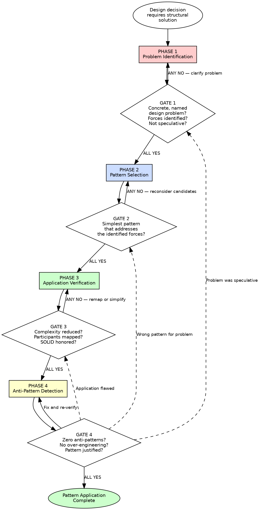

# Design Patterns

## Overview

Select and apply design patterns based on the problem they solve, not the structure they provide. Every pattern decision must start with a concrete design problem and end with a verification that the pattern reduces complexity.

**Core principle:** A pattern is a proven solution to a recurring design problem in a given context. Without an identified problem, applying a pattern is over-engineering. Without understanding the forces, selecting a pattern is guessing. Without verifying the result, applying a pattern is cargo-culting.

**About this skill:** This skill serves as both an AI enforcement guide (with mandatory gates and verification checks) and a human reference for design pattern selection and application. AI agents follow the phased gates during pattern decisions. Humans can use it as a checklist, learning guide, or team onboarding reference.

**Violating the letter of these rules is violating the spirit of disciplined pattern application.**

## Quick Reference — Phases at a Glance

| Phase | What You Do | Gate Question |
|---|---|---|
| 1 — Problem Identification | Identify the specific design problem that exists TODAY, not speculatively | Concrete, named problem? Justifies a pattern vs simpler solution? |
| 2 — Pattern Selection | Map problem to candidates using GoF intent (not structure); pick simplest | Pattern intent matches problem? Multiple candidates considered? |
| 3 — Application Verification | Verify participants map to domain concepts, SOLID honored, complexity reduced | Every participant mapped to domain concept? Passes all 5 SOLID checks? |
| 4 — Anti-Pattern Detection | Sweep for over-engineering, pattern soup, golden hammer, cargo-cult | Simpler solution NOT equally effective? Code free of pattern soup? |

**Each phase has a mandatory gate. ALL gate checks must pass before proceeding to the next phase.**

## Key Concepts

- **Gang of Four (GoF)** — Gamma, Helm, Johnson, and Vlissides — authors of *Design Patterns: Elements of Reusable Object-Oriented Software* (1994), the foundational pattern catalog defining 23 patterns organized by purpose and scope.
- **Intent vs Structure** — The correct way to select a pattern. Intent describes what problem the pattern solves; structure describes what the class diagram looks like. Two patterns can have identical structures but different intents (e.g., Strategy vs State). Always match by intent.
- **Creational Patterns** — Patterns that abstract object creation: Factory Method, Abstract Factory, Builder, Singleton, Prototype. They decouple client code from the concrete classes it instantiates.
- **Structural Patterns** — Patterns that compose classes or objects into larger structures: Adapter, Bridge, Composite, Decorator, Facade, Flyweight, Proxy. They manage relationships between entities.
- **Behavioral Patterns** — Patterns that define communication and responsibility between objects: Strategy, Observer, Command, State, Template Method, Iterator, Mediator, Chain of Responsibility, Visitor, Memento, Interpreter. They distribute behavior cleanly.
- **Anti-Pattern** — A common solution that appears helpful but actually creates more problems than it solves. Pattern soup (too many patterns), golden hammer (same pattern for everything), and cargo-cult (copying structure without understanding intent) are frequent anti-patterns.

## The Iron Law

```
NO PATTERN WITHOUT A PROBLEM.
NO SELECTION WITHOUT INTENT MATCHING.
NO APPLICATION WITHOUT VERIFICATION.
```

If you cannot name the specific design problem a pattern solves, do not apply the pattern. (Gang of Four, Design Patterns Ch. 1: "The hardest part about object-oriented design is decomposing a system into objects")

If you selected a pattern based on its structure rather than its intent, you selected the wrong pattern. (Gang of Four, Design Patterns Ch. 1: each pattern has an Intent that describes the design problem it addresses)

If the pattern increases complexity rather than reducing it, the pattern is wrong for this context — even if the problem-pattern match seems correct. (Ousterhout, A Philosophy of Software Design Ch. 2: "Complexity is anything related to the structure of a software system that makes it hard to understand and modify")

If you applied a pattern to a problem that does not yet exist, you violated YAGNI and introduced speculative complexity. Wait for the real problem. (Beck, Extreme Programming Explained; Kerievsky, Refactoring to Patterns: "Evolve toward patterns rather than imposing them")

**This gate is falsifiable at every decision point.** Point at any pattern in the codebase and ask: "What concrete problem does this solve? Is this the simplest pattern that solves it? Does it reduce complexity?" Yes or No. No ambiguity.

## When to Use

**Always:**
- Selecting a design pattern for new or existing code
- Reviewing code that uses design patterns
- Deciding whether a design pattern is appropriate for a given problem
- Evaluating whether an existing pattern application is correct

**Especially when:**
- A design problem has been identified and multiple solutions seem viable
- Existing code has a pattern that feels over-engineered or misapplied
- A developer suggests a pattern by name without first articulating the problem it solves
- Code exhibits "pattern soup" — multiple interacting patterns creating unnecessary complexity
- A familiar pattern is being applied to an unfamiliar problem ("golden hammer")
- A conditional chain, type-switch, or growing class hierarchy suggests a structural problem

**Exceptions (require explicit human approval):**
- Simple scripts under 200 lines with no structural problems
- Throwaway prototypes explicitly marked for deletion
- Performance-critical code where pattern overhead is measured and unacceptable (profile first)

## Process Flow



Announce at the start: **"Using design-patterns skill — running 4-phase enforcement."**

---

## Problem-to-Pattern Quick Reference

Use this table to map a concrete design problem to candidate patterns. Always verify intent match — do not select based on structure alone.

**How to use:** (1) Identify the problem in the left column. (2) Verify the forces match your situation. (3) Check the GoF intent. (4) If the intent matches your problem, the pattern is a candidate. (5) If multiple patterns match, select the simplest one.

### Creational Patterns

| Design Problem | Forces / Tension | Candidate Patterns | Intent |
|---|---|---|---|
| Object creation varies by type or context | Decouple creation from usage; type determined at runtime | **Factory Method**, Abstract Factory | "Define an interface for creating an object, but let subclasses decide which class to instantiate" |
| Need families of related objects without specifying concrete classes | Multiple product families; swap families without changing client code | **Abstract Factory** | "Provide an interface for creating families of related or dependent objects" |
| Complex object requires step-by-step construction | Many optional parameters; same construction process, different representations | **Builder** | "Separate the construction of a complex object from its representation" |
| Only one instance should exist system-wide | Global access point; lazy initialization; shared state (use sparingly — prefer DI) | **Singleton** | "Ensure a class only has one instance and provide a global point of access" |
| Creating exact copies of objects without coupling to concrete classes | Clone objects; prototype registry; avoid subclass proliferation | **Prototype** | "Specify the kinds of objects to create using a prototypical instance" |

### Structural Patterns

| Design Problem | Forces / Tension | Candidate Patterns | Intent |
|---|---|---|---|
| Incompatible interfaces need to work together | Third-party class with wrong interface; legacy integration | **Adapter** | "Convert the interface of a class into another interface clients expect" |
| Need to separate an abstraction from its implementation | Two independent dimensions of variation; avoid Cartesian product of subclasses | **Bridge** | "Decouple an abstraction from its implementation so that the two can vary independently" |
| Need to treat individual objects and compositions uniformly | Tree structures; part-whole hierarchies; recursive composition | **Composite** | "Compose objects into tree structures to represent part-whole hierarchies" |
| Need to add behavior to objects dynamically without subclassing | Flexible combination of behaviors; alternative to deep inheritance | **Decorator** | "Attach additional responsibilities to an object dynamically" |
| Need to simplify a complex subsystem interface | Many classes behind a single entry point; reduce coupling to internals | **Facade** | "Provide a unified interface to a set of interfaces in a subsystem" |
| Need to share fine-grained objects efficiently | Large number of similar objects; memory optimization; extrinsic vs intrinsic state | **Flyweight** | "Use sharing to support large numbers of fine-grained objects efficiently" |
| Need to control access to an object | Lazy loading; access control; logging; remote access; caching | **Proxy** | "Provide a surrogate or placeholder for another object to control access to it" |

### Behavioral Patterns

| Design Problem | Forces / Tension | Candidate Patterns | Intent |
|---|---|---|---|
| Algorithm varies by type, context, or configuration | if/elif/switch on type selects behavior; swap behavior at runtime | **Strategy** | "Define a family of algorithms, encapsulate each one, and make them interchangeable" |
| Algorithm skeleton is fixed but individual steps vary | Invariant sequence; specific steps differ by subclass | **Template Method** | "Define the skeleton of an algorithm, deferring some steps to subclasses" |
| Objects need to be notified when state changes | One-to-many dependency; event broadcasting; decouple publisher from subscribers | **Observer** | "Define a one-to-many dependency so that when one changes state, all dependents are notified" |
| Object behavior changes based on internal state | State-dependent conditionals; object appears to change class at runtime | **State** | "Allow an object to alter its behavior when its internal state changes" |
| Need to add operations to object structures without modifying them | Operations vary more often than structure; double dispatch | **Visitor** | "Represent an operation to be performed on elements of an object structure" |
| Need to traverse a collection without exposing its structure | Multiple traversal strategies; uniform iteration interface | **Iterator** | "Provide a way to access elements of an aggregate sequentially without exposing its underlying representation" |
| Need to decouple request sender from handler | Multiple potential handlers; handler determined at runtime | **Chain of Responsibility** | "Avoid coupling the sender of a request to its receiver" |
| Need to encapsulate a request as an object | Undo/redo; queuing; logging of operations; parameterize clients | **Command** | "Encapsulate a request as an object" |
| Need to mediate interactions between many objects | N-to-N reduced to N-to-1; decouple colleagues | **Mediator** | "Define an object that encapsulates how a set of objects interact" |
| Need to capture and restore object state | Undo/redo; snapshots; checkpointing without violating encapsulation | **Memento** | "Capture and externalize an object's internal state without violating encapsulation" |
| Need to define a grammar and interpret sentences in it | Simple language parsing; rule evaluation; DSL interpretation | **Interpreter** | "Given a language, define a representation for its grammar along with an interpreter" |

### Modern / Enterprise Patterns

| Design Problem | Forces / Tension | Candidate Patterns | Intent |
|---|---|---|---|
| Need to decouple data access from domain logic | Persistence ignorance; testable domain; swap storage implementations | **Repository** (Evans) | "Mediates between the domain and data mapping layers using a collection-like interface" |
| Need to track multiple changes as a single transaction | Atomic persistence; batch operations; change tracking | **Unit of Work** (Fowler) | "Maintains a list of objects affected by a business transaction and coordinates writing out changes" |
| Need to encapsulate business rules as composable objects | Complex query predicates; combinable criteria; domain rules as first-class objects | **Specification** (Evans) | "A predicate that determines if an object satisfies some criteria" |
| Need to decouple object creation and wiring from usage | Testability; swappable implementations; configuration-driven assembly | **Dependency Injection** (Fowler) | "Enable loose coupling through dependency inversion" |
| Need to separate read and write models | Different optimization needs for reads vs writes; complex queries vs simple commands | **CQRS** (Fowler/Young) | "Segregate operations that read data from operations that update data" |
| Need to store all changes as a sequence of events | Audit trail; temporal queries; event replay; eventual consistency | **Event Sourcing** (Fowler/Young) | "Store all changes to application state as a sequence of events" |

---

## Phase 1: Problem Identification

**Purpose:** Before reaching for any pattern, identify the specific design problem that exists right now. What force or tension needs resolution? What axis of change needs accommodation? A pattern without a problem is over-engineering.

### Rules

**1. Name the Problem Before the Solution** — You must articulate the design problem in concrete terms before considering any pattern. "We need a Strategy here" is not problem identification — it is solution-first thinking. "We have three discount algorithms that vary by customer type, and adding a fourth requires modifying the existing function" is problem identification.
*(Gang of Four, Design Patterns Ch. 1; Kerievsky, Refactoring to Patterns Ch. 1)*

```
BAD:  "Let's use the Observer pattern here"
GOOD: "OrderService needs to notify multiple independent subsystems
       (inventory, billing, notifications) when an order is placed,
       but it should not know about or depend on any of them."
```

**2. Identify the Forces** — Every design problem involves competing forces: flexibility vs simplicity, performance vs abstraction, coupling vs cohesion, extensibility vs immediate clarity. Name the specific forces in tension. A pattern resolves forces — if you have not identified the forces, you cannot evaluate whether a pattern resolves them.
*(Gang of Four, Design Patterns Ch. 1; Alexander, A Pattern Language)*

**3. Distinguish Real Problems from Speculative Ones** — A real problem exists in the code today or is required by a concrete, scheduled feature. A speculative problem is "we might need this someday." Patterns for speculative problems violate YAGNI and introduce complexity for problems that may never arrive.
*(Beck, Extreme Programming Explained; Ousterhout, A Philosophy of Software Design Ch. 6)*

```
REAL:       "We have 3 payment processors today and a 4th contracted for next quarter"
SPECULATIVE: "We might need to support different payment processors someday"
```

**4. Check the Axis of Change** — Identify what specific dimension of the code is changing or will change. Is it the algorithm? The object being created? The interface being adapted? The state transitions? The axis of change determines which pattern family is relevant. Without identifying the axis, pattern selection is random.
*(Gang of Four, Design Patterns Ch. 1; Martin, Agile Software Development Ch. 9)*

**5. Verify the Problem Justifies a Pattern** — Not every design problem requires a pattern. If a simple conditional, a well-named function, or a straightforward class solves the problem without unnecessary abstraction, use the simpler solution. Patterns have a complexity cost — they are justified only when that cost is less than the complexity they resolve.
*(Ousterhout, A Philosophy of Software Design Ch. 2-3; Metz, Practical Object-Oriented Design Ch. 1)*

**6. Consult the Code, Not Your Memory** — Examine the actual code exhibiting the problem. Count the real conditionals, the real duplication, the real coupling. Do not diagnose from memory or from a whiteboard diagram. The code is the truth.
*(Fowler, Refactoring Ch. 3; Kerievsky, Refactoring to Patterns Ch. 1)*

**7. Apply the Rule of Three** — One instance of a variation is not a pattern opportunity. Two instances make it suspicious. Three instances confirm the axis of change. Do not introduce a pattern for a single case — that is premature abstraction.
*(Beck, Implementation Patterns; Metz, Practical Object-Oriented Design Ch. 1: "duplication is far cheaper than the wrong abstraction")*

### Gate 1 — Mandatory Checkpoint

```
Before considering ANY pattern:
  1. Can you name the specific design problem in concrete terms?              YES/NO
  2. Can you identify the competing forces/tensions?                         YES/NO
  3. Does the problem exist TODAY (not speculatively)?                       YES/NO
  4. Have you identified the specific axis of change?                        YES/NO
  5. Does the problem justify a pattern (vs. simpler solution)?              YES/NO
  ALL YES → proceed to Phase 2
  ANY NO  → do not apply a pattern — use the simplest solution that works
```

**How to verify:** State the problem aloud without mentioning any pattern name. If you cannot describe the problem without referencing a solution, you are thinking solution-first. Go back and identify the problem.

---

## Phase 2: Pattern Selection

**Purpose:** Map the identified problem to candidate patterns using GoF intent, not structure. Select based on problem-pattern fit. Consider multiple candidates. Choose the simplest pattern that resolves the identified forces.

### Rules

**1. Match Problem to Intent, Not Structure** — The GoF catalog organizes patterns by intent: what design problem does the pattern solve? Do not select a pattern because its class diagram looks like your current code. Select it because its stated intent matches your stated problem.
*(Gang of Four, Design Patterns Ch. 1)*

```
BAD:  "Our code has a class that wraps another class — that's Decorator"
GOOD: "We need to add logging, caching, and retry behavior to a service
       independently and in any combination, without modifying the service.
       Decorator's intent — 'attach additional responsibilities dynamically' — fits."
```

**2. Consider Multiple Candidates** — For any design problem, at least two patterns are usually applicable. Strategy and State both resolve behavioral variation. Factory Method and Abstract Factory both resolve creation variation. Adapter and Facade both simplify interfaces. List the candidates, then compare their trade-offs against your specific forces.
*(Gang of Four, Design Patterns Ch. 1; Kerievsky, Refactoring to Patterns Ch. 7)*

**3. Select the Simplest Pattern** — When multiple patterns solve the problem, select the one with the fewest participants and the least structural overhead. Strategy is simpler than State when there is no state-transition logic. Factory Method is simpler than Abstract Factory when there is only one product family. Simpler patterns are easier to understand, maintain, and remove.
*(Ousterhout, A Philosophy of Software Design Ch. 2; Metz, Practical Object-Oriented Design Ch. 1)*

**4. Understand the Trade-Offs** — Every pattern has costs. Strategy adds indirection and a class per algorithm. Observer creates implicit coupling and ordering issues. Visitor violates encapsulation of the element structure. Know the trade-offs before committing. If the trade-offs are worse than the problem, do not apply the pattern.
*(Gang of Four, Design Patterns Ch. 1: "Consequences" section; Ousterhout, A Philosophy of Software Design Ch. 2)*

**5. Use the Quick Reference Table** — Consult the Problem-to-Pattern Quick Reference table above. Find your design problem in the left column, verify the forces match, check the intent. If the intent matches your problem, the pattern is a legitimate candidate. If the intent does not match, the pattern is wrong regardless of structural similarity.

**6. Prefer Evolving Toward Patterns Over Imposing Them** — The safest path to a pattern is through refactoring. Start with the simplest solution. When the code develops smells that a pattern would resolve, refactor toward the pattern. Imposed patterns solve problems that may not exist. Evolved patterns solve problems that demonstrably do.
*(Kerievsky, Refactoring to Patterns Ch. 1; Beck, Extreme Programming Explained)*

**7. Verify the Pattern's Context Matches** — Every GoF pattern description includes Applicability — the conditions under which the pattern applies. Read the Applicability section. If your situation does not match the listed conditions, the pattern does not apply, regardless of how well the intent seems to fit.
*(Gang of Four, Design Patterns: Applicability section; Martin, Agile Software Development)*

### Gate 2 — Mandatory Checkpoint

```
Before applying ANY pattern:
  1. Does the pattern's stated intent match the identified problem?           YES/NO
  2. Were multiple candidate patterns considered?                             YES/NO
  3. Is this the simplest pattern that resolves the identified forces?        YES/NO
  4. Do the pattern's trade-offs outweigh the cost of the current problem?   NO required
  5. Does the pattern's Applicability section match your context?             YES/NO
  ALL YES (and Q4 is NO) → proceed to Phase 3
  ANY fail → reconsider candidates, possibly reject all patterns
```

**How to verify:** State the pattern's intent from the GoF catalog. State your problem. Do they match? If you have to stretch the intent to fit, the match is wrong.

---

## Phase 3: Application Verification

**Purpose:** Before finalizing the implementation, verify the pattern is correctly applied. Check that the pattern's participants are correctly mapped to domain concepts, that SOLID principles are honored, and that the pattern genuinely reduces complexity.

### Rules

**1. Map Pattern Participants to Domain Concepts** — Every pattern defines participants (e.g., Strategy has Context, Strategy interface, ConcreteStrategy). Each participant must map to a meaningful domain concept. If a participant has no clear domain counterpart, the mapping is forced and the pattern may be wrong.
*(Gang of Four, Design Patterns: Participants section; Evans, Domain-Driven Design Ch. 5)*

```
GOOD mapping (Strategy):
  Context          → DiscountCalculator
  Strategy (ABC)   → DiscountPolicy
  ConcreteStrategy → RegularDiscount, PremiumDiscount, VipDiscount

BAD mapping (forced):
  Context          → Manager        (vague, no domain meaning)
  Strategy (ABC)   → Handler        (generic, not domain-specific)
  ConcreteStrategy → HandlerA, HandlerB  (meaningless names)
```

**2. Use ABC for All Pattern Interfaces** — All abstract participants in a pattern must be defined as abstract base classes using `ABC` and `@abstractmethod`. Concrete participants must properly inherit from their ABCs. This makes the pattern structure explicit and enforceable.
*(Martin, Agile Software Development Ch. 11; Gang of Four, Design Patterns Ch. 1)*

```
from abc import ABC, abstractmethod

class NotificationChannel(ABC):
    @abstractmethod
    def send(self, message: str, recipient: str) -> None: ...

class EmailChannel(NotificationChannel):
    def send(self, message: str, recipient: str) -> None:
        # email implementation
        ...

class SmsChannel(NotificationChannel):
    def send(self, message: str, recipient: str) -> None:
        # SMS implementation
        ...
```

**3. Verify SOLID Compliance** — Run the pattern application through all five SOLID checks. SRP: does each participant have one responsibility? OCP: does the pattern enable extension without modification? LSP: are concrete participants substitutable for the abstract? ISP: are interfaces minimal? DIP: do dependencies point toward the abstraction?
*(Martin, Agile Software Development Ch. 8-12; Metz, Practical Object-Oriented Design Ch. 2-5)*

**4. Verify Complexity Reduction** — The pattern must reduce overall complexity compared to the non-pattern alternative. Measure by: fewer conditional branches, clearer extension points, more cohesive classes, less coupling between modules. If the pattern adds more classes and indirection without reducing any of these, it is adding complexity, not removing it.
*(Ousterhout, A Philosophy of Software Design Ch. 2)*

**5. Check for Deep Modules** — Each pattern participant should be a deep module: simple interface, powerful implementation. If the pattern creates shallow classes (one-line methods behind multi-method interfaces), the abstraction is not carrying its weight.
*(Ousterhout, A Philosophy of Software Design Ch. 4; Fowler, Refactoring Ch. 3: Speculative Generality)*

**6. Verify Domain Language Alignment** — Pattern participant names must use the domain's ubiquitous language, not pattern jargon. The class is `DiscountPolicy`, not `DiscountStrategy`. The class is `OrderValidator`, not `OrderSpecification` (unless your domain experts say "specification"). Pattern names belong in documentation, not in class names.
*(Evans, Domain-Driven Design Ch. 2; Beck, Implementation Patterns Ch. 3)*

**7. Test the Pattern Boundaries** — Each pattern participant must be independently testable. The abstract participant defines the contract that tests verify. Concrete participants are tested against the abstract contract. If you cannot test a participant in isolation, the pattern has created coupling instead of reducing it.
*(Metz, Practical Object-Oriented Design Ch. 9; Martin, Clean Architecture Ch. 5)*

### Gate 3 — Mandatory Checkpoint

```
Before finalizing pattern application:
  1. Is every pattern participant mapped to a meaningful domain concept?       YES/NO
  2. Do all abstract participants use ABC with @abstractmethod?               YES/NO
  3. Do all concrete participants properly inherit from their ABCs?           YES/NO
  4. Does the pattern pass all five SOLID checks?                             YES/NO
  5. Does the pattern reduce complexity vs. the non-pattern alternative?      YES/NO
  6. Is every participant a deep module (simple interface, real implementation)? YES/NO
  7. Are participant names in domain language, not pattern jargon?             YES/NO
  ALL YES → proceed to Phase 4
  ANY NO  → remap participants, simplify, or reconsider the pattern choice
```

**How to verify:** For each pattern participant, state its domain role in one sentence. If the sentence is "this is the Strategy interface" instead of "this defines how discount policies calculate discounts," the mapping is structural, not meaningful.

---

## Phase 4: Anti-Pattern Detection

**Purpose:** Final sweep for pattern misuse. Actively search for over-engineering, wrong pattern selection, pattern soup, golden hammer, and speculative patterns. This is the most important phase — it catches the failures that good intentions miss.

### Rules

**1. Detect Over-Engineering** — A pattern is over-engineered if the problem it solves could be handled by a simple conditional, a function parameter, or a straightforward class. If the pattern adds 5 classes to replace a 3-branch if/elif that will never grow, it is over-engineering. The test: remove the pattern and replace it with the simplest possible code. If the simple code is equally maintainable, the pattern was unnecessary.
*(Ousterhout, A Philosophy of Software Design Ch. 6; Metz, Practical Object-Oriented Design Ch. 1)*

**2. Detect Pattern Soup** — Pattern soup occurs when multiple patterns interact in the same area of code, creating a maze of indirection. Strategy wrapping Decorator wrapping Adapter is pattern soup. Each additional pattern must be justified by its own independent problem. If you cannot understand the code without understanding all the patterns simultaneously, you have soup.
*(Kerievsky, Refactoring to Patterns Ch. 1; Ousterhout, A Philosophy of Software Design Ch. 2)*

**3. Detect Golden Hammer** — Golden hammer is using a favorite pattern everywhere, regardless of fit. Signs: the same pattern appears in unrelated parts of the codebase; the pattern is applied before the problem is identified; a developer advocates for the pattern by name rather than by problem analysis. Every pattern application must be justified by its own problem.
*(Gang of Four, Design Patterns Ch. 1; Martin, Agile Software Development)*

**4. Detect Speculative Patterns** — A speculative pattern solves a problem that does not exist yet. "We might need to add more notification channels" is speculation unless a concrete requirement exists. Speculative patterns add real complexity today for hypothetical benefits tomorrow.
*(Beck, Extreme Programming Explained; Fowler, Refactoring Ch. 3: Speculative Generality)*

**5. Detect Premature Abstraction** — Premature abstraction creates an interface or abstract class before there is a second implementation. One implementation behind an abstraction is acceptable when required by DIP (at architectural boundaries). Otherwise, wait for the second implementation. Abstractions based on one example are often wrong.
*(Metz, Practical Object-Oriented Design Ch. 3: "duplication is far cheaper than the wrong abstraction")*

**6. Detect Cargo-Cult Patterns** — Cargo-cult patterns mimic the structure of a pattern without understanding its purpose. Signs: pattern participants have generic names (Handler, Manager, Processor); the "context" class does nothing but delegate; the pattern structure exists but no concrete design problem motivated it. If you cannot explain what problem the pattern solves without saying "it's best practice," it is cargo cult.
*(Kerievsky, Refactoring to Patterns Ch. 1; Ousterhout, A Philosophy of Software Design Ch. 1)*

**7. Verify the Pattern is Removable** — A well-applied pattern should be removable. If the problem disappears or the requirements change, you should be able to simplify back to non-pattern code without a major rewrite. If the pattern has entangled itself so deeply that it cannot be removed, it has created the very rigidity it was supposed to prevent.
*(Fowler, Refactoring Ch. 2; Metz, Practical Object-Oriented Design Ch. 1)*

### Gate 4 — Mandatory Checkpoint

```
Final sweep of ALL pattern applications:
  1. Could a simpler solution (no pattern) solve the same problem equally well?   NO required
  2. Is the code free of pattern soup (multiple interacting patterns)?             YES/NO
  3. Is the pattern chosen based on this specific problem, not developer preference? YES/NO
  4. Does the problem exist today (not speculatively)?                             YES/NO
  5. Are there at least 2 implementations (or a DIP boundary justification)?       YES/NO
  6. Can you explain the problem the pattern solves without saying "best practice"? YES/NO
  ALL YES (and Q1 is NO) → pattern application complete
  ANY fail → simplify, remove the pattern, or return to the phase indicated by the failure
```

**How to verify:** Ask a developer unfamiliar with the code: "What problem does this pattern solve?" If they cannot answer from reading the code and its tests, the pattern is either wrong, over-engineered, or poorly applied.

---

## Red Flags — STOP and Revisit

If you see any of these, STOP. Return to the indicated phase and fix before proceeding.

**Phase 1 (Problem Identification):**
- Suggesting a pattern by name before articulating the design problem
- "We should use Strategy here" without explaining what varies and why
- The "problem" is speculative — "we might need this someday"
- Cannot identify the specific axis of change
- Only one variation exists (Rule of Three not met)

**Phase 2 (Pattern Selection):**
- Selecting the first pattern that comes to mind without considering alternatives
- Choosing a pattern because of structural similarity, not intent match
- Cannot state the pattern's GoF intent from memory
- The pattern's trade-offs are worse than the problem it solves

**Phase 3 (Application Verification):**
- Pattern participants have generic names (Manager, Handler, Processor, Helper)
- A pattern participant is a shallow class (trivial implementation behind a multi-method interface)
- The pattern increases the number of classes without reducing conditionals, coupling, or duplication
- SOLID violations in any pattern participant
- Concrete participants do not inherit from their ABCs

**Phase 4 (Anti-Pattern Detection):**
- The same pattern appears in 3+ unrelated parts of the codebase (golden hammer)
- Removing the pattern and using a simple conditional produces equally maintainable code (over-engineering)
- Multiple patterns interact in the same area creating hard-to-follow indirection (pattern soup)
- An abstraction exists with only one implementation and no DIP boundary justification (premature abstraction)
- "It's best practice" is the only justification for the pattern (cargo cult)

**Universal — ALL PHASES:**
- **"Every good codebase uses design patterns"** — Good codebases solve problems. Sometimes patterns help. Sometimes they do not. The pattern is a tool, not a goal.
- **"This is how the GoF book shows it"** — The GoF book provides structure. You must provide judgment about when and where to apply it. Slavish imitation is not design.
- **"We'll need it eventually"** — When eventually arrives, you will write it then, informed by actual requirements. Speculative patterns solve speculative problems with real complexity.

**All of these mean: return to the indicated phase, fix the violation, re-verify the gate.**

---

## Rationalization Table

| Excuse | Reality | Phase |
|--------|---------|-------|
| "We need a Strategy pattern here" (without stating the problem) | Name the problem first. The pattern comes after the diagnosis, never before. Prescribing medicine without a diagnosis is malpractice. (GoF, Ch. 1) | 1 |
| "This might need to vary in the future" | YAGNI. If it varies today, handle it today. If it might vary someday, handle it someday. Speculative patterns create real complexity now. (Beck, XP) | 1 |
| "The design problem is obvious, I don't need to articulate it" | If it is obvious, articulating it takes ten seconds. If articulating it is hard, the problem is not as clear as you think. Name it. (Kerievsky, Ch. 1) | 1 |
| "This code is getting complex, we need a pattern" | Patterns can reduce complexity or increase it. First identify which specific complexity — duplication? conditional sprawl? coupling? — then check if a pattern addresses that specific force. (Ousterhout, Ch. 2) | 1 |
| "I know this pattern well, so it's the right choice" | Familiarity is not fitness. The right pattern is the one whose intent matches the problem, not the one you have used most often. That is golden hammer. (GoF, Ch. 1) | 2 |
| "Strategy and State are basically the same" | Strategy varies algorithm independently of state. State varies behavior in response to internal state transitions. The intents are different. Intent determines selection. (GoF, Ch. 5) | 2 |
| "We only need one pattern for this" | Maybe. But did you consider alternatives? Factory Method vs Abstract Factory, Strategy vs Template Method, Adapter vs Facade — similar problems, different trade-offs. Consider at least two. (GoF, Ch. 1) | 2 |
| "The simpler pattern doesn't cover all our cases" | Does it cover the cases that exist today? Over-covering is over-engineering. Start simple, evolve toward the more complex pattern when the forces demand it. (Kerievsky, Ch. 1; Metz, Ch. 1) | 2 |
| "The participants don't map perfectly, but close enough" | "Close enough" means the pattern is forcing your domain into its structure instead of serving your domain. Remap or reconsider. (Evans, Ch. 5) | 3 |
| "We named it FooStrategy because that's what the pattern calls it" | Pattern jargon in class names serves the developer who knows the pattern, not the one who reads the code. Use domain language. (Evans, Ch. 2; Beck, Ch. 3) | 3 |
| "The extra classes are just the cost of good design" | Extra classes that reduce complexity are good design. Extra classes that add indirection without reducing conditionals, coupling, or duplication are over-engineering. Measure, do not assume. (Ousterhout, Ch. 2) | 3 |
| "This pattern is best practice" | "Best practice" is not a problem statement. What problem does it solve in your code? If you cannot answer with a concrete force, the pattern is cargo cult. (Ousterhout, Ch. 1) | 4 |
| "We use this pattern everywhere, it keeps things consistent" | Consistency in pattern use is golden hammer. Each application must be justified by its own problem. Consistency in coding style is good. Consistency in pattern application is a smell. (GoF, Ch. 1) | 4 |
| "Removing the pattern would mean rewriting if requirements change" | If requirements change, you will rewrite regardless. The question is whether the pattern earns its complexity cost today. If not, remove it and add it back when requirements actually change. (Metz, Ch. 1; Beck, XP) | 4 |
| "The pattern only adds a few extra classes" | A few extra classes times every pattern decision equals pattern soup. Each class must justify its existence by reducing complexity, not by satisfying a pattern diagram. (Ousterhout, Ch. 2) | 4 |
| "We're under time pressure, just use the pattern we know" | Time pressure is the worst time to reach for an unverified pattern. A misapplied pattern under pressure becomes a misapplied pattern under more pressure — plus debugging. (Martin, Clean Code Ch. 1) | All |

---

## Verification Checklist

Before marking pattern application complete, every box must be checked:

- [ ] A concrete design problem was identified and named before any pattern was considered (Gate 1)
- [ ] The forces and tensions driving the problem were explicitly identified (Gate 1)
- [ ] The problem exists today, not speculatively (Gate 1)
- [ ] The selected pattern's GoF intent matches the identified problem (Gate 2)
- [ ] Multiple candidate patterns were considered and the simplest was chosen (Gate 2)
- [ ] Every pattern participant maps to a meaningful domain concept with domain-language names (Gate 3)
- [ ] All abstract participants use ABC with @abstractmethod, all concrete participants inherit properly (Gate 3)
- [ ] The pattern passes all five SOLID checks (Gate 3)
- [ ] The pattern demonstrably reduces complexity vs. the non-pattern alternative (Gate 3)
- [ ] No over-engineering — a simpler solution would NOT suffice (Gate 4)
- [ ] No pattern soup — each pattern has its own independent justification (Gate 4)
- [ ] No golden hammer — pattern was selected for this problem, not from habit (Gate 4)

**Cannot check all boxes? Return to the failing gate. Fix before proceeding. No exceptions.**

---

## Related Skills

- **solid-principles** — Gate 3 requires all five SOLID checks to pass. SOLID and design patterns reinforce each other: patterns are often the mechanism by which SOLID principles are achieved (Strategy enables OCP, DI enables DIP, role interfaces enable ISP).
- **clean-code** — Pattern participants must pass clean-code gates: intention-revealing names, small focused functions, deep modules.
- **refactoring** — The safest path to a pattern is through refactoring: identify the smell, apply the technique, evolve toward the pattern. Use the refactoring skill when moving existing code toward a pattern.
- **superpowers:test-driven-development** — Pattern participants must be independently testable. Use TDD to drive toward interfaces and verify contracts.
- **superpowers:verification-before-completion** — Final verification after Gate 4 passes. Run it.

**Reading order:** This is skill 4 of 8. Prerequisites: solid-principles. Next: modern-python. See `skills/READING_ORDER.md` for the full path.
