# Domain-Driven Design

## Overview

Model software around the business domain. Let the domain dictate the structure, the vocabulary, and the boundaries. Every class, every module, every layer exists to express and protect the domain model.

**Core principle:** The structure of the software must mirror the structure of the domain. The code speaks the language of the business. The architecture isolates the domain from infrastructure corruption. (Evans, Domain-Driven Design, 2003)

**Authorities:** Evans (Domain-Driven Design, 2003 — the Blue Book), Vernon (Implementing Domain-Driven Design, 2013 — the Red Book; Domain-Driven Design Distilled, 2016), Millett & Tune (Patterns, Principles, and Practices of DDD), Brandolini (EventStorming)

**About this skill:** This skill serves as both an AI enforcement guide (with mandatory gates and verification checks) and a human reference for Domain-Driven Design implementation. AI agents follow the phased gates during domain modeling and code review. Humans can use it as a checklist, learning guide, or team onboarding reference.

**Violating the letter of these rules is violating the spirit of Domain-Driven Design.**

## Quick Reference — Phases at a Glance

| Phase | What You Do | Gate Question |
|---|---|---|
| 1 — Ubiquitous Language & Strategic Design | Names from domain experts, Bounded Contexts identified, Context Map defined, Core Domain distilled | Every name from domain vocabulary? No Manager/Handler/Processor? |
| 2 — Tactical Building Blocks | Entities, Value Objects, Aggregates, Domain Events, Repositories, Factories, Specifications | Aggregates enforce invariants? VOs immutable? Cross-aggregate refs by ID? |
| 3 — Supple Design | Intent-revealing interfaces, side-effect-free functions, closure of operations | Names communicate WHAT not HOW? Business logic on domain objects? |
| 4 — Layer Structure | Evans' 4 layers with DIP, every cross-layer call through ABC contract | Domain imports ONLY stdlib/abc? No outward imports from inner layers? |
| 5 — Infrastructure Isolation | External deps as replaceable plugins, domain testable with zero infra | Domain testable with zero infra? Easy technology swap? |
| 6 — Integration & Advanced Patterns | CQRS, Event Sourcing, Sagas applied where justified | Event handling idempotent? No ad-hoc cross-context coupling? |

**Each phase has a mandatory gate. ALL gate checks must pass before proceeding to the next phase.**

## Key Concepts

- **CQRS (Command Query Responsibility Segregation)** — Separate the read model (queries) from the write model (commands) when they have different scaling, performance, or complexity needs. Not a default — use only when justified by asymmetric read/write requirements.
- **Event Sourcing** — Store all state changes as an immutable sequence of domain events rather than overwriting current state. Reconstruct current state by replaying events. Provides full audit trail and temporal queries, but adds complexity.
- **Saga / Process Manager** — Coordinate a long-running business process across multiple aggregates or bounded contexts. Choreography (events trigger reactions) or Orchestration (a central coordinator). Uses compensating transactions for rollback since distributed transactions are impractical.
- **Specification Pattern** — Express domain rules, queries, and validation as composable objects. A specification answers: "Does this object satisfy a business rule?" Specifications can be combined with AND/OR/NOT. (Evans & Fowler)
- **Subdomain** — A subdivision of the business domain: Core (competitive advantage — invest the most here), Supporting (necessary but not differentiating), Generic (commodity — buy or use off-the-shelf). Classification drives resource allocation and design investment.
- **Anti-Corruption Layer (ACL)** — A translation layer that protects one Bounded Context from the model of another. The ACL converts external concepts into the local context's Ubiquitous Language, preventing model corruption. (Evans, DDD Ch. 14)

## The Iron Law

```
THE DOMAIN MODEL IS THE HEART OF THE SOFTWARE.
THE UBIQUITOUS LANGUAGE IS THE ONLY LANGUAGE.
AGGREGATES PROTECT CONSISTENCY BOUNDARIES.
THE DOMAIN LAYER HAS NO OUTWARD DEPENDENCIES.
INFRASTRUCTURE IMPLEMENTS THE INNER LAYERS' CONTRACTS — NEVER THE REVERSE.
```

If a class name does not come from the Ubiquitous Language — rename it. (Evans, DDD Ch. 2)
If an entity is modified outside its Aggregate Root — the consistency boundary is broken. Fix the aggregate. (Evans, DDD Ch. 6)
If a domain object imports infrastructure — the domain is corrupted. Define an ABC in the domain, implement it in infrastructure. (Evans, DDD Ch. 4; Vernon, IDDD Ch. 4)
If a Value Object is mutable — it is not a Value Object. Make it immutable. (Evans, DDD Ch. 5)
If a Bounded Context leaks its internals to another context — the boundary is violated. Add an Anti-Corruption Layer. (Evans, DDD Ch. 14)

**This gate is falsifiable at every level.** Point at any class, module, import, or name and ask the questions. Yes or No. No ambiguity.

## When to Use

**Always:**
- Designing domain models, entities, or value objects
- Creating or modifying aggregates and their boundaries
- Defining relationships between domain objects
- Structuring modules, packages, or layers
- Adding dependencies between modules
- Naming classes, methods, or variables that represent domain concepts
- Reviewing import statements and dependency direction
- Modeling business processes or workflows

**Especially when:**
- Business rules are complex and require explicit modeling
- Multiple teams or contexts interact and need clear boundaries
- A domain concept is being represented as a primitive type instead of a Value Object
- An entity is being modified from outside its aggregate
- Business vocabulary differs from technical vocabulary in the code
- A domain module imports from infrastructure (ORM, HTTP, filesystem)
- Tests require infrastructure to test domain logic
- Complex queries need domain-level expression (Specifications)
- Long-running business processes span multiple aggregates (Sagas)

**Exceptions (require explicit human approval):**
- Simple scripts under 200 lines with no domain model
- Pure CRUD with no business rules beyond validation
- Prototypes explicitly marked for deletion before production

## The DDD Layered Architecture

Evans defines exactly four layers (DDD Ch. 4 — "Isolating the Domain"). The modern standard applies the Dependency Inversion Principle so the Domain layer has zero outward dependencies.

### Evans' Four Layers (with DIP Applied)

```
┌─────────────────────────────────────────────────────┐
│              USER INTERFACE LAYER                     │
│  (Controllers, Views, CLI, API Endpoints,            │
│   Presenters, Serializers, Input Validation)         │
├─────────────────────────────────────────────────────┤
│              APPLICATION LAYER                        │
│  (Application Services, Use Cases,                   │
│   Commands, Queries, DTOs,                           │
│   Unit of Work ABC, Event Dispatching)               │
├─────────────────────────────────────────────────────┤
│                DOMAIN LAYER                           │
│  (Aggregates, Entities, Value Objects,               │
│   Domain Services, Domain Events,                    │
│   Repository ABCs, Specifications,                   │
│   Factories, Modules)                                │
├─────────────────────────────────────────────────────┤
│            INFRASTRUCTURE LAYER                       │
│  (Repository Implementations, ORM, DB Drivers,       │
│   Message Brokers, External API Clients,             │
│   Email/SMS Services, DI Container,                  │
│   Framework Configuration, Composition Root)         │
└─────────────────────────────────────────────────────┘
```

### Dependency Direction

Evans' original (2003): top-down — `UI → Application → Domain → Infrastructure`. The Domain depended on Infrastructure.

**Modern standard (DIP-evolved, endorsed by Evans in later talks, Vernon IDDD Ch. 4):**

```
User Interface ──→ Application ──→ Domain
                      ↑               ↑
                      └───────────────┘
                    Infrastructure
              (implements ABCs from both)
```

- **User Interface** depends on Application (calls use cases)
- **Application** depends on Domain only (orchestrates domain objects)
- **Domain** depends on NOTHING (only Python stdlib and `abc`) — **the heart**
- **Infrastructure** depends on Domain AND Application (implements ABCs defined in both layers)

**Key insight:** With DIP, Infrastructure is NOT beneath the Domain. Infrastructure and User Interface are both outer layers. The Domain defines Repository ABCs and domain contracts; the Application defines Unit of Work ABCs, Event Dispatcher ABCs, and other application-level contracts. Infrastructure implements ALL of them. The Composition Root in Infrastructure wires everything together at startup.

### Layer Responsibility Reference

| Layer | Contains | Depends On | Forbidden Dependencies |
|---|---|---|---|
| **User Interface** | Controllers, API endpoints, CLI handlers, Views, Presenters, Serializers, Input validation (format-level) | Application | Domain directly, Infrastructure |
| **Application** | Application Services, Use Cases, Commands, Queries, DTOs, Unit of Work ABC, Event Handlers, Event Dispatching | Domain | User Interface, Infrastructure, ANY framework |
| **Domain** | Aggregates, Entities, Value Objects, Domain Services, Repository ABCs, Domain Events, Specifications, Factories, Modules | Python stdlib, `abc` only | Application, User Interface, Infrastructure, ANY framework |
| **Infrastructure** | Repository Implementations, ORM config, DB drivers, Message Broker clients, External API clients, Email/SMS services, DI container, Composition Root | Domain and Application (implements ABCs from both) | — |

*Note:* The User Interface layer does NOT import Infrastructure directly. Both depend on Application and Domain. The Composition Root (in Infrastructure) wires concrete implementations to ABCs at startup.

### Application Services vs Domain Services

| Aspect | Application Service | Domain Service |
|---|---|---|
| **Layer** | Application | Domain |
| **Contains business logic?** | NO — thin orchestrator only (Evans, DDD Ch. 4) | YES — logic that spans multiple Entities/VOs |
| **State** | Stateless, may hold task progress | Stateless |
| **Dependencies** | Domain objects, Repository ABCs, Domain Services | Other domain objects only — no infrastructure |
| **Responsibilities** | Transaction management, security enforcement, use case coordination, DTO assembly, event dispatching | Domain calculations, cross-entity operations, domain rule enforcement |
| **Names from** | Use case vocabulary (`PlaceOrderUseCase`, `TransferFundsService`) | Ubiquitous Language verbs (`CalculateOrderTotal`, `AllocateStock`, `AuthorizePayment`) |

**The Anemic Domain Model Anti-Pattern (Evans, DDD Ch. 3; Vernon, IDDD Ch. 7):** When Application Services contain business logic that should live on Entities, Value Objects, or Domain Services — the domain model becomes a data-only shell. Business logic MUST live on domain objects. Application Services orchestrate; they do not decide.

### Architectural Companions

DDD's layered architecture predates and is distinct from these complementary patterns:

| Pattern | Author | Year | Relationship to DDD |
|---|---|---|---|
| **Hexagonal (Ports & Adapters)** | Cockburn | 2005 | Vernon (IDDD Ch. 4) recommends as implementation strategy for DDD. "Ports" map to Domain ABCs, "Adapters" map to Infrastructure implementations. |
| **Onion Architecture** | Palermo | 2008 | Formalizes the DIP-evolved DDD layers as concentric rings. Same principle, different visualization. |
| **Clean Architecture** | Martin | 2012 | Generalizes the dependency rule across 4 concentric rings. Compatible with DDD but uses different vocabulary (Entities, Use Cases, Interface Adapters, Frameworks). |

These patterns share the principle of domain isolation. They are NOT DDD — they are compatible architectural styles. This skill enforces Evans' DDD layers with DIP. If you are also applying Hexagonal or Clean Architecture, the DDD layer names and rules take precedence.

## Process Flow

```dot
digraph ddd {
    rankdir=TB;
    node [fontname="Helvetica", fontsize=10];
    edge [fontname="Helvetica", fontsize=9];

    start [label="Domain code\nwritten or modified", shape=ellipse];

    phase1 [label="PHASE 1\nUbiquitous Language\n& Strategic Design", shape=box, style=filled, fillcolor="#ccddff"];
    gate1 [label="GATE 1\nAll names from UL?\nBounded Contexts identified?\nContext Map defined?\nSubdomains classified?\nNo leaking internals?", shape=diamond];

    phase2 [label="PHASE 2\nTactical Building\nBlocks", shape=box, style=filled, fillcolor="#ccffcc"];
    gate2 [label="GATE 2\nAggregates enforce consistency?\nVOs immutable? Entities identity-based?\nDomain Events raised?\nFactories for complex creation?\nSpecifications for domain queries?", shape=diamond];

    phase3 [label="PHASE 3\nSupple Design", shape=box, style=filled, fillcolor="#ddccff"];
    gate3 [label="GATE 3\nInterfaces intention-revealing?\nFunctions side-effect-free?\nOperations closed on types?\nConceptual contours aligned?\nNo anemic model?", shape=diamond];

    phase4 [label="PHASE 4\nLayer Structure &\nDependency Direction", shape=box, style=filled, fillcolor="#ffffcc"];
    gate4 [label="GATE 4\nEvans' 4 layers correct?\nDeps follow DIP direction?\nDomain pure?\nABC at every boundary?", shape=diamond];

    phase5 [label="PHASE 5\nInfrastructure Isolation\n& Replaceability", shape=box, style=filled, fillcolor="#ffddcc"];
    gate5 [label="GATE 5\nDomain testable alone?\nInfra swappable?\nSingle Composition Root?\nReplacement test passes?", shape=diamond];

    phase6 [label="PHASE 6\nIntegration &\nAdvanced Patterns", shape=box, style=filled, fillcolor="#ccffee"];
    gate6 [label="GATE 6\nCQRS where needed?\nSagas for long processes?\nIdempotent event handling?\nEvent Storming artifacts?", shape=diamond];

    done [label="DDD\nComplete", shape=ellipse, style=filled, fillcolor="#ccffcc"];

    start -> phase1;
    phase1 -> gate1;
    gate1 -> phase2 [label="ALL YES"];
    gate1 -> phase1 [label="ANY NO — rename/restructure"];
    phase2 -> gate2;
    gate2 -> phase3 [label="ALL YES"];
    gate2 -> phase2 [label="ANY NO — fix model"];
    phase3 -> gate3;
    gate3 -> phase4 [label="ALL YES"];
    gate3 -> phase3 [label="ANY NO — refine design"];
    phase4 -> gate4;
    gate4 -> phase5 [label="ALL YES"];
    gate4 -> phase4 [label="ANY NO — fix layers/deps"];
    phase5 -> gate5;
    gate5 -> phase6 [label="ALL YES"];
    gate5 -> phase5 [label="ANY NO — decouple"];
    phase6 -> gate6;
    gate6 -> done [label="ALL YES or N/A"];
    gate6 -> phase6 [label="ANY NO — implement pattern"];
}
```



---

## Phase 1 — Ubiquitous Language & Strategic Design

**Goal:** Every name in the code comes from the domain experts' vocabulary. The modeling process is collaborative. Bounded Contexts are identified. The Context Map is defined. Subdomains are classified. Core Domain is distilled.

**Authorities:** Evans (DDD Ch. 1, 2, 3, 14, 15, 16), Vernon (IDDD Ch. 2, 3), Brandolini (EventStorming)

### Rules

**Rule 1: Knowledge Crunching — collaborate with domain experts to distill the model**

The domain model emerges through iterative collaboration between developers and domain experts. Developers must learn the domain. Domain experts must engage with the model. This is not optional — it is the foundation of DDD. (Evans, DDD Ch. 1)

Key practices:
- **Modeling Out Loud** — speak scenarios using model terms to test and refine the language (Evans, DDD Ch. 2)
- **Hands-on Modelers** — the people writing the code participate directly in modeling; no "ivory tower" architects who hand off to developers (Evans, DDD Ch. 3)
- **Event Storming** — collaborative workshop to discover Domain Events, Commands, Aggregates, Policies, and hotspots (Brandolini; Vernon Distilled Ch. 7)
- **Continuous Learning** — developers study the domain; domain experts review the model

**Rule 2: Every class, method, and variable name must come from the Ubiquitous Language**

The Ubiquitous Language is the shared vocabulary between developers and domain experts, used in code, speech, diagrams, and documentation. If a domain expert would not recognize the name — it does not belong in the domain layer. (Evans, DDD Ch. 2)

```python
# BAD — technical names that mean nothing to domain experts
class DataProcessor:
    def handle_record(self, record: dict) -> dict: ...

class ItemManager:
    def do_operation(self, item_id: int) -> None: ...
```

```python
# GOOD — names from the Ubiquitous Language
class OrderFulfillmentService:
    def fulfill_order(self, order: Order, /) -> ShipmentConfirmation: ...

class InventoryAllocationService:
    def allocate_stock(self, order: Order, /) -> Allocation: ...
```

**Rule 3: Model-Driven Design — the model and the code are the same thing**

The model is not a diagram that exists apart from the code. The code IS the model. If the model changes, the code changes. If implementation constraints force a code change, the model must change too. They are bound together. (Evans, DDD Ch. 3)

- Every domain concept in the model has a corresponding code element
- Every code element in the domain layer corresponds to a model concept
- Changes to one require changes to the other
- Avoid the **Smart UI Anti-Pattern**: never put business logic in controllers, views, or UI code (Evans, DDD Ch. 3-4)

**Rule 4: One Bounded Context per cohesive domain area — never a monolithic domain model**

A Bounded Context is an explicit boundary within which a particular domain model is defined and applicable. The same real-world concept may have different representations in different contexts. (Evans, DDD Ch. 14)

```python
# BAD — one monolithic "User" entity used everywhere

# GOOD — separate models per Bounded Context
# identity_context/domain/entities/user_account.py
@dataclass(eq=False, slots=True)
class UserAccount:
    id: UserAccountId
    email: Email
    password_hash: str
    roles: frozenset[Role]

# billing_context/domain/entities/customer.py
@dataclass(eq=False, slots=True)
class Customer:
    id: CustomerId
    billing_email: Email
    payment_methods: list[PaymentMethod]
    tax_id: TaxId | None
```

**Continuous Integration within a Bounded Context** (Evans, DDD Ch. 14): Within a single context, all developers work on the same model. Frequent merging, automated tests, and Ubiquitous Language enforcement keep the model unified. This is DDD's own concept of CI — distinct from CI/CD tooling.

**Rule 5: Context Maps define relationships between Bounded Contexts**

Every interaction between contexts must be explicitly mapped. Drawing the Context Map documents what exists, not what you wish existed. (Evans, DDD Ch. 14; Vernon, IDDD Ch. 3)

| Relationship | Description | When to Use |
|---|---|---|
| **Partnership** | Two teams cooperate on a shared goal; both evolve together | Co-dependent teams, aligned schedules |
| **Shared Kernel** | Two contexts share a small subset of the model; changes need both teams' agreement | Tightly coupled teams, small shared concepts |
| **Customer-Supplier** | Upstream context serves downstream; upstream plans with downstream's needs in mind | Clear provider/consumer relationship |
| **Conformist** | Downstream adopts upstream's model as-is, no translation | No influence over upstream, model is acceptable |
| **Anti-Corruption Layer (ACL)** | Downstream translates upstream's model to protect its own | Upstream model is unsuitable for downstream |
| **Open Host Service (OHS)** | Upstream publishes a well-defined protocol/API for consumers | Multiple downstream consumers |
| **Published Language** | Shared schema (JSON Schema, Protobuf, Avro) for interchange | Cross-team or cross-system integration; often paired with OHS |
| **Separate Ways** | No integration — contexts are independent | No meaningful overlap; integration cost exceeds benefit |
| **Big Ball of Mud** | (Anti-pattern) System with no discernible model; draw a boundary around it, use ACL to interface | Legacy systems with no recoverable structure |

**Rule 6: Anti-Corruption Layers protect context boundaries**

When integrating with another context (or external system), never let foreign models leak into your domain. Translate at the boundary using Facades, Adapters, and Translators. (Evans, DDD Ch. 14)

```python
# BAD — external API model used directly in domain
class OrderService:
    def place_order(self, order: Order) -> None:
        stripe_charge = stripe.Charge.create(...)  # foreign model in domain
        order.payment_reference = stripe_charge.id  # foreign concept leaks
```

```python
# GOOD — Anti-Corruption Layer translates at the boundary
# domain/repositories/payment_gateway.py
class PaymentGateway(ABC):
    @abstractmethod
    def charge(self, amount: Money, /, *, reference: str) -> PaymentResult: ...

# infrastructure/payment/stripe_payment_gateway.py — the ACL
class StripePaymentGateway(PaymentGateway):
    @override
    def charge(self, amount: Money, /, *, reference: str) -> PaymentResult:
        stripe_charge = stripe.Charge.create(...)  # foreign model stays HERE
        return PaymentResult(  # translated to domain model
            status=PaymentStatus.SUCCESS,
            transaction_id=TransactionId(stripe_charge.id),
        )
```

**Rule 7: Subdomains & Distillation — classify business importance and identify the Core Domain**

(Evans, DDD Ch. 15)

| Subdomain Type | Description | Design Investment |
|---|---|---|
| **Core** | The competitive advantage — what makes the business unique | Maximum: rich domain model, full DDD tactical patterns, best developers |
| **Supporting** | Necessary but not differentiating — supports the core | Moderate: simpler domain model, key patterns |
| **Generic** | Solved problems — authentication, email, logging | Minimal: buy/adopt off-the-shelf, wrap behind ACL |

**Distillation practices:**
- **Domain Vision Statement** — a short document (roughly one page) stating the Core Domain's value proposition and how it is distinguished from supporting and generic subdomains (Evans, DDD Ch. 15)
- **Highlighted Core** — make the Core Domain visible by flagging core modules in the codebase and writing a Distillation Document (3-7 pages) describing the core and its key interactions (Evans, DDD Ch. 15)
- **Cohesive Mechanisms** — extract computationally complex, algorithmic functionality into separate modules, leaving the domain model expressive and declarative. Separate mechanism from policy. (Evans, DDD Ch. 15)
- **Segregated Core** — physically separate the Core Domain modules from supporting code (Evans, DDD Ch. 15)
- **Abstract Core** — create an abstract model of the most fundamental concepts across multiple core modules, reducing duplication (Evans, DDD Ch. 15)

Invest modeling effort proportional to subdomain importance. Put your best people on the Core Domain.

**Rule 8: Module structure reflects Bounded Contexts — Evans' 4 layers within each**

```python
# BAD — organized by technical layer across all contexts
src/
    models/         # all entities from all contexts mixed
    services/       # all services from all contexts mixed
    repositories/   # all repos from all contexts mixed
```

```python
# GOOD — organized by Bounded Context, Evans' 4 layers within each
src/
    ordering/                    # Bounded Context: Ordering
        domain/                  # DOMAIN LAYER
            aggregates/
            value_objects/
            events/
            services/
            specifications/
            factories/
            repositories/       # ABCs only
        application/             # APPLICATION LAYER
            commands/
            queries/
            use_cases/
        user_interface/          # USER INTERFACE LAYER
            controllers/
            presenters/
            serializers/
        infrastructure/          # INFRASTRUCTURE LAYER
            persistence/         # Repository implementations
            messaging/
            external_services/
    inventory/                   # Bounded Context: Inventory
        domain/
        application/
        user_interface/
        infrastructure/
```

Module names are part of the Ubiquitous Language. Refactor module structure as the model evolves. (Evans, DDD Ch. 5; Vernon, IDDD Ch. 9)

**Rule 9: Cross-context communication uses Domain Events or explicit integration interfaces — never direct model access**

```python
# BAD — Ordering context directly imports from Inventory context
from inventory.domain.entities.stock import Stock  # cross-context coupling

# GOOD — Ordering context communicates via Domain Event
@dataclass(frozen=True, slots=True, kw_only=True)
class OrderPlaced:
    order_id: OrderId
    items: tuple[OrderLineItem, ...]
    placed_at: datetime

# inventory/application/event_handlers/order_placed_handler.py
class OrderPlacedHandler:
    def handle(self, event: OrderPlaced, /) -> None:
        for item in event.items:
            self._inventory_service.reserve_stock(item.product_id, item.quantity)
```

### Large-Scale Structure (Evans, DDD Ch. 16)

For large systems, consider these organizational patterns that emerge on top of Bounded Contexts:

| Pattern | Description |
|---|---|
| **Evolving Order** | Large-scale structure should emerge and evolve, not be imposed upfront |
| **Responsibility Layers** | Organize domain modules into broad layers of domain responsibility (e.g., Policy → Operations → Capability). These are domain-level layers, NOT architectural layers. |
| **Knowledge Level** | A meta-model within the domain that defines structure and constraints governing the operational level. Configuration objects that define what operational objects can do. (Related to Type Object pattern) |
| **Pluggable Component Framework** | When a mature model supports interchangeable implementations of major subsystems. High bar; rarely achievable. Requires Abstract Core and very stable interfaces. |

### Gate 1 — Ubiquitous Language & Strategic Design Checkpoint

| Check | Question |
|---|---|
| **Ubiquitous Language** | Does every class, method, and variable name come from the domain experts' vocabulary? |
| **No technical names** | Are there any classes named `Manager`, `Handler`, `Processor`, `Helper`, `Utils` in the domain layer? |
| **Model-Driven Design** | Does the code directly reflect the domain model? Is there a 1:1 correspondence? |
| **Bounded Contexts identified** | Is each cohesive domain area in its own Bounded Context? |
| **Context Map defined** | Are relationships between contexts explicitly identified (ACL, Shared Kernel, Partnership, etc.)? |
| **No cross-context coupling** | Does any context directly import another context's domain model? |
| **Subdomain classification** | Is each subdomain classified as Core, Supporting, or Generic? |
| **Core Domain distilled** | Is the Core Domain identified and receiving maximum investment? |
| **Module structure matches contexts** | Is the codebase organized by Bounded Context with Evans' 4 layers within each? |

**ALL must be YES to proceed.** ANY NO → rename, restructure, or add boundaries before continuing.

---

## Phase 2 — Tactical Building Blocks

**Goal:** Every domain concept is modeled with the correct DDD building block. Aggregates protect consistency. Value Objects are immutable. Entities have identity. Domain Events capture what happened. Factories handle complex creation. Specifications express domain queries and validation.

**Authorities:** Evans (DDD Ch. 5, 6, 7, 8, 9), Vernon (IDDD Ch. 5, 6, 7, 8, 10, 11, 12), Millett & Tune (PPP of DDD)

### Rules

**Rule 1: Entities have identity — equality is based on identity, not attributes**

An Entity is an object defined by its identity, not its attributes. Two entities with the same attributes but different IDs are different objects. (Evans, DDD Ch. 5)

**Identity creation strategies** (Vernon, IDDD Ch. 5):
1. User-provided identity (e.g., username, email)
2. Application-generated identity (UUID — preferred for domain independence)
3. Persistence-mechanism-generated identity (database sequences — creates infrastructure coupling)
4. Another Bounded Context supplies identity

```python
# GOOD — Entity with identity-based equality
@dataclass(eq=False, slots=True)
class Order:
    id: OrderId
    customer_id: CustomerId
    status: OrderStatus
    items: list[OrderLineItem]

    def __eq__(self, other: object) -> bool:
        return isinstance(other, Order) and self.id == other.id

    def __hash__(self) -> int:
        return hash(self.id)
```

**Rule 2: Value Objects are immutable, equality is based on all attributes, and they have no identity**

A Value Object describes a characteristic of a thing. It is defined entirely by its attributes. It must be immutable. Prefer Value Objects over Entities when identity is not needed — maximize Value Objects, minimize Entities. (Evans, DDD Ch. 5; Vernon, IDDD Ch. 6)

```python
# GOOD — Value Objects: immutable, attribute-based equality
@dataclass(frozen=True, slots=True)
class Money:
    amount: Decimal
    currency: str

    def add(self, other: Money, /) -> Money:
        if self.currency != other.currency:
            raise ValueError(f"Cannot add {self.currency} and {other.currency}")
        return Money(amount=self.amount + other.amount, currency=self.currency)

@dataclass(frozen=True, slots=True)
class Address:
    street: str
    city: str
    postal_code: str
    country: str

@dataclass(frozen=True, slots=True)
class Email:
    value: str

    def __post_init__(self) -> None:
        if "@" not in self.value:
            raise ValueError(f"Invalid email: {self.value}")

@dataclass(frozen=True, slots=True)
class OrderId:
    value: UUID
```

Value Objects replace primitive obsession. Use `Money` instead of `float`, `Email` instead of `str`, `OrderId` instead of `UUID`.

**Rule 3: Associations — constrain, qualify, and direct**

Model only the associations that matter to the domain. Eliminate unnecessary associations. Make associations unidirectional where possible. Qualify associations to reduce their multiplicity. (Evans, DDD Ch. 5)

```python
# BAD — bidirectional association, unconstrained
class Customer:
    orders: list[Order]  # customer knows all orders

class Order:
    customer: Customer  # order knows its customer — bidirectional coupling

# GOOD — unidirectional, by ID, qualified where needed
@dataclass(eq=False, slots=True)
class Order:
    id: OrderId
    customer_id: CustomerId  # unidirectional reference by ID
```

**Rule 4: Aggregates are consistency boundaries — the Root controls all access**

An Aggregate is a cluster of Entities and Value Objects treated as a single unit for data changes. The Aggregate Root is the only entry point. (Evans, DDD Ch. 6)

**Vernon's four Aggregate design rules** (IDDD Ch. 10):
1. **Protect business invariants** inside Aggregate boundaries
2. **Design small Aggregates** — prefer single-Entity Aggregates when possible
3. **Reference other Aggregates by identity only** — not by direct object reference
4. **Update other Aggregates using eventual consistency** — via Domain Events

```python
# GOOD — Aggregate Root controls all mutations
@dataclass(eq=False, slots=True)
class Order:  # Aggregate Root
    id: OrderId
    customer_id: CustomerId  # reference by ID only (Rule 3)
    _items: list[OrderLineItem]  # internal — not accessed directly
    _status: OrderStatus

    def add_item(self, product_id: ProductId, quantity: int, unit_price: Money, /) -> None:
        if self._status != OrderStatus.DRAFT:
            raise DomainError("Cannot add items to a non-draft order")
        existing = self._find_item(product_id)
        if existing:
            existing.increase_quantity(quantity)
        else:
            self._items.append(
                OrderLineItem(product_id=product_id, quantity=quantity, unit_price=unit_price)
            )

    def place(self) -> list[DomainEvent]:
        if self._status != OrderStatus.DRAFT:
            raise DomainError(f"Cannot place order in status {self._status}")
        if not self._items:
            raise DomainError("Cannot place an empty order")
        self._status = OrderStatus.PLACED
        return [OrderPlaced(order_id=self.id, placed_at=datetime.now(UTC))]

    @property
    def total(self) -> Money: ...

    def _find_item(self, product_id: ProductId, /) -> OrderLineItem | None:
        return next((i for i in self._items if i.product_id == product_id), None)

    def __eq__(self, other: object) -> bool:
        return isinstance(other, Order) and self.id == other.id

    def __hash__(self) -> int:
        return hash(self.id)
```

Additional Aggregate rules:
- Root has global identity; inner entities have local identity only
- Nothing outside holds a persistent reference to internals (transient references during a single operation are acceptable)
- Only the Root can be obtained from a Repository
- Delete must remove everything inside the boundary
- One transaction modifies one Aggregate; cross-aggregate consistency uses Domain Events

**Rule 5: Domain Events capture what happened — past tense, immutable, raised by Aggregates**

(Evans, DDD Ch. 8; Vernon, IDDD Ch. 8)

```python
@dataclass(frozen=True, slots=True, kw_only=True)
class OrderPlaced:
    order_id: OrderId
    customer_id: CustomerId
    placed_at: datetime
    total: Money

@dataclass(frozen=True, slots=True, kw_only=True)
class OrderCancelled:
    order_id: OrderId
    cancelled_at: datetime
    reason: str
```

Domain Event rules:
- Past tense: `OrderPlaced`, not `PlaceOrder` (that is a Command)
- Named from the Ubiquitous Language
- Immutable (`frozen=True`)
- Contain only the data needed for consumers to react — include timestamp and aggregate identity
- Raised by Aggregates, dispatched by Application Services
- **Idempotent handling** — consumers must handle duplicate delivery safely (Vernon, IDDD Ch. 8)

**Rule 6: Domain Services encapsulate logic that does not belong to any single Entity or Value Object**

(Evans, DDD Ch. 5; Vernon, IDDD Ch. 7)

Domain Services are named as **verbs** (operations), not nouns (things). A service IS an operation. (Evans, DDD Ch. 5)

```python
# BAD — noun-based (names a thing, not an action)
class PricingService: ...
class ShippingCostCalculator: ...
class PaymentProcessor: ...

# GOOD — verb-based (names the operation the service performs)
class CalculateOrderTotal: ...
class CalculateShippingCost: ...
class AuthorizePayment: ...
```

```python
# GOOD — verb-based Domain Service
class CalculateOrderTotal:
    def execute(
        self,
        items: list[OrderLineItem],
        customer_tier: CustomerTier,
        /,
    ) -> Money:
        subtotal = sum(
            (item.unit_price.amount * item.quantity for item in items), Decimal("0")
        )
        discount = self._tier_discount(customer_tier, subtotal)
        return Money(amount=subtotal - discount, currency=items[0].unit_price.currency)

    def _tier_discount(self, tier: CustomerTier, subtotal: Decimal, /) -> Decimal:
        match tier:
            case CustomerTier.VIP:
                return subtotal * Decimal("0.15")
            case CustomerTier.PREMIUM:
                return subtotal * Decimal("0.10")
            case _:
                return Decimal("0")
```

Domain Service characteristics:
- **Named as verbs** — the class name IS the operation (`CalculateOrderTotal`, `AllocateStock`, `TransferFunds`), not a noun (`PricingService`, `StockManager`)
- Stateless
- Operates on domain objects (Entities, Value Objects)
- Has NO infrastructure dependencies
- Not a dumping ground — first try to place behavior on Entities or Value Objects

**Rule 7: Repository ABCs belong in the Domain layer — one per Aggregate Root**

(Evans, DDD Ch. 6; Vernon, IDDD Ch. 12)

```python
# domain/repositories/order_repository.py
from abc import ABC, abstractmethod

class OrderRepository(ABC):
    @abstractmethod
    def find_by_id(self, order_id: OrderId, /) -> Order | None: ...

    @abstractmethod
    def save(self, order: Order, /) -> None: ...

    @abstractmethod
    def next_id(self) -> OrderId: ...
```

Repository rules:
- One Repository per Aggregate Root (never for internal entities or value objects)
- ABCs live in the Domain layer; implementations live in Infrastructure
- Repositories persist and retrieve whole Aggregates — never partial state
- Method signatures use domain types only (not database types)
- Transaction control belongs to the Application layer, not the Repository (Evans, DDD Ch. 6)
- **Collection-Oriented** Repositories mimic an in-memory collection (add/remove) — work well with Unit of Work (Vernon, IDDD Ch. 12)
- **Persistence-Oriented** Repositories require explicit save/put — work well with key-value and document stores (Vernon, IDDD Ch. 12)
- Repository vs. DAO: Repository is domain-centric (speaks domain language); DAO is persistence-centric

**Rule 8: Factories encapsulate complex object and Aggregate creation**

(Evans, DDD Ch. 6; Vernon, IDDD Ch. 11)

Use Factories when construction is complex — multiple collaborating objects, invariants that must hold at creation time, or reconstitution from persistence. When construction is simple, a plain constructor suffices.

```python
# GOOD — Factory Method on the Aggregate Root
@dataclass(eq=False, slots=True)
class Order:
    id: OrderId
    customer_id: CustomerId
    _items: list[OrderLineItem]
    _status: OrderStatus

    @classmethod
    def create(
        cls,
        order_id: OrderId,
        customer_id: CustomerId,
        /,
    ) -> Order:
        """Factory method: creates a new Order in DRAFT status with empty items."""
        return cls(
            id=order_id,
            customer_id=customer_id,
            _items=[],
            _status=OrderStatus.DRAFT,
        )

# GOOD — Standalone Factory for complex Aggregate creation
class OrderFactory:
    def __init__(self, calculate_price: CalculateUnitPrice, /) -> None:
        self._calculate_price = calculate_price

    def create_from_cart(
        self,
        order_id: OrderId,
        customer: CustomerId,
        cart_items: list[CartItem],
        /,
    ) -> Order:
        """Factory: creates an Order from a shopping cart, applying pricing rules."""
        line_items = [
            OrderLineItem(
                product_id=item.product_id,
                quantity=item.quantity,
                unit_price=self._calculate_price.execute(item.product_id),
            )
            for item in cart_items
        ]
        order = Order.create(order_id, customer)
        for item in line_items:
            order.add_item(item.product_id, item.quantity, item.unit_price)
        return order
```

Factory rules:
- Factories enforce all invariants at creation time
- Separate creation logic from the object itself when creation is complex
- Use Factory Methods on the Aggregate Root for simpler cases
- Use standalone Factory objects for cross-aggregate or multi-step creation
- Factories for reconstitution from persistence: rebuild Aggregates from stored data without re-validating creation-time invariants (Evans, DDD Ch. 6)

**Rule 9: Specifications express domain queries, validation, and selection criteria**

(Evans, DDD Ch. 9)

A Specification is a predicate-like object that tests whether a domain object satisfies a criterion. Specifications make implicit domain rules explicit and composable.

Three uses:
1. **Validation** — does an object satisfy the spec?
2. **Selection (querying)** — find objects satisfying the spec
3. **Building to order (creation)** — create objects that satisfy the spec

```python
# GOOD — Specification pattern
from abc import ABC, abstractmethod

class Specification[T](ABC):
    @abstractmethod
    def is_satisfied_by(self, candidate: T, /) -> bool: ...

    def and_spec(self, other: Specification[T], /) -> Specification[T]:
        return _AndSpecification(self, other)

    def or_spec(self, other: Specification[T], /) -> Specification[T]:
        return _OrSpecification(self, other)

    def not_spec(self) -> Specification[T]:
        return _NotSpecification(self)

@dataclass(frozen=True, slots=True)
class _AndSpecification[T](Specification[T]):
    _left: Specification[T]
    _right: Specification[T]

    @override
    def is_satisfied_by(self, candidate: T, /) -> bool:
        return self._left.is_satisfied_by(candidate) and self._right.is_satisfied_by(candidate)

@dataclass(frozen=True, slots=True)
class _OrSpecification[T](Specification[T]):
    _left: Specification[T]
    _right: Specification[T]

    @override
    def is_satisfied_by(self, candidate: T, /) -> bool:
        return self._left.is_satisfied_by(candidate) or self._right.is_satisfied_by(candidate)

@dataclass(frozen=True, slots=True)
class _NotSpecification[T](Specification[T]):
    _inner: Specification[T]

    @override
    def is_satisfied_by(self, candidate: T, /) -> bool:
        return not self._inner.is_satisfied_by(candidate)

# Domain-specific specifications
@dataclass(frozen=True, slots=True)
class OverdueOrderSpecification(Specification[Order]):
    as_of: datetime

    @override
    def is_satisfied_by(self, candidate: Order, /) -> bool:
        return (
            candidate.status == OrderStatus.PLACED
            and candidate.placed_at < self.as_of - timedelta(days=30)
        )

@dataclass(frozen=True, slots=True)
class HighValueOrderSpecification(Specification[Order]):
    threshold: Money

    @override
    def is_satisfied_by(self, candidate: Order, /) -> bool:
        return candidate.total.amount >= self.threshold.amount

# Usage — composable domain queries
overdue_high_value = OverdueOrderSpecification(
    as_of=datetime.now(UTC)
).and_spec(
    HighValueOrderSpecification(threshold=Money(Decimal("1000"), "USD"))
)
```

### Gate 2 — Tactical Building Blocks Checkpoint

| Check | Question |
|---|---|
| **Entities have identity** | Do all entities use `eq=False` with identity-based `__eq__` and `__hash__`? |
| **Value Objects immutable** | Are all value objects `@dataclass(frozen=True, slots=True)`? |
| **VOs maximized** | Are Value Objects preferred over Entities where identity is not needed? |
| **No primitive obsession** | Are domain concepts (money, email, IDs) modeled as Value Objects, not primitives? |
| **Associations constrained** | Are associations unidirectional, by ID, and minimized to what the domain requires? |
| **Aggregates enforce invariants** | Does each Aggregate Root control all mutations to its internals? |
| **Small Aggregates** | Are Aggregates as small as possible while still protecting invariants? |
| **Reference by ID** | Do Aggregates reference other Aggregates by ID, not direct object reference? |
| **Domain Events raised** | Do state changes raise immutable, past-tense Domain Events? |
| **Idempotent handling** | Can event consumers safely handle duplicate delivery? |
| **Domain Services verb-based** | Are Domain Services named as verbs (operations), not nouns (things)? |
| **Domain Services stateless** | Are Domain Services stateless with no infrastructure dependencies? |
| **One repo per Aggregate** | Is there exactly one Repository ABC per Aggregate Root in the Domain layer? |
| **Factories for complex creation** | Is complex Aggregate creation encapsulated in Factories with invariant enforcement? |
| **Specifications explicit** | Are domain queries and validation criteria expressed as composable Specifications? |

**ALL must be YES to proceed.** ANY NO → fix the domain model before continuing.

---

## Phase 3 — Supple Design

**Goal:** The domain model is easy to work with, easy to understand, and easy to change. Interfaces reveal intent. Functions are side-effect-free where possible. Operations close on their types. Conceptual boundaries align with the domain's natural divisions.

**Authorities:** Evans (DDD Ch. 10 — "Supple Design"), Vernon (IDDD)

Supple Design makes the model a pleasure to work with, not just correct. Without it, even a well-modeled domain becomes rigid and hard to change. (Evans, DDD Ch. 10)

### Rules

**Rule 1: Intention-Revealing Interfaces — names state purpose, not mechanism**

Method and class names must communicate WHAT they do, not HOW they do it. The client should be able to understand the interface without reading the implementation. (Evans, DDD Ch. 10)

```python
# BAD — mechanism-revealing
class Order:
    def process(self) -> None: ...
    def update_status_and_notify(self) -> None: ...
    def run_validation_pipeline(self) -> bool: ...

# GOOD — intention-revealing
class Order:
    def place(self) -> list[DomainEvent]: ...
    def cancel(self, reason: str, /) -> list[DomainEvent]: ...
    def is_eligible_for_express_shipping(self) -> bool: ...
```

**Rule 2: Side-Effect-Free Functions — prefer logic on Value Objects**

Operations that return results without modifying observable state are the safest to use, test, and combine. Place as much domain logic as possible on Value Objects, which are naturally side-effect-free. (Evans, DDD Ch. 10)

```python
# GOOD — Side-effect-free operations on Value Objects
@dataclass(frozen=True, slots=True)
class Money:
    amount: Decimal
    currency: str

    def add(self, other: Money, /) -> Money:      # returns new, no mutation
        ...
    def multiply(self, factor: int, /) -> Money:   # returns new, no mutation
        ...
    def is_positive(self) -> bool:                  # query, no mutation
        return self.amount > 0

@dataclass(frozen=True, slots=True)
class DateRange:
    start: date
    end: date

    def contains(self, d: date, /) -> bool: ...             # query
    def overlaps(self, other: DateRange, /) -> bool: ...     # query
    def extend_by(self, days: int, /) -> DateRange: ...      # returns new
```

Commands (methods that modify state) should be clearly separated from queries (methods that return information). Avoid methods that both modify state AND return results. (Evans, DDD Ch. 10)

**Rule 3: Assertions — state post-conditions and invariants explicitly**

Make rules explicit even when the language does not enforce them. Use `__post_init__`, property setters, or dedicated validation methods to assert invariants. Document invariants that cannot be programmatically enforced. (Evans, DDD Ch. 10)

```python
@dataclass(frozen=True, slots=True)
class Percentage:
    value: Decimal

    def __post_init__(self) -> None:
        if not (Decimal("0") <= self.value <= Decimal("100")):
            raise ValueError(f"Percentage must be 0-100, got {self.value}")

@dataclass(eq=False, slots=True)
class Order:
    # INVARIANT: items is never empty when status is PLACED
    # INVARIANT: total is always consistent with items
    ...

    def place(self) -> list[DomainEvent]:
        assert self._items, "INVARIANT VIOLATED: cannot place empty order"
        ...
```

**Rule 4: Conceptual Contours — align boundaries with natural domain divisions**

Design object and method boundaries to follow the natural conceptual contours of the domain. When boundaries align with the domain's structure, the model is easier to change because changes follow natural lines. When boundaries cut across concepts, every change is painful. (Evans, DDD Ch. 10)

- Operations that domain experts describe together should live together
- Operations that change for different reasons should be separated
- If a method does two things the domain considers separate, split it
- If two methods always change together, they may belong on the same object

**Rule 5: Standalone Classes — minimize dependencies**

A class that can be understood without reference to other classes is most tractable. Reduce dependencies between domain objects to make each one independently comprehensible. Especially important for Value Objects. (Evans, DDD Ch. 10)

```python
# BAD — Value Object with unnecessary dependency
@dataclass(frozen=True, slots=True)
class ShippingCost:
    amount: Decimal
    currency: str
    carrier: Carrier          # unnecessary coupling to another aggregate
    estimated_days: int

# GOOD — standalone Value Object
@dataclass(frozen=True, slots=True)
class ShippingCost:
    amount: Money             # Value Object depends on another Value Object (acceptable)
    carrier_name: str         # plain data, not a reference to another aggregate
    estimated_days: int
```

**Rule 6: Closure of Operations — operations return the same type as their arguments**

Operations whose return type is the same as the type of their argument(s) create algebraic-like structures that are combinable without introducing new dependencies. (Evans, DDD Ch. 10)

```python
# GOOD — Closure of Operations
@dataclass(frozen=True, slots=True)
class Money:
    amount: Decimal
    currency: str

    def add(self, other: Money, /) -> Money: ...        # Money + Money → Money
    def subtract(self, other: Money, /) -> Money: ...   # Money - Money → Money

@dataclass(frozen=True, slots=True)
class DateRange:
    start: date
    end: date

    def intersect(self, other: DateRange, /) -> DateRange | None: ...  # DateRange ∩ DateRange → DateRange

# Specifications close over themselves too
class Specification[T](ABC):
    def and_spec(self, other: Specification[T], /) -> Specification[T]: ...  # Spec ∧ Spec → Spec
    def or_spec(self, other: Specification[T], /) -> Specification[T]: ...   # Spec ∨ Spec → Spec
```

**Rule 7: Declarative Design — express domain logic through combinable, composable patterns**

Use Specifications, Value Object operations, and other composable patterns to express domain logic in a declarative style rather than procedural conditionals. Leverage established formalisms from the domain (accounting rules, set theory, etc.) where applicable. (Evans, DDD Ch. 10)

```python
# BAD — procedural domain logic
def find_priority_orders(orders: list[Order]) -> list[Order]:
    result = []
    for order in orders:
        if order.total.amount > 1000 and order.status == OrderStatus.PLACED:
            if order.customer_tier == CustomerTier.VIP:
                result.append(order)
    return result

# GOOD — declarative with composable Specifications
priority_orders_spec = (
    HighValueOrderSpecification(threshold=Money(Decimal("1000"), "USD"))
    .and_spec(PlacedOrderSpecification())
    .and_spec(VipCustomerOrderSpecification())
)
priority_orders = [o for o in orders if priority_orders_spec.is_satisfied_by(o)]
```

### Strategy (Policy) Pattern in Domain Modeling

(Evans, DDD Ch. 12)

Use the Strategy pattern when a domain operation has multiple interchangeable algorithms selected based on business context. Name the Strategy using the Ubiquitous Language (often as a "Policy").

```python
# GOOD — Strategy (Policy) pattern for domain algorithms
class ShippingPolicy(ABC):
    @abstractmethod
    def calculate_cost(self, order: Order, /) -> Money: ...

class StandardShippingPolicy(ShippingPolicy):
    @override
    def calculate_cost(self, order: Order, /) -> Money:
        return Money(Decimal("5.99"), order.total.currency)

class FreeShippingPolicy(ShippingPolicy):
    @override
    def calculate_cost(self, order: Order, /) -> Money:
        return Money(Decimal("0"), order.total.currency)

class WeightBasedShippingPolicy(ShippingPolicy):
    @override
    def calculate_cost(self, order: Order, /) -> Money:
        weight = sum(item.weight for item in order.items)
        return Money(weight * Decimal("0.50"), order.total.currency)
```

### Gate 3 — Supple Design Checkpoint

| Check | Question |
|---|---|
| **Intention-Revealing** | Do all method and class names communicate WHAT, not HOW? |
| **Side-Effect-Free** | Is domain logic on Value Objects side-effect-free? Are queries separated from commands? |
| **Assertions** | Are invariants and post-conditions explicitly stated? |
| **Conceptual Contours** | Do object and method boundaries follow the domain's natural divisions? |
| **Standalone Classes** | Can Value Objects be understood without reading other classes? |
| **Closure of Operations** | Do operations on Value Objects return the same type? |
| **Declarative Style** | Is domain logic expressed through composable patterns where possible? |
| **No Anemic Model** | Does business logic live on domain objects, not in services? |

**ALL must be YES to proceed.** ANY NO → refine the design before continuing.

---

## Phase 4 — Layer Structure & Dependency Direction

**Goal:** Every component lives in the correct DDD layer. Every dependency follows the DIP-evolved direction. Every cross-layer call goes through an explicit ABC contract.

**Authorities:** Evans (DDD Ch. 4 — "Isolating the Domain"), Vernon (IDDD Ch. 4 — "Architecture")

### Rules

**Rule 1: The Domain layer imports ONLY Python stdlib and `abc`**

Scan every import in every domain file. The only allowed imports are:
- Python standard library (`dataclasses`, `datetime`, `decimal`, `uuid`, `enum`, `typing`, `collections.abc`, etc.)
- `abc.ABC` and `abc.abstractmethod`
- Other domain modules (within the same Bounded Context)

**Forbidden in domain:** `sqlalchemy`, `django`, `fastapi`, `pydantic`, `requests`, `httpx`, `celery`, `redis`, or ANY third-party library.

**Rule 2: Dependencies follow the DIP-evolved direction**

```
User Interface ──→ Application ──→ Domain
                      ↑               ↑
                      └───────────────┘
                    Infrastructure
              (implements ABCs from both)
```

- User Interface calls Application Services (never Domain directly)
- Application orchestrates Domain objects
- Domain defines Repository ABCs and domain contracts
- Application defines Unit of Work ABCs, Event Dispatcher ABCs, and other application-level contracts
- Infrastructure implements ABCs from BOTH Domain and Application layers

An inner layer MUST NEVER import from an outer layer.

**Rule 3: Use Dependency Inversion at every boundary**

When an inner layer needs a capability provided by an outer layer, the inner layer defines an ABC and the outer layer implements it. ABCs may be defined in either the Domain layer (e.g., `OrderRepository`) or the Application layer (e.g., `UnitOfWork`, `EventDispatcher`).

```python
# Domain defines the contract
class PaymentGateway(ABC):
    @abstractmethod
    def charge(self, amount: Money, /, *, reference: str) -> PaymentResult: ...

# Infrastructure implements the contract
class StripePaymentGateway(PaymentGateway):
    @override
    def charge(self, amount: Money, /, *, reference: str) -> PaymentResult:
        ...  # Stripe SDK used only here
```

**Rule 4: ABCs use domain vocabulary — never infrastructure vocabulary**

```python
# BAD — infrastructure vocabulary
class NotificationPort(ABC):
    @abstractmethod
    def send_email(self, to: str, subject: str, html_body: str, /) -> None: ...

# GOOD — domain vocabulary
class NotificationService(ABC):
    @abstractmethod
    def notify_order_placed(self, order: Order, /) -> None: ...
```

**Rule 5: Cross-layer data flows through DTOs or domain objects — never framework objects**

```python
# BAD — framework object crosses boundary
class PlaceOrderUseCase:
    def execute(self, request: FastAPIRequest) -> FastAPIResponse: ...

# GOOD — application-layer Commands and DTOs
class PlaceOrderUseCase:
    def execute(self, command: PlaceOrderCommand, /) -> OrderDTO: ...
```

The User Interface layer translates framework objects (HTTP requests, CLI args) into application Commands/DTOs before calling Application Services. The Application layer returns DTOs; the User Interface layer translates them into framework responses.

**Rule 6: Events flow outward — Commands flow inward**

Domain Events are raised by Aggregates and propagated outward to Application Services, other contexts, or Infrastructure. Commands are issued by outer layers (User Interface) and handled by Application Services.

**Rule 7: One implementation per ABC — no god-classes**

```python
# BAD — god-class
class DatabaseLayer(OrderRepository, CustomerRepository, InventoryRepository): ...

# GOOD — one implementation per ABC
class SqlOrderRepository(OrderRepository): ...
class SqlCustomerRepository(CustomerRepository): ...
```

### Gate 4 — Layer Structure & Dependency Direction Checkpoint

| Check | Question |
|---|---|
| **Evans' 4 layers** | Does the codebase have exactly User Interface, Application, Domain, and Infrastructure layers? |
| **Domain purity** | Does the Domain layer import ONLY stdlib and `abc`? |
| **DIP direction correct** | Does Infrastructure depend on Domain and Application (implements ABCs from both)? Does User Interface depend on Application (not Domain directly)? |
| **No outward imports** | Does any inner layer import from an outer layer? |
| **No circular deps** | Are there any circular import chains between layers or modules? |
| **ABC at every boundary** | Does every cross-layer call go through an explicitly defined ABC? |
| **Domain vocabulary in ABCs** | Do all ABCs defined in the Domain use business terms, not infrastructure terms? |
| **No framework leaks** | Do cross-layer calls pass domain/application objects, not framework objects? |
| **One impl per ABC** | Does each implementation class implement exactly one ABC? |
| **App Services thin** | Do Application Services only orchestrate — with zero business logic? |

**ALL must be YES to proceed.** ANY NO → fix the layer placement, invert the dependency, or add a contract.

---

## Phase 5 — Infrastructure Isolation & Replaceability

**Goal:** Every external dependency is a replaceable plugin. The domain is testable with zero infrastructure. Swapping any technology requires changing ONLY infrastructure implementations and wiring.

**Authorities:** Evans (DDD Ch. 4 — "Isolating the Domain"), Vernon (IDDD Ch. 4)

### Rules

**Rule 1: The domain is testable with zero infrastructure**

```python
def test_order_placement():
    order = Order.create(
        OrderId(value=uuid4()),
        CustomerId(value=uuid4()),
    )
    order.add_item(ProductId("SKU-001"), 2, Money(Decimal("29.99"), "USD"))
    events = order.place()

    assert order.status == OrderStatus.PLACED
    assert len(events) == 1
    assert isinstance(events[0], OrderPlaced)
```

If a domain test requires database fixtures, HTTP mocking, or filesystem setup — the domain is coupled to infrastructure.

**Rule 2: Application services are testable with in-memory implementations**

```python
class InMemoryOrderRepository(OrderRepository):
    def __init__(self) -> None:
        self._store: dict[OrderId, Order] = {}

    @override
    def find_by_id(self, order_id: OrderId, /) -> Order | None:
        return self._store.get(order_id)

    @override
    def save(self, order: Order, /) -> None:
        self._store[order.id] = order

    @override
    def next_id(self) -> OrderId:
        return OrderId(value=uuid4())
```

**Rule 3: Swapping infrastructure requires changing ONLY the implementation and the Composition Root**

The test: "Can I switch from PostgreSQL to MongoDB by writing a new Repository implementation and changing the Composition Root, without touching domain or application code?" If no — the architecture is coupled.

**Rule 4: Configuration is infrastructure — inject it, never import it**

```python
# BAD — inner layer reads environment
class PlaceOrderUseCase:
    def execute(self, command: PlaceOrderCommand) -> None:
        max_items = int(os.environ["MAX_ORDER_ITEMS"])  # infrastructure leak

# GOOD — configuration injected
@dataclass(frozen=True, slots=True)
class OrderConfig:
    max_items: int

class PlaceOrderUseCase:
    def __init__(self, order_repo: OrderRepository, /, *, config: OrderConfig) -> None:
        self._order_repo = order_repo
        self._config = config
```

**Rule 5: Third-party libraries are wrapped — never used directly in Domain or Application**

**Rule 6: The Composition Root is the ONLY place where concrete implementations are wired**

```python
# infrastructure/config/container.py (Composition Root — lives in Infrastructure layer)
def create_container(settings: Settings, /) -> Container:
    session = create_session(settings.database_url)

    order_repo = SqlOrderRepository(session)
    payment_gateway = StripePaymentGateway(settings.stripe_api_key)
    notification = SendGridNotificationService(settings.sendgrid_api_key)

    return Container(
        place_order=PlaceOrderUseCase(order_repo, payment_gateway, notification),
    )
```

No other file constructs concrete implementations. The Composition Root lives in the Infrastructure layer.

**Rule 7: Verify with the replacement test**

| Dependency | Should Break | Should NOT Break |
|---|---|---|
| PostgreSQL driver | Infrastructure implementation, migrations, Composition Root | Domain, Application, User Interface |
| HTTP framework | User Interface controllers, Composition Root | Domain, Application, Infrastructure persistence |
| Message broker | Infrastructure messaging, Composition Root | Domain, Application, User Interface |
| External API client | Infrastructure ACL implementation, Composition Root | Domain, Application, User Interface |

### Gate 5 — Infrastructure Isolation Checkpoint

| Check | Question |
|---|---|
| **Domain testable alone** | Can all domain logic be tested with zero infrastructure dependencies? |
| **Use cases testable** | Can all Application Services be tested with in-memory implementations? |
| **Swappable infrastructure** | Can every infrastructure dependency be swapped by changing only the implementation + Composition Root? |
| **Config injected** | Is all configuration injected, not imported directly by inner layers? |
| **Libraries wrapped** | Are all third-party libraries wrapped behind domain ABCs? |
| **Single Composition Root** | Is there exactly one place where concrete implementations are wired? |
| **Replacement test passes** | Does removing any infrastructure dependency leave Domain and Application intact? |

**ALL must be YES to proceed.** ANY NO → decouple the infrastructure before continuing.

---

## Phase 6 — Integration & Advanced Patterns

**Goal:** Cross-context integration is explicit and decoupled. Advanced patterns (CQRS, Event Sourcing, Sagas) are applied where they add value. Event handling is idempotent. Long-running processes are modeled explicitly.

**Authorities:** Vernon (IDDD Ch. 4, 8, 13), Evans (DDD Ch. 14)

**Note:** Phase 6 patterns are applied where the domain requires them. Not every system needs CQRS, Event Sourcing, or Sagas. Apply when the domain problem warrants it. Mark checks as N/A when the pattern is not needed.

### Rules

**Rule 1: CQRS — separate read and write models when query needs diverge from command needs**

(Vernon, IDDD Ch. 4)

Command Query Responsibility Segregation separates the write model (processes commands, enforces invariants) from the read model (optimized projections for queries).

```python
# WRITE SIDE — Command model (rich domain model with full DDD)
class PlaceOrderCommandHandler:
    def __init__(self, order_repo: OrderRepository, /) -> None:
        self._order_repo = order_repo

    def handle(self, command: PlaceOrderCommand, /) -> None:
        order = self._order_repo.find_by_id(command.order_id)
        if order is None:
            raise DomainError(f"Order {command.order_id} not found")
        events = order.place()
        self._order_repo.save(order)
        # Application service dispatches events → read model updated

# READ SIDE — Query model (thin projection, optimized for reading)
class OrderSummaryQuery(ABC):
    @abstractmethod
    def find_by_customer(
        self, customer_id: CustomerId, /
    ) -> list[OrderSummaryDTO]: ...

@dataclass(frozen=True, slots=True)
class OrderSummaryDTO:
    order_id: str
    status: str
    total: str
    placed_at: datetime | None
    item_count: int
```

When to use CQRS:
- Complex querying needs that do not map well to the domain model
- Performance requirements demand separate read optimization
- Scalability needs — scale reads independently from writes
- When the read model needs to aggregate data from multiple Aggregates

When NOT to use CQRS:
- Simple CRUD — overhead exceeds benefit
- Read and write models are nearly identical
- Team lacks experience with eventual consistency

**Rule 2: Event Sourcing — store state as a sequence of Domain Events when audit or temporal queries are required**

(Vernon, IDDD Ch. 4)

Instead of storing current state, store every Domain Event that occurred. Reconstruct current state by replaying events. The Event Store is the single source of truth.

```python
# GOOD — Event-sourced Aggregate
class Order:
    def __init__(self, events: list[DomainEvent], /) -> None:
        self._events: list[DomainEvent] = []
        self._uncommitted_events: list[DomainEvent] = []
        # Reconstitute from stored events
        for event in events:
            self._apply(event)

    def place(self) -> None:
        if self._status != OrderStatus.DRAFT:
            raise DomainError("Cannot place non-draft order")
        self._raise(OrderPlaced(order_id=self.id, placed_at=datetime.now(UTC)))

    def _raise(self, event: DomainEvent, /) -> None:
        self._apply(event)
        self._uncommitted_events.append(event)

    def _apply(self, event: DomainEvent, /) -> None:
        match event:
            case OrderPlaced():
                self._status = OrderStatus.PLACED
            case OrderCancelled():
                self._status = OrderStatus.CANCELLED
        self._events.append(event)

    @property
    def uncommitted_events(self) -> list[DomainEvent]:
        return list(self._uncommitted_events)

# Event Store ABC (Domain layer)
class EventStore(ABC):
    @abstractmethod
    def load_events(self, aggregate_id: OrderId, /) -> list[DomainEvent]: ...

    @abstractmethod
    def append_events(self, aggregate_id: OrderId, events: list[DomainEvent], /) -> None: ...
```

**Snapshots** for performance: periodically save the current state so replay starts from the snapshot, not from event zero. (Vernon, IDDD Ch. 4)

When to use Event Sourcing:
- Full audit trail required (financial, legal, compliance)
- Temporal queries ("what was the state at time T?")
- Complex event-driven architectures
- When paired with CQRS for separate read projections

When NOT to use Event Sourcing:
- Simple CRUD domains
- When eventual consistency is unacceptable
- Team lacks experience with event-driven systems

**Rule 3: Sagas / Process Managers — model long-running business processes explicitly**

(Vernon, IDDD Ch. 13)

When a business process spans multiple Aggregates or Bounded Contexts and requires coordination, model it as a Saga (choreography-based) or Process Manager (orchestration-based).

**Choreography** — events drive the process, no central coordinator:

```python
# Each context reacts to events independently
# ordering context raises OrderPlaced
# → payment context handles it, charges customer, raises PaymentReceived
# → shipping context handles PaymentReceived, creates shipment, raises ShipmentCreated
# → ordering context handles ShipmentCreated, marks order as shipped
```

**Orchestration** — a Process Manager entity tracks state and coordinates:

```python
@dataclass(eq=False, slots=True)
class OrderFulfillmentProcess:
    """Process Manager: orchestrates the order fulfillment saga."""
    id: ProcessId
    order_id: OrderId
    _state: FulfillmentState

    def handle_order_placed(self, event: OrderPlaced, /) -> list[Command]:
        self._state = FulfillmentState.AWAITING_PAYMENT
        return [ChargeCustomer(order_id=event.order_id, amount=event.total)]

    def handle_payment_received(self, event: PaymentReceived, /) -> list[Command]:
        self._state = FulfillmentState.AWAITING_SHIPMENT
        return [CreateShipment(order_id=self.order_id)]

    def handle_payment_failed(self, event: PaymentFailed, /) -> list[Command]:
        self._state = FulfillmentState.FAILED
        return [CancelOrder(order_id=self.order_id, reason="Payment failed")]

    def handle_shipment_created(self, event: ShipmentCreated, /) -> list[Command]:
        self._state = FulfillmentState.COMPLETED
        return []
```

**Compensating transactions** — when a step fails, undo previous steps:

| Step | Action | Compensation |
|---|---|---|
| 1. Place order | Create order | Cancel order |
| 2. Charge payment | Charge customer | Refund payment |
| 3. Reserve inventory | Reserve stock | Release stock |
| 4. Create shipment | Ship order | Cancel shipment |

**Key principles:**
- Sagas maintain eventual consistency across Aggregates/contexts
- Each step is a local transaction on a single Aggregate
- Compensating transactions undo completed steps on failure
- **Idempotent processing** — every step must handle duplicate delivery safely (Vernon, IDDD Ch. 8)
- Timeout handling — detect stuck processes and trigger compensation

**Rule 4: Integration between Bounded Contexts**

(Evans, DDD Ch. 14; Vernon, IDDD Ch. 13)

Integration approaches:
- **Messaging (asynchronous)** — preferred for loose coupling; Domain Events published to message broker
- **REST / API (synchronous)** — for simple request-response; implement with OHS/Published Language
- **File-based** — for batch processing; rarely preferred

Integration must use the Context Map relationship patterns (Phase 1, Rule 5). Every integration point must have an explicit ACL, OHS, or Shared Kernel — never ad-hoc coupling.

**Rule 5: Event Storming artifacts guide the model**

(Brandolini; Vernon Distilled Ch. 7)

Event Storming produces:
- **Domain Events** (orange) → Domain Event classes
- **Commands** (blue) → Command classes in Application layer
- **Aggregates** (yellow) → Aggregate Roots
- **Policies** (lilac) → Domain Services or event handlers
- **External Systems** (large yellow) → ACL integration points
- **Hotspots/Questions** (pink/red) → areas requiring further modeling

These artifacts are primary inputs for Phases 1-3. If Event Storming was conducted, verify that every artifact has a corresponding code element.

### Gate 6 — Integration & Advanced Patterns Checkpoint

| Check | Question |
|---|---|
| **CQRS applied where needed** | Are read and write models separated when query needs diverge from command needs? (N/A if not needed) |
| **Event Sourcing where needed** | Is state stored as events when audit trail or temporal queries are required? (N/A if not needed) |
| **Sagas for long processes** | Are multi-aggregate/multi-context processes modeled as Sagas or Process Managers? (N/A if not needed) |
| **Compensating transactions** | Do Sagas have compensating actions for every step? (N/A if no Sagas) |
| **Idempotent event handling** | Can all event consumers safely handle duplicate delivery? |
| **Integration explicit** | Does every cross-context integration use a Context Map relationship pattern? |
| **No ad-hoc coupling** | Is there any cross-context communication without ACL, OHS, or Shared Kernel? |
| **Event Storming mapped** | Do all Event Storming artifacts have corresponding code elements? (N/A if no Event Storming) |

**ALL must be YES or N/A to complete.** ANY NO → implement the pattern or fix the integration.

---

## Red Flags — STOP and Fix

### Phase 1 — Ubiquitous Language & Strategic Design
- Class named `Manager`, `Handler`, `Processor`, `Helper`, or `Utils` in the domain layer
- Same entity model used across multiple Bounded Contexts
- No Context Map defined for inter-context communication
- Direct imports between Bounded Contexts' domain layers
- External system model used directly in domain without ACL translation
- Module structure organized by technical layer instead of Bounded Context
- Core Domain not identified or receiving minimal investment
- No collaboration with domain experts — model built from assumptions alone

### Phase 2 — Tactical Building Blocks
- Entity without identity-based equality (`__eq__` on all attributes)
- Value Object that is mutable (not `frozen=True`)
- Domain concept represented as a primitive (`float` for money, `str` for email, `int` for ID)
- Aggregate internal state accessed or mutated from outside the Root
- Aggregate holds direct object reference to another aggregate (not ID reference)
- Large Aggregate that could be decomposed
- Missing Domain Events for significant state changes
- Domain Service named as a noun (`PricingService`, `ShippingCalculator`) instead of a verb (`CalculateOrderTotal`, `CalculateShippingCost`)
- Repository for an internal entity (not an Aggregate Root)
- Complex Aggregate creation without a Factory
- Implicit domain query logic that should be a Specification

### Phase 3 — Supple Design
- Method names describe HOW, not WHAT (mechanism-revealing instead of intention-revealing)
- Business logic in Application Services instead of Domain objects (anemic model)
- Value Object methods that mutate state instead of returning new instances
- Invariants not explicitly asserted or documented
- Object boundaries that cut across natural domain concepts
- Procedural conditional logic that should be declarative Specifications

### Phase 4 — Layer Structure & Dependency Direction
- Domain entity imports `sqlalchemy`, `django.db`, `pydantic`, or any ORM
- Application layer imports from Infrastructure or User Interface
- Framework request/response objects passed to Application Services
- Cross-layer call without an explicit ABC
- ABC uses infrastructure vocabulary (`send_email`, `execute_query`, `http_get`)
- Circular imports between layers
- An "Adapters" layer inserted between Application and Infrastructure (not a DDD layer)

### Phase 5 — Infrastructure Isolation
- Domain test requires database, network, or filesystem
- Swapping a database requires changing Application layer code
- `os.environ` read in Domain or Application layers
- Third-party library imported in Domain or Application layers
- Multiple files constructing concrete implementations (no single Composition Root)

### Phase 6 — Integration & Advanced Patterns
- Non-idempotent event handlers
- Long-running process without explicit Saga or Process Manager
- Cross-context communication without an ACL, OHS, or Shared Kernel
- Event Sourcing without snapshots on large event streams
- CQRS without eventual consistency handling
- Ad-hoc integration between Bounded Contexts

**All of these mean: Fix the design now. No exceptions.**

## Rationalization Table

| Excuse | Reality |
|---|---|
| "The Ubiquitous Language is just naming" | It is the foundation. Wrong names mean wrong models. Wrong models mean wrong software. (Evans, DDD Ch. 2) |
| "We don't need Bounded Contexts for this project" | Every project has multiple contexts. Ignoring them creates a Big Ball of Mud. (Evans, DDD Ch. 14) |
| "Value Objects are overkill for simple fields" | Primitives have no behavior and no validation. `Money` catches currency mismatches. `str` does not. (Evans, DDD Ch. 5) |
| "Aggregates are too rigid" | Aggregates protect consistency. Without them, invariants are violated by any caller at any time. (Evans, DDD Ch. 6) |
| "One big entity is simpler" | One big entity is simpler to write, harder to maintain, impossible to reason about. Design small Aggregates. (Vernon, IDDD Ch. 10) |
| "Domain Events add complexity" | Domain Events decouple contexts and enable eventual consistency. The alternative is temporal coupling. (Vernon, IDDD Ch. 8) |
| "Noun-based service names are more natural" | Evans (DDD Ch. 5): a Domain Service IS an operation, not a thing. `CalculateOrderTotal` communicates the action. `PricingService` hides it behind a vague noun that becomes a dumping ground. |
| "Factories are over-engineering" | Factories enforce invariants at creation time and encapsulate complex assembly. A constructor that takes 10 args is the real over-engineering. (Evans, DDD Ch. 6) |
| "Specifications are too abstract" | Specifications make implicit rules explicit and composable. Scattered conditionals are the real abstraction problem. (Evans, DDD Ch. 9) |
| "Supple Design is just aesthetics" | Intention-Revealing Interfaces and Side-Effect-Free Functions reduce bugs, ease testing, and make the model changeable. This is engineering, not aesthetics. (Evans, DDD Ch. 10) |
| "It's faster to import the ORM directly" | Coupling slows you down within weeks. Layer discipline costs minutes. (Evans, DDD Ch. 4) |
| "The domain is too simple for layers" | Simple domains grow. Layers established early cost minutes and save hours. |
| "One outward import won't hurt" | One outward import creates a precedent. Others follow. Zero tolerance. |
| "We can refactor to DDD later" | Later never comes. Code crystallizes around its coupling. Model now. |
| "The framework handles everything" | Frameworks change. Domain models should not change when frameworks do. |
| "Testing with mocks is enough" | Mocks verify interaction, not isolation. If the domain needs mocks for infrastructure — it is coupled. |
| "DTOs are unnecessary overhead" | DTOs protect boundaries. Without them, domain objects leak to controllers and framework objects leak to use cases. |
| "We'll never swap the database" | You will swap the test database (in-memory). That requires the same isolation. |
| "An ACL is over-engineering" | An ACL costs one class. Without it, foreign models corrupt your domain permanently. (Evans, DDD Ch. 14) |
| "This exception won't set a precedent" | Every exception sets a precedent. Architectural erosion starts with "just this once." |
| "DDD layers are the same as Clean Architecture" | They share domain isolation, but DDD has 4 named layers (Evans Ch. 4). Clean Architecture has 4 concentric rings with different names. They are compatible, not identical. |
| "We need an Adapters layer between Application and Infrastructure" | Evans defines no such layer. DDD has exactly four layers. "Adapters" is Hexagonal Architecture vocabulary — it maps onto DDD's Infrastructure layer. |
| "CQRS is always needed with DDD" | CQRS is an advanced pattern for when read/write models diverge. Simple domains do not need it. Apply when the problem warrants it. (Vernon, IDDD Ch. 4) |
| "Event Sourcing is too complex" | Event Sourcing is for when you NEED full audit, temporal queries, or event-driven projections. Don't use it everywhere — but don't avoid it when the domain demands it. |
| "The anemic model is good enough" | An anemic model puts business logic in services, creating procedural code disguised as OOP. Logic MUST live on domain objects. (Evans, DDD Ch. 3; Vernon, IDDD Ch. 7) |

## Verification Checklist

Before marking any DDD work complete, verify every item:

**Strategic Design:**
- [ ] **Ubiquitous Language** — every domain name comes from business vocabulary
- [ ] **Knowledge Crunching** — model developed collaboratively with domain experts
- [ ] **Model-Driven Design** — code and model are the same thing, 1:1 correspondence
- [ ] **Bounded Contexts** — each cohesive area has its own context with explicit boundaries
- [ ] **Context Map** — inter-context relationships are identified and documented
- [ ] **Core Domain distilled** — Core, Supporting, and Generic subdomains classified

**Tactical Building Blocks:**
- [ ] **Entities have identity** — `eq=False` with custom `__eq__`/`__hash__` based on ID
- [ ] **Value Objects immutable** — `frozen=True, slots=True`, no primitive obsession, maximized over Entities
- [ ] **Aggregates enforce invariants** — Root controls all mutations, small aggregates, reference by ID
- [ ] **Domain Events** — significant state changes raise immutable past-tense events, idempotent handling
- [ ] **Factories** — complex creation encapsulated with invariant enforcement at creation time
- [ ] **Specifications** — domain queries and validation expressed as composable Specifications
- [ ] **Repositories** — one ABC per Aggregate Root in Domain layer, implementations in Infrastructure

**Supple Design:**
- [ ] **Intention-Revealing Interfaces** — all names state purpose, not mechanism
- [ ] **Side-Effect-Free Functions** — logic on Value Objects is mutation-free
- [ ] **No Anemic Model** — business logic lives on domain objects, not in services

**Layer Architecture:**
- [ ] **Evans' 4 layers** — User Interface, Application, Domain, Infrastructure all present and correctly named
- [ ] **Domain purity** — Domain layer imports only stdlib and `abc`
- [ ] **DIP direction** — Infrastructure depends on Domain and Application (implements ABCs from both), not the reverse
- [ ] **ABC at every boundary** — cross-layer calls go through explicit ABCs with domain vocabulary
- [ ] **App Services thin** — Application Services orchestrate only, zero business logic

**Infrastructure Isolation:**
- [ ] **Domain testable alone** — all domain tests run without infrastructure
- [ ] **Infrastructure replaceable** — every external dependency swappable via implementation + Composition Root
- [ ] **Single Composition Root** — one wiring location in the Infrastructure layer

**Integration (if applicable):**
- [ ] **CQRS** — applied where read/write models diverge (N/A if not needed)
- [ ] **Sagas** — long-running processes modeled with compensating transactions (N/A if not needed)
- [ ] **Idempotent events** — all event consumers handle duplicate delivery safely
- [ ] **Integration explicit** — all cross-context communication uses Context Map patterns

## Related Skills

- **solid-principles** — DIP (dependency direction), ISP (ABC segregation), SRP (aggregate boundaries), OCP (Strategy/Policy pattern for extensibility)
- **design-patterns** — Repository, Factory, Strategy, Specification, Composite, Observer in DDD context
- **clean-code** — naming discipline reinforces Ubiquitous Language, function discipline supports Supple Design
- **refactoring** — safely restructuring code to establish or repair boundaries, refactoring toward deeper insight (Evans, DDD Ch. 8-13)
- **modern-python** — ABC with `@abstractmethod`, `@override`, `@dataclass(frozen=True, slots=True)` for Value Objects, PEP 695 generics for Specifications

**Reading order:** This is skill 8 of 8. Prerequisites: ddd-planning, solid-principles. See `skills/READING_ORDER.md` for the full path.
