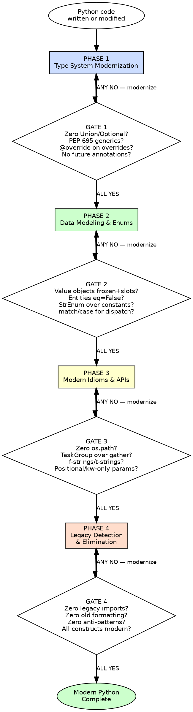

# Modern Python 3.14+

## Overview

Write Python that belongs in 2025, not 2018. Every construct must use its modern Python 3.14+ equivalent — legacy patterns are technical debt from the first keystroke.

**Core principle:** Python evolves fast. Code written with `Union[X, Y]` when `X | Y` exists, `os.path.join` when `pathlib` exists, or `asyncio.gather` when `TaskGroup` exists is **already legacy** the moment it is written.

**About this skill:** This skill serves as both an AI enforcement guide (with mandatory gates and verification checks) and a human reference for modern Python 3.14+ idioms. AI agents follow the phased gates during Python code review and generation. Humans can use it as a checklist, learning guide, or team onboarding reference.

**Violating the letter of these rules is violating the spirit of modern Python.**

## Key Concepts

- **PEP (Python Enhancement Proposal)** — The formal process for proposing changes to Python. Each PEP has a number (e.g., PEP 604 for `X | Y` union syntax). PEPs are the authoritative source for when and why a language feature was added.
- **Type Narrowing** — The ability of type checkers to refine a variable's type based on control flow (e.g., after an `isinstance` check or `is not None` guard). Modern Python's pattern matching (`match/case`) and `TypeGuard` enable precise narrowing.
- **Structural Subtyping (Protocol)** — A type relationship based on structure (what methods/attributes an object has) rather than inheritance (what class it extends). Python's `typing.Protocol` enables duck-typing with type safety.
- **Generic Syntax (PEP 695)** — Python 3.12+ syntax for generics: `def f[T](x: T) -> T` instead of `T = TypeVar('T')`. Cleaner, scoped, and the modern way to write generic code.
- **slots=True** — A dataclass parameter that generates `__slots__`, preventing dynamic attribute creation and reducing memory usage. Should be the default for all dataclasses unless dynamic attributes are explicitly needed.

## The Iron Law

```
EVERY CONSTRUCT MUST USE ITS MODERN PYTHON 3.14+ EQUIVALENT. LEGACY PATTERNS ARE DEFECTS, NOT PREFERENCES.
```

If a type hint uses `Union[X, Y]` when `X | Y` exists — it is a defect. Fix it. (PEP 604, Python 3.10+)
If a generic uses `TypeVar('T')` when `def f[T]()` exists — it is a defect. Fix it. (PEP 695, Python 3.12+)
If a data class omits `slots=True` without justification — it is a defect. Fix it. (Python 3.10+)
If a string interpolation uses `.format()` when an f-string works — it is a defect. Fix it. (PEP 498, Python 3.6+)
If `from __future__ import annotations` appears when PEP 649 is available — it is a defect. Remove it. (PEP 649, Python 3.14+)

**This gate is falsifiable at every level.** Point at any construct and ask: "Is there a modern equivalent?" Yes or No. No ambiguity.

## When to Use

**Always:**
- Writing new Python functions, classes, or modules
- Modifying existing Python code (any change, any size)
- Reviewing Python code (your own or others')
- Refactoring Python code to modern standards

**Especially when:**
- Starting a new project — set the standard from line one
- Under time pressure — legacy patterns create confusion and bugs that cost more later
- "The old way works" feels reasonable — that is rationalization speaking
- Adding to an existing codebase — the Boy Scout Rule applies: modernize what you touch

**Exceptions (require explicit human approval):**
- Code that must run on Python < 3.14 (specify minimum version)
- Vendored third-party code you do not own
- Generated code from tools (but review output through these gates)

## Legacy-to-Modern Quick Reference

This table is the centerpiece of the skill. Every legacy pattern maps to its modern replacement.

### Type Hints

| Legacy Pattern | Modern Replacement | Since | PEP |
|---|---|---|---|
| `Union[X, Y]` | `X \| Y` | 3.10 | 604 |
| `Optional[X]` | `X \| None` | 3.10 | 604 |
| `List[X]`, `Dict[K, V]`, `Tuple[X, ...]`, `Set[X]` | `list[X]`, `dict[K, V]`, `tuple[X, ...]`, `set[X]` | 3.9 | 585 |
| `FrozenSet[X]`, `Type[X]` | `frozenset[X]`, `type[X]` | 3.9 | 585 |
| `T = TypeVar('T')` then `def f(x: T) -> T` | `def f[T](x: T) -> T` | 3.12 | 695 |
| `T = TypeVar('T', bound=Base)` | `def f[T: Base](x: T) -> T` | 3.12 | 695 |
| `MyType = TypeAlias` or `MyType: TypeAlias = int` | `type MyType = int` | 3.12 | 695 |
| `TypeGuard[X]` | `TypeIs[X]` (narrows both branches) | 3.13 | 742 |
| `from __future__ import annotations` | Remove — PEP 649 deferred evaluation is native | 3.14 | 649 |
| `-> 'ClassName'` (forward references as strings) | `-> ClassName` (deferred evaluation handles it) | 3.14 | 649 |
| Return `self` typed as `-> 'ClassName'` | `-> Self` | 3.11 | 673 |
| `NoReturn` for never-returning functions | `Never` (more general, includes empty types) | 3.11 | 655 |
| No annotation on overridden methods | `@override` decorator on all overrides | 3.12 | 698 |

### Data Modeling

| Legacy Pattern | Modern Replacement | Since |
|---|---|---|
| `class Foo: __slots__ = (...)` manual slots | `@dataclass(slots=True)` | 3.10 |
| Mutable dataclass for value objects | `@dataclass(frozen=True, slots=True)` | 3.10 |
| Positional args for multi-field constructors | `@dataclass(kw_only=True)` | 3.10 |
| `class Status(str, Enum)` | `class Status(StrEnum)` with `auto()` | 3.11 |
| String constants for enumerations | `StrEnum` members | 3.11 |
| `NamedTuple` for structured data | `@dataclass(frozen=True, slots=True)` | 3.10 |
| `TypedDict` without key restrictions | `TypedDict(..., closed=True)` when extras forbidden | 3.14 |
| `TypedDict` with mutable fields | `ReadOnly[X]` for immutable fields | 3.13 |

### Control Flow & Error Handling

| Legacy Pattern | Modern Replacement | Since |
|---|---|---|
| `isinstance()` chains for dispatch | `match/case` structural pattern matching | 3.10 |
| `if x is not None: y = x` | `if (y := x) is not None:` (walrus) where clearer | 3.8 |
| `except (ValueError, TypeError):` | `except ValueError, TypeError:` (no parens needed) | 3.14 |
| Sequential validation error raising | `ExceptionGroup` + `except*` for aggregate errors | 3.11 |
| `try/except` with manual type narrowing | `except*` for selective exception handling | 3.11 |

### Async

| Legacy Pattern | Modern Replacement | Since |
|---|---|---|
| `asyncio.gather(*tasks)` | `async with asyncio.TaskGroup() as tg:` | 3.11 |
| Manual event loop management | `asyncio.Runner()` | 3.11 |
| `asyncio.get_event_loop()` | `asyncio.get_running_loop()` (inside async) | 3.10 |

### String & Path Handling

| Legacy Pattern | Modern Replacement | Since |
|---|---|---|
| `"{}".format(x)` or `"%s" % x` | `f"{x}"` | 3.6 |
| f-string limitations (no backslash, no nested) | Relaxed f-strings (any expression, nesting, comments) | 3.12 |
| `os.path.join()`, `os.path.exists()` | `pathlib.Path` / operator and methods | 3.4+ |
| f-strings for HTML/SQL interpolation | `t"..."` template strings for safe interpolation | 3.14 |
| `logging.info("msg %s" % x)` | `logging.info("msg %s", x)` (lazy evaluation) | — |

## Process Flow



---

## Phase 1 — Type System Modernization

**Goal:** Every type annotation uses Python 3.14+ syntax. Zero legacy typing imports for constructs with modern equivalents.

**Authorities:** Van Rossum (PEP 484), PEP 604 (Punie/Langa), PEP 695 (Tratt/Shannon), PEP 649 (Hastings), PEP 742 (Christensen)

### Rules

**Rule 1: Use `X | Y` union syntax — never `Union[X, Y]` or `Optional[X]`**

```python
# BAD — legacy Union/Optional
from typing import Union, Optional

def find_user(user_id: int) -> Optional[User]:
    ...

def process(value: Union[str, int]) -> Union[str, None]:
    ...
```

```python
# GOOD — modern union syntax (3.10+)
def find_user(user_id: int) -> User | None:
    ...

def process(value: str | int) -> str | None:
    ...
```

**Rule 2: Use built-in generics — never `typing.List`, `typing.Dict`, `typing.Tuple`, `typing.Set`**

```python
# BAD — legacy typing generics
from typing import List, Dict, Tuple, Set

def get_names() -> List[str]:
    ...

def get_config() -> Dict[str, Tuple[int, ...]]:
    ...
```

```python
# GOOD — built-in generics (3.9+)
def get_names() -> list[str]:
    ...

def get_config() -> dict[str, tuple[int, ...]]:
    ...
```

**Rule 3: Use PEP 695 type parameter syntax for generics**

```python
# BAD — legacy TypeVar
from typing import TypeVar

T = TypeVar('T')
K = TypeVar('K')
V = TypeVar('V')

def first(items: list[T]) -> T:
    ...

def merge(a: dict[K, V], b: dict[K, V]) -> dict[K, V]:
    ...
```

```python
# GOOD — PEP 695 type parameters (3.12+)
def first[T](items: list[T]) -> T:
    ...

def merge[K, V](a: dict[K, V], b: dict[K, V]) -> dict[K, V]:
    ...
```

**Rule 4: Use PEP 695 `type` statement for type aliases**

```python
# BAD — legacy type aliases
from typing import TypeAlias

UserId: TypeAlias = int
Result = str | None
JSON = str | int | float | bool | None | list['JSON'] | dict[str, 'JSON']
```

```python
# GOOD — PEP 695 type statement (3.12+)
type UserId = int
type Result = str | None
type JSON = str | int | float | bool | None | list[JSON] | dict[str, JSON]
```

Note: The `type` statement handles recursive types naturally — no string forward references needed.

**Rule 5: Use `Self` for return-self patterns and `Never` for no-return**

```python
# BAD — forward reference string for self-return
class Builder:
    def with_name(self, name: str) -> 'Builder':
        self.name = name
        return self
```

```python
# GOOD — Self type (3.11+)
from typing import Self

class Builder:
    def with_name(self, name: str) -> Self:
        self.name = name
        return self
```

```python
# GOOD — Never for functions that never return (3.11+)
from typing import Never

def fail(message: str) -> Never:
    raise RuntimeError(message)
```

**Rule 6: Use `@override` on every overridden method**

```python
# BAD — silent override, no protection against typos
from abc import ABC, abstractmethod

class Repository(ABC):
    @abstractmethod
    def find_by_id(self, entity_id: int) -> Entity | None:
        ...

class SqlRepository(Repository):
    def find_by_id(self, entity_id: int) -> Entity | None:  # override not marked
        ...
```

```python
# GOOD — explicit @override (3.12+)
from abc import ABC, abstractmethod
from typing import override

class Repository(ABC):
    @abstractmethod
    def find_by_id(self, entity_id: int) -> Entity | None:
        ...

class SqlRepository(Repository):
    @override
    def find_by_id(self, entity_id: int) -> Entity | None:
        ...
```

**Rule 7: Remove `from __future__ import annotations` — PEP 649 handles deferred evaluation**

```python
# BAD — unnecessary future import (3.14+)
from __future__ import annotations

class Order:
    def add_item(self, item: OrderItem) -> OrderConfirmation:
        ...
```

```python
# GOOD — PEP 649 deferred evaluation is native (3.14+)
class Order:
    def add_item(self, item: OrderItem) -> OrderConfirmation:
        ...
```

PEP 649 stores annotations lazily and evaluates them only when accessed. Forward references resolve naturally without string quotes or future imports.

### Gate 1 — Type System Modernization Checkpoint

| Check | Question |
|---|---|
| **Zero `Union[]`** | Does any type hint use `Union[X, Y]` instead of `X \| Y`? |
| **Zero `Optional[]`** | Does any type hint use `Optional[X]` instead of `X \| None`? |
| **Zero legacy generics** | Does any import use `typing.List`, `Dict`, `Tuple`, `Set`, `FrozenSet`, `Type`? |
| **PEP 695 generics** | Does any generic use `TypeVar('T')` instead of `def f[T]()`? |
| **PEP 695 aliases** | Does any alias use `TypeAlias` instead of `type X = ...`? |
| **`@override` present** | Does every overridden method have `@override`? |
| **No future annotations** | Does `from __future__ import annotations` appear anywhere? |

**ALL must be YES to proceed.** ANY NO → go back and modernize before continuing.

---

## Phase 2 — Data Modeling & Enums

**Goal:** Every data structure uses modern dataclass features. Every enumeration uses `StrEnum`. Every dispatch uses `match/case`.

**Authorities:** Hettinger (dataclasses), PEP 681 (dataclass transforms), PEP 659 (specializing adaptive interpreter), Van Rossum (PEP 634 — match/case)

### Rules

**Rule 1: Value objects use `@dataclass(frozen=True, slots=True)`**

```python
# BAD — mutable, no slots, wasteful
@dataclass
class Money:
    amount: Decimal
    currency: str
```

```python
# GOOD — immutable, memory-efficient value object
@dataclass(frozen=True, slots=True)
class Money:
    amount: Decimal
    currency: str
```

`frozen=True` gives you immutability and hashability. `slots=True` prevents dynamic attribute creation and reduces memory by ~40%.

**Rule 2: Entities use `@dataclass(eq=False, slots=True)` with identity-based equality**

```python
# BAD — default equality compares all fields (wrong for entities)
@dataclass
class Order:
    id: OrderId
    items: list[OrderItem]
```

```python
# GOOD — identity-based equality for entities
@dataclass(eq=False, slots=True)
class Order:
    id: OrderId
    items: list[OrderItem] = field(default_factory=list)

    def __eq__(self, other: object) -> bool:
        return isinstance(other, Order) and self.id == other.id

    def __hash__(self) -> int:
        return hash(self.id)
```

**Rule 3: Multi-field constructors use `kw_only=True`**

```python
# BAD — positional args for many fields (error-prone)
@dataclass(frozen=True, slots=True)
class Address:
    street: str
    city: str
    state: str
    zip_code: str
    country: str

# Is this street, city, state or city, state, street?
address = Address("123 Main St", "Springfield", "IL", "62704", "US")
```

```python
# GOOD — keyword-only forces explicit naming (3.10+)
@dataclass(frozen=True, slots=True, kw_only=True)
class Address:
    street: str
    city: str
    state: str
    zip_code: str
    country: str

# Crystal clear — no positional ambiguity
address = Address(street="123 Main St", city="Springfield", state="IL", zip_code="62704", country="US")
```

**Rule 4: Use `StrEnum` with `auto()` — never string constants or `str, Enum`**

```python
# BAD — string constants scattered across code
STATUS_PENDING = "pending"
STATUS_CONFIRMED = "confirmed"
STATUS_SHIPPED = "shipped"

# BAD — old-style str+Enum
class OrderStatus(str, Enum):
    PENDING = "pending"
    CONFIRMED = "confirmed"
```

```python
# GOOD — StrEnum with auto() (3.11+)
from enum import StrEnum, auto

class OrderStatus(StrEnum):
    PENDING = auto()      # "pending"
    CONFIRMED = auto()    # "confirmed"
    SHIPPED = auto()      # "shipped"
    DELIVERED = auto()    # "delivered"
```

`StrEnum` values are strings — they serialize naturally without `.value`. `auto()` generates lowercase member names.

**Rule 5: Use `match/case` for type dispatch and command/event handling**

```python
# BAD — isinstance chains
def handle(command):
    if isinstance(command, CreateOrder):
        return create(command)
    elif isinstance(command, CancelOrder):
        return cancel(command)
    elif isinstance(command, ShipOrder):
        return ship(command)
    else:
        raise UnknownCommand(command)
```

```python
# GOOD — structural pattern matching (3.10+)
def handle(command: Command) -> Result:
    match command:
        case CreateOrder(customer_id=cid, items=items):
            return self._create(cid, items)
        case CancelOrder(order_id=oid):
            return self._cancel(oid)
        case ShipOrder(order_id=oid, address=addr):
            return self._ship(oid, addr)
        case _:
            raise UnknownCommandError(command)
```

Pattern matching destructures naturally with dataclasses (they generate `__match_args__`). Guards (`if` clauses) add conditional logic.

**Rule 6: Domain events and commands are frozen, keyword-only dataclasses**

```python
# GOOD — immutable, clear construction, pattern-matchable
@dataclass(frozen=True, slots=True, kw_only=True)
class OrderPlaced:
    order_id: OrderId
    customer_id: CustomerId
    placed_at: datetime
    items: tuple[OrderItem, ...]  # tuple for immutability

@dataclass(frozen=True, slots=True, kw_only=True)
class CreateOrder:
    customer_id: CustomerId
    items: tuple[OrderItem, ...]
```

Use `tuple[...]` instead of `list[...]` for immutable collections in frozen dataclasses.

**Rule 7: Use `TypedDict(closed=True)` when extra keys are forbidden**

```python
# BAD — TypedDict allows any extra keys by default
class ApiResponse(TypedDict):
    status: int
    message: str
```

```python
# GOOD — closed TypedDict rejects unknown keys (3.14+)
class ApiResponse(TypedDict, closed=True):
    status: int
    message: str

# GOOD — ReadOnly for immutable fields (3.13+)
from typing import ReadOnly

class Config(TypedDict, closed=True):
    db_url: ReadOnly[str]
    debug: bool
```

### Gate 2 — Data Modeling Checkpoint

| Check | Question |
|---|---|
| **Value objects frozen+slots** | Do all value objects use `@dataclass(frozen=True, slots=True)`? |
| **Entities eq=False** | Do all entities use `eq=False` with custom identity equality? |
| **kw_only for 4+ fields** | Do dataclasses with 4+ fields use `kw_only=True`? |
| **StrEnum over constants** | Are all string enumerations `StrEnum`, not string constants or `str, Enum`? |
| **match/case for dispatch** | Is `match/case` used instead of `isinstance()` chains? |
| **Events/commands frozen** | Are all domain events and commands `frozen=True, slots=True, kw_only=True`? |
| **closed TypedDict** | Do TypedDicts that forbid extras use `closed=True`? |

**ALL must be YES to proceed.** ANY NO → go back and modernize before continuing.

---

## Phase 3 — Modern Idioms & APIs

**Goal:** Every API call, string operation, and parameter declaration uses its modern Python 3.14+ equivalent.

**Authorities:** Van Rossum (PEP 572 — walrus), PEP 750 (Krekel/Smith — t-strings), PEP 758 (Vieira — except syntax), Ronacher (pathlib advocacy)

### Rules

**Rule 1: Use `pathlib.Path` — never `os.path`**

```python
# BAD — os.path is procedural and stringly-typed
import os

config_path = os.path.join(base_dir, "config", "settings.toml")
if os.path.exists(config_path):
    with open(config_path) as f:
        content = f.read()

for name in os.listdir(schemas_dir):
    if name.endswith(".json"):
        full = os.path.join(schemas_dir, name)
```

```python
# GOOD — pathlib is object-oriented and composable
from pathlib import Path

config_path = Path(base_dir) / "config" / "settings.toml"
if config_path.exists():
    content = config_path.read_text(encoding="utf-8")

for schema in Path(schemas_dir).glob("*.json"):
    ...
```

**Rule 2: Use f-strings with 3.12+ relaxed syntax — never `.format()` or `%`**

```python
# BAD — old-style formatting
message = "Order {} for customer {}".format(order_id, customer_name)
message = "Order %s for customer %s" % (order_id, customer_name)
```

```python
# GOOD — f-strings (3.12+ relaxed: nesting, backslashes, comments allowed)
message = f"Order {order_id} for customer {customer_name}"

# Complex expressions are fine in 3.12+
summary = f"Total: {
    sum(item.price for item in order.items)  # includes tax
:.2f}"
```

**Exception:** Use `%s` style ONLY in `logging` calls for lazy evaluation:
```python
# CORRECT — logging uses lazy % formatting
logger.info("Processing order %s for customer %s", order_id, customer_id)
```

**Rule 3: Use t-strings for safe string interpolation (3.14+)**

```python
# BAD — f-strings for HTML/SQL (injection risk)
html = f"<p>Hello {user_name}</p>"
query = f"SELECT * FROM users WHERE name = '{name}'"
```

```python
# GOOD — t-strings produce Template objects for safe processing (3.14+)
html = t"<p>Hello {user_name}</p>"    # Template object, NOT a string
query = t"SELECT * FROM users WHERE name = {name}"  # safe parameterization

# Libraries process the Template object safely
rendered = html_escape(html)
result = db.execute(query)  # library extracts params safely
```

t-strings separate static parts from interpolated values, enabling libraries to process them safely (escaping, parameterization).

**Rule 4: Use positional-only `/` and keyword-only `*` parameters**

```python
# BAD — all parameters are ambiguous
def create_user(name, email, role="user", active=True):
    ...
```

```python
# GOOD — clear API boundaries
def create_user(
    name: str,           # positional-only (implementation detail)
    /,
    email: str,          # positional or keyword
    *,
    role: str = "user",  # keyword-only (configuration)
    active: bool = True,
) -> User:
    ...
```

Use `/` for parameters whose names are implementation details (callers should not depend on the name). Use `*` for configuration/optional parameters (callers must name them explicitly).

**Rule 5: Use `ExceptionGroup` and `except*` for aggregate errors**

```python
# BAD — raising only the first error, losing the rest
def validate(order: Order) -> None:
    if not order.customer_id:
        raise ValidationError("Customer required")
    if not order.items:
        raise ValidationError("Items required")
    # Second error never reached if first fails
```

```python
# GOOD — collect and raise all errors (3.11+)
def validate(order: Order) -> None:
    errors: list[ValidationError] = []
    if not order.customer_id:
        errors.append(ValidationError("Customer required"))
    if not order.items:
        errors.append(ValidationError("Items required"))
    if errors:
        raise ExceptionGroup("Validation failed", errors)

# Catching with except* (3.11+)
try:
    validate_and_save(order)
except* ValidationError as eg:
    for err in eg.exceptions:
        log_validation_error(err)
except* PermissionError:
    handle_auth_failure()
```

**Rule 6: Use `asyncio.TaskGroup` — never `asyncio.gather`**

```python
# BAD — gather has poor error handling, no structured concurrency
results = await asyncio.gather(
    validate_inventory(order),
    process_payment(order),
    notify_customer(order),
)
```

```python
# GOOD — TaskGroup with structured concurrency (3.11+)
async with asyncio.TaskGroup() as tg:
    inv_task = tg.create_task(validate_inventory(order))
    pay_task = tg.create_task(process_payment(order))
    notify_task = tg.create_task(notify_customer(order))
# All tasks completed or ExceptionGroup raised
# Access results: inv_task.result(), pay_task.result()
```

`TaskGroup` guarantees all tasks complete or all are cancelled on error. `gather` can leave orphaned tasks.

**Rule 7: Use walrus operator `:=` where it eliminates redundancy**

```python
# BAD — redundant computation or variable
match = pattern.search(text)
if match:
    process(match)

filtered = []
for raw in inputs:
    cleaned = sanitize(raw)
    if cleaned is not None:
        filtered.append(cleaned)
```

```python
# GOOD — walrus eliminates redundancy
if (match := pattern.search(text)):
    process(match)

filtered = [cleaned for raw in inputs if (cleaned := sanitize(raw)) is not None]

while (chunk := stream.read(8192)):
    process(chunk)
```

Use walrus only when it **reduces** complexity. Do not force it into simple assignments.

### Gate 3 — Modern Idioms Checkpoint

| Check | Question |
|---|---|
| **Zero `os.path`** | Does any code use `os.path` instead of `pathlib.Path`? |
| **f-strings everywhere** | Does any non-logging string use `.format()` or `%` formatting? |
| **t-strings for interpolation** | Are HTML/SQL/template strings using `t"..."` instead of `f"..."`? |
| **Positional/keyword params** | Do public APIs use `/` and `*` to clarify parameter intent? |
| **ExceptionGroup for aggregates** | Are aggregate errors using `ExceptionGroup`, not single-raise? |
| **TaskGroup over gather** | Does async code use `TaskGroup` instead of `asyncio.gather`? |
| **Walrus where appropriate** | Are match-and-use patterns using `:=` to eliminate redundancy? |

**ALL must be YES to proceed.** ANY NO → go back and modernize before continuing.

---

## Phase 4 — Legacy Detection & Elimination

**Goal:** Zero legacy patterns remain. Every construct has been verified against the Legacy-to-Modern table.

**Authorities:** All PEP authors above, Python core developers, Python 3.14 What's New documentation

### Rules

**Rule 1: No `from __future__ import annotations`**

PEP 649 makes deferred evaluation native in Python 3.14. The `__future__` import is unnecessary and misleading — it suggests the codebase targets older Python.

**Rule 2: No `typing.Union`, `typing.Optional`, or legacy generic imports**

Scan every import statement. These imports must not exist:
- `from typing import Union`
- `from typing import Optional`
- `from typing import List, Dict, Tuple, Set, FrozenSet, Type`
- `from typing import TypeAlias`

**Rule 3: No `NamedTuple` where `@dataclass` fits**

```python
# BAD — NamedTuple is limited (no slots, no frozen mutation control, no kw_only)
class Point(NamedTuple):
    x: float
    y: float
```

```python
# GOOD — dataclass with all modern features
@dataclass(frozen=True, slots=True)
class Point:
    x: float
    y: float
```

`NamedTuple` is acceptable only when tuple unpacking is genuinely needed (e.g., returning from a function where positional access is the API).

**Rule 4: No bare `dict` for structured data**

```python
# BAD — stringly-typed, no validation, no IDE support
def get_user() -> dict:
    return {"name": "Alice", "age": 30, "role": "admin"}
```

```python
# GOOD — typed, validated, discoverable
@dataclass(frozen=True, slots=True)
class UserInfo:
    name: str
    age: int
    role: str
```

Use `TypedDict` only when interacting with JSON/dict-based APIs. Use `@dataclass` for domain objects.

**Rule 5: No `isinstance()` chains where `match/case` fits**

Scan for `if isinstance(x, A): ... elif isinstance(x, B):` patterns. Replace with `match/case` unless the types do not support pattern matching.

**Rule 6: No unparenthesized multi-exception legacy syntax confusion**

```python
# Python 3.14+ allows unparenthesized (PEP 758)
except ValueError, TypeError:     # GOOD in 3.14+
except ValueError, TypeError as e:  # GOOD in 3.14+
```

Verify the codebase consistently uses one style for multi-exception handling.

**Rule 7: No legacy async patterns**

Scan for:
- `asyncio.gather` → replace with `TaskGroup`
- `asyncio.get_event_loop()` → replace with `asyncio.get_running_loop()` (inside async) or `asyncio.Runner()` (entry point)
- Manual `loop.run_until_complete()` → replace with `asyncio.run()` or `asyncio.Runner()`
- `@asyncio.coroutine` / `yield from` → replace with `async def` / `await`

### Gate 4 — Legacy Elimination Checkpoint

| Check | Question |
|---|---|
| **Zero future annotations** | Does `from __future__ import annotations` appear anywhere? |
| **Zero legacy typing imports** | Do any files import `Union`, `Optional`, `List`, `Dict`, `Tuple`, `Set`, `TypeAlias` from `typing`? |
| **Zero old formatting** | Does any non-logging code use `%` or `.format()` instead of f-strings? |
| **Zero bare dicts** | Are all structured return types typed with `@dataclass` or `TypedDict`? |
| **Zero isinstance chains** | Are all type-dispatch patterns using `match/case`? |
| **Zero legacy async** | Are all async patterns using `TaskGroup`, `Runner`, `get_running_loop`? |
| **Full table compliance** | Has every entry in the Legacy-to-Modern table been checked? |

**ALL must be YES to proceed.** ANY NO → go back and modernize before continuing.

---

## Red Flags — STOP and Modernize

### Phase 1 — Type System
- `from typing import Union` appears in new code
- `Optional[X]` used instead of `X | None`
- `T = TypeVar('T')` in a file targeting 3.12+
- `TypeAlias` annotation instead of `type` statement
- Missing `@override` on a method that overrides a base class method
- `from __future__ import annotations` in a 3.14+ project
- Forward references as strings (`-> 'ClassName'`) when PEP 649 is active

### Phase 2 — Data Modeling
- `@dataclass` without `slots=True` and no justification
- Mutable dataclass used for a value object
- String constants used where `StrEnum` belongs
- `isinstance()` chain with 3+ branches instead of `match/case`
- Domain event or command that is not `frozen=True`

### Phase 3 — Modern Idioms
- `os.path.join()` or `os.path.exists()` in new code
- `.format()` or `%` formatting in non-logging code
- `f"..."` used for HTML or SQL interpolation (should be `t"..."`)
- `asyncio.gather()` in new async code
- Public API with no positional-only or keyword-only separation

### Phase 4 — Legacy Elimination
- "It works" used as justification for legacy patterns
- "The team is used to the old way" — habits are not standards
- "We'll modernize later" — later never comes

**All of these mean: Modernize now. No exceptions.**

## Rationalization Table

| Excuse | Reality |
|---|---|
| "`Union[X, Y]` is more explicit" | `X \| Y` is the standard since 3.10. `Union` is legacy. |
| "`Optional[X]` reads better" | `X \| None` is universally understood. `Optional` misleads — it does not mean the parameter is optional. |
| "`TypeVar` is more flexible" | PEP 695 syntax supports bounds, constraints, and variance. It is strictly superior. |
| "We don't need `slots=True`" | 40% memory reduction, prevents accidental attribute creation, faster access. Always use it. |
| "`frozen=True` is inconvenient for updates" | Use `dataclasses.replace()` for immutable updates. Mutability in value objects is a bug. |
| "`os.path` is simpler for one-liners" | `pathlib` is simpler: `Path(a) / b` vs `os.path.join(a, b)`. Consistency matters more than familiarity. |
| "`.format()` is fine, f-strings are just sugar" | f-strings are faster, more readable, and support full expressions in 3.12+. `.format()` is legacy. |
| "`asyncio.gather` works fine" | `TaskGroup` provides structured concurrency and proper error handling. `gather` can leak tasks. |
| "Walrus operator is confusing" | Used correctly (match-and-use), it reduces duplication. Avoid when it hurts readability. |
| "`match/case` is overkill for 2 branches" | Two branches today become five tomorrow. Pattern matching destructures naturally. Start modern. |
| "`NamedTuple` is lighter than dataclass" | `@dataclass(frozen=True, slots=True)` is equally light with more features. |
| "We'll modernize later" | Later never comes. Legacy patterns spread. Modernize at the point of creation. |
| "The old way is more portable" | This project targets 3.14+. Portability to older Python is not a requirement. |
| "`@override` is just decoration" | `@override` catches silent bugs where a base method is renamed and the subclass override becomes dead code. |
| "t-strings are too new" | This project targets 3.14+. Use t-strings for all safe interpolation use cases. |
| "`from __future__ import annotations` doesn't hurt" | It conflicts with PEP 649 behavior. It is actively misleading in a 3.14+ codebase. Remove it. |

## Verification Checklist

Before marking any Python code complete, verify every item:

- [ ] **Zero `Union[]` or `Optional[]`** — all unions use `X | Y` syntax
- [ ] **Zero legacy generic imports** — all generics use built-in `list`, `dict`, `tuple`, `set`
- [ ] **PEP 695 everywhere** — all generics use `def f[T]()`, all aliases use `type X = ...`
- [ ] **`@override` on all overrides** — every method overriding a base class has the decorator
- [ ] **No `from __future__ import annotations`** — PEP 649 handles deferred evaluation
- [ ] **Value objects: `frozen=True, slots=True`** — all value objects are immutable and slotted
- [ ] **Entities: `eq=False`** — all entities use identity-based equality
- [ ] **`StrEnum` for enumerations** — no string constants or `str, Enum` patterns
- [ ] **`match/case` for dispatch** — no `isinstance()` chains
- [ ] **`pathlib.Path` everywhere** — zero `os.path` usage
- [ ] **f-strings for formatting** — `.format()` and `%` only in logging calls
- [ ] **`TaskGroup` for concurrency** — zero `asyncio.gather` in new code

## Related Skills

- **clean-code** — naming, function discipline, structural clarity (language-agnostic foundations)
- **solid-principles** — SRP, OCP, LSP, ISP, DIP enforcement with ABC examples
- **design-patterns** — problem-first pattern selection, GoF + modern patterns
- **refactoring** — behavior-preserving transformation with smell-to-technique mapping

**Reading order:** This is skill 5 of 8. Prerequisites: clean-code, solid-principles. Next: architecture-decisions. See `skills/READING_ORDER.md` for the full path.
