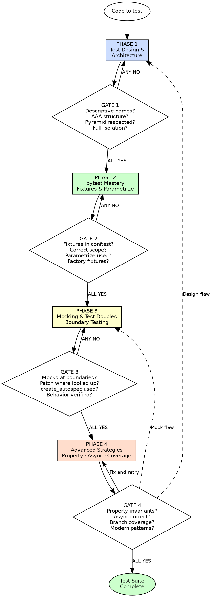

# Python Testing

## Overview

Test behavior, not implementation. Every test earns its place by catching a real bug or documenting a real requirement.

**Core principle:** Tests are executable specifications of what code should do. A test suite that breaks on every refactor is a liability. A test suite that catches every regression is an asset. The difference is whether tests are coupled to behavior or implementation.

**About this skill:** This skill serves as both an AI enforcement guide (with mandatory gates and verification checks) and a human reference for modern Python 3.12+ testing. AI agents follow the phased gates during test writing and review. Humans can use it as a checklist, learning guide, or team onboarding reference.

**Violating the letter of these rules is violating the spirit of testing.**

## Quick Reference — Phases at a Glance

| Phase | What You Do | Gate Question |
|---|---|---|
| 1 — Test Design & Architecture | Plan test structure: pyramid, naming, AAA, isolation, file layout | Can a developer understand each test's purpose from its name? Is every test independent? |
| 2 — pytest Mastery | Use fixtures, parametrize, markers, conftest hierarchy | Is shared setup in fixtures? Are variations parametrized, not copy-pasted? |
| 3 — Mocking & Test Doubles | Mock at boundaries only, spec all mocks, verify behavior | Are mocks only at I/O boundaries? Does every mock have a spec? |
| 4 — Advanced Strategies | Property-based testing, async testing, coverage, modern patterns | Do property tests cover invariants? Are async tests using pytest-asyncio correctly? |

**Each phase has a mandatory gate. ALL gate checks must pass before proceeding to the next phase.**

## Key Concepts

- **Test Pyramid** — A model where the test suite has many fast unit tests at the base, fewer integration tests in the middle, and very few end-to-end tests at the top. Inverting the pyramid produces slow, brittle, hard-to-debug suites. (Fowler, "TestPyramid"; Cohn, Succeeding with Agile)
- **Test Double** — A generic term for any object used in place of a real dependency in a test. Subtypes: stub (returns canned answers), mock (verifies interactions), fake (working implementation with shortcuts), spy (records calls for later verification). (Meszaros, xUnit Test Patterns)
- **Fixture** — In pytest, a composable function that provides test setup and teardown. Fixtures replace xUnit setUp/tearDown with dependency injection, explicit scope, and lazy evaluation. (Okken, Python Testing with pytest Ch. 3)
- **Property-Based Testing** — Testing that a property (invariant) holds for all inputs drawn from a strategy, rather than checking specific examples. The framework generates, shrinks, and replays counterexamples automatically. (MacIver, Hypothesis documentation)
- **Arrange-Act-Assert (AAA)** — The canonical test structure: set up preconditions (Arrange), perform the action under test (Act), verify the result (Assert). A test with more than one Act section is testing multiple behaviors. (Beck, TDD by Example)
- **Branch Coverage** — A coverage metric that measures whether both the true and false branches of every conditional have been exercised. Higher fidelity than line coverage, which can miss untested branches in single-line expressions. (pytest-cov documentation; coverage.py)

## The Iron Law

```
EVERY TEST VERIFIES BEHAVIOR, NOT IMPLEMENTATION.
EVERY MOCK LIVES AT AN ARCHITECTURAL BOUNDARY, NOWHERE ELSE.
EVERY TEST IS INDEPENDENT, ISOLATED, AND REPEATABLE.
```

If a test breaks when you refactor without changing behavior, the test is coupled to implementation — it is a maintenance burden, not a safety net. (Fowler, "Mocks Aren't Stubs"; Percival, TDD with Python Ch. 22)

If a mock replaces a collaborator that is not an I/O boundary, the test is verifying wiring, not behavior. Such tests provide false confidence and resist refactoring. (Freeman/Pryce, Growing Object-Oriented Software Guided by Tests)

If a test depends on another test's side effects, execution order, or shared mutable state, it is a flaky time bomb. Tests must run in any order, in parallel, in isolation. (Okken, Python Testing with pytest Ch. 2)

**This gate is falsifiable at every level.** Point at any test and ask: "Does this test verify what the code does, or how it does it?" The answer must be "what." No ambiguity.

## When to Use

**Always:**
- Writing new functions, classes, or modules
- Fixing bugs (write a test that reproduces the bug first)
- Refactoring (establish safety net before any structural change)
- Reviewing test code (your own or others')

**Especially when:**
- Starting a new project — set testing standards from line one
- Under time pressure — tests save more time than they cost within hours
- Legacy code with no tests — write characterization tests first (Feathers, Working Effectively with Legacy Code)
- Code that handles money, authentication, or user data — correctness is non-negotiable

**Exceptions (require explicit human approval):**
- Throwaway prototypes explicitly marked for deletion
- One-time scripts that will never be maintained
- Exploratory spikes (but write tests before committing)

## Process Flow



Announce at the start: **"Using python-testing skill — running 4-phase enforcement."**

---

## Phase 1 — Test Design & Architecture

**Purpose:** Before writing a single test, design the test structure. Choose the right level (unit, integration, e2e), name tests descriptively, follow AAA, and ensure every test is independent. Poor test architecture makes suites slow, brittle, and misleading.

**Authorities:** Fowler ("TestPyramid"), Beck (TDD by Example), Cohn (Succeeding with Agile), Percival (TDD with Python)

### Rules

**1. Respect the test pyramid — unit >> integration >> e2e.**

Unit tests are fast, isolated, and pinpoint failures. Integration tests verify boundaries. E2e tests verify workflows. Inverting the pyramid (many e2e, few unit) produces slow, flaky suites that tell you *something* is broken but not *what*. (Fowler, "TestPyramid")

**2. Name every test: `test_<unit>_<scenario>_<expected_outcome>`.**

A test name is its specification. A reader should understand the behavior being tested without reading the body.

BAD:
```python
def test_order():
    order = Order()
    order.add_item(Item("widget", 10.00))
    assert order.total == 10.00
```

GOOD:
```python
def test_order_total_with_single_item_returns_item_price():
    order = Order()
    order.add_item(Item("widget", price=Decimal("10.00")))
    assert order.total == Decimal("10.00")
```

(Percival, TDD with Python Ch. 6; Okken, Python Testing with pytest Ch. 2)

**3. Every test follows Arrange-Act-Assert with clear separation.**

Arrange sets up preconditions. Act performs the single action under test. Assert verifies the outcome. One Act per test — multiple Acts mean multiple behaviors crammed into one test.

BAD:
```python
def test_user_workflow():
    user = User("alice")
    user.activate()
    assert user.is_active
    user.deactivate()
    assert not user.is_active
    user.delete()
    assert user.is_deleted
```

GOOD:
```python
def test_activate_user_sets_active_flag():
    user = User("alice")

    user.activate()

    assert user.is_active is True


def test_deactivate_active_user_clears_active_flag():
    user = User("alice", active=True)

    user.deactivate()

    assert user.is_active is False
```

(Beck, TDD by Example)

**4. Every test is independent and isolated — no shared mutable state, no order dependency.**

If test B relies on state left by test A, both are broken. Tests must be runnable in any order, in parallel, in isolation. Use fixtures for setup, not shared module-level state.

BAD:
```python
results = []

def test_step_one():
    results.append("processed")
    assert len(results) == 1

def test_step_two():
    assert len(results) == 1  # depends on test_step_one running first
```

GOOD:
```python
def test_step_one():
    results: list[str] = []
    results.append("processed")
    assert len(results) == 1

def test_step_two():
    results = ["processed"]
    assert len(results) == 1
```

**5. Mirror source structure in test structure.**

If the source is `src/billing/invoice.py`, the test is `tests/billing/test_invoice.py`. This makes finding tests trivial and keeps the test suite navigable as the project grows. (Okken, Python Testing with pytest Ch. 2)

**6. One logical assertion per test.**

A test may contain multiple `assert` statements if they verify the same logical concept. But if assertions verify different behaviors, split into separate tests. Each test failure should point to exactly one broken behavior.

BAD:
```python
def test_create_user():
    user = create_user("alice", "alice@example.com")
    assert user.name == "alice"
    assert user.email == "alice@example.com"
    assert user.is_active is False
    assert user.created_at is not None
    assert len(user.roles) == 0
    assert user.can_login() is False  # different behavior
```

GOOD:
```python
def test_create_user_sets_profile_fields():
    user = create_user("alice", "alice@example.com")
    assert user.name == "alice"
    assert user.email == "alice@example.com"
    assert user.created_at is not None


def test_create_user_starts_inactive_with_no_roles():
    user = create_user("alice", "alice@example.com")
    assert user.is_active is False
    assert len(user.roles) == 0


def test_inactive_user_cannot_login():
    user = create_user("alice", "alice@example.com")
    assert user.can_login() is False
```

### Gate 1 — Mandatory Checkpoint

Before proceeding to Phase 2, ALL must be YES:

- [ ] Does every test name describe the scenario and expected outcome?
- [ ] Does every test follow Arrange-Act-Assert with clear separation?
- [ ] Does the test suite respect the pyramid (unit >> integration >> e2e)?
- [ ] Is every test independent and isolated (no order dependency, no shared mutable state)?
- [ ] Does the test file structure mirror the source structure?
- [ ] Does each test verify one logical assertion?

**ALL YES → proceed to Phase 2. ANY NO → fix before continuing.**

---

## Phase 2 — pytest Mastery

**Purpose:** pytest is the testing framework for modern Python. Master its features — fixtures, parametrize, markers, conftest — to write tests that are concise, composable, and maintainable. Tests are code; apply the same quality standards.

**Authorities:** Okken (Python Testing with pytest), pytest documentation

### Rules

**1. Use fixtures for shared setup — never duplicate setup across tests.**

If three or more tests share the same Arrange section, extract it into a `@pytest.fixture`. Fixtures are dependency injection for tests — explicit, composable, and scoped.

BAD:
```python
def test_order_total():
    db = Database(":memory:")
    db.connect()
    repo = OrderRepository(db)
    order = repo.create_order(customer_id=1)
    order.add_item(Item("widget", Decimal("10.00")))
    assert order.total == Decimal("10.00")

def test_order_empty():
    db = Database(":memory:")
    db.connect()
    repo = OrderRepository(db)
    order = repo.create_order(customer_id=1)
    assert order.total == Decimal("0")
```

GOOD:
```python
@pytest.fixture
def order(db_session: Session) -> Order:
    repo = OrderRepository(db_session)
    return repo.create_order(customer_id=1)

def test_order_total_with_single_item(order: Order):
    order.add_item(Item("widget", price=Decimal("10.00")))
    assert order.total == Decimal("10.00")

def test_empty_order_has_zero_total(order: Order):
    assert order.total == Decimal("0")
```

(Okken, Python Testing with pytest Ch. 3)

**2. Use factory fixtures instead of complex parameterized fixtures.**

When tests need variations of the same object, create a factory fixture that returns a callable. This keeps fixture scope simple and gives each test control over its own data.

BAD:
```python
@pytest.fixture(params=["admin", "viewer", "editor"])
def user(request: pytest.FixtureRequest) -> User:
    return User(role=request.param)
```

GOOD:
```python
@pytest.fixture
def make_user() -> Callable[..., User]:
    def _make_user(role: str = "viewer", active: bool = True) -> User:
        return User(role=role, active=active)
    return _make_user

def test_admin_can_delete(make_user: Callable[..., User]):
    admin = make_user(role="admin")
    assert admin.can_delete is True

def test_viewer_cannot_delete(make_user: Callable[..., User]):
    viewer = make_user(role="viewer")
    assert viewer.can_delete is False
```

(Okken, Python Testing with pytest Ch. 5)

**3. Use `@pytest.mark.parametrize` for input variations — never copy-paste tests.**

When the same test logic applies to multiple inputs, parametrize it. The test body stays DRY, and each parameter set appears as a separate test case in the output.

BAD:
```python
def test_validate_email_valid():
    assert is_valid_email("user@example.com") is True

def test_validate_email_valid_with_plus():
    assert is_valid_email("user+tag@example.com") is True

def test_validate_email_invalid_no_at():
    assert is_valid_email("userexample.com") is False

def test_validate_email_invalid_no_domain():
    assert is_valid_email("user@") is False
```

GOOD:
```python
@pytest.mark.parametrize(
    ("email", "expected"),
    [
        ("user@example.com", True),
        ("user+tag@example.com", True),
        ("userexample.com", False),
        ("user@", False),
    ],
    ids=["valid-basic", "valid-plus-tag", "missing-at", "missing-domain"],
)
def test_email_validation(email: str, expected: bool):
    assert is_valid_email(email) is expected
```

(Okken, Python Testing with pytest Ch. 4)

**4. Place shared fixtures in `conftest.py` at the correct hierarchy level.**

A fixture used by one test file belongs in that file. A fixture used across a test directory belongs in that directory's `conftest.py`. A fixture used project-wide belongs in the root `conftest.py`. Never put all fixtures in a single root conftest.

BAD:
```
tests/
    conftest.py          # 50 fixtures, some used by only one file
    test_auth.py
    test_billing.py
```

GOOD:
```
tests/
    conftest.py          # project-wide fixtures (db_session, client)
    auth/
        conftest.py      # auth-specific fixtures (authenticated_user)
        test_login.py
        test_permissions.py
    billing/
        conftest.py      # billing-specific fixtures (invoice, payment)
        test_invoice.py
        test_payment.py
```

(Okken, Python Testing with pytest Ch. 3)

**5. Use appropriate fixture scope — default to `function`, widen only with justification.**

`scope="function"` (default) creates a fresh fixture per test — safe and isolated. Use `scope="session"` only for expensive, truly immutable resources (database engine creation, loading large datasets). A session-scoped fixture that mutates state is a bug factory.

BAD:
```python
@pytest.fixture(scope="session")
def user() -> User:
    return User(name="alice", active=True)  # mutated by tests, shared across all

def test_deactivate(user: User):
    user.deactivate()  # mutates the session-scoped fixture
    assert not user.is_active

def test_is_active(user: User):
    assert user.is_active  # FAILS because test_deactivate mutated it
```

GOOD:
```python
@pytest.fixture(scope="session")
def db_engine() -> Engine:
    engine = create_engine("sqlite:///:memory:")
    Base.metadata.create_all(engine)
    return engine  # immutable, safe to share

@pytest.fixture
def user() -> User:
    return User(name="alice", active=True)  # fresh per test
```

**6. Use `yield` fixtures for teardown — not `addfinalizer`.**

`yield` fixtures are clearer: setup code before yield, teardown code after. The fixture function reads as a single narrative.

BAD:
```python
@pytest.fixture
def tmp_config(request: pytest.FixtureRequest) -> Path:
    path = Path("/tmp/test_config.toml")
    path.write_text("[settings]\ndebug = true")
    request.addfinalizer(lambda: path.unlink(missing_ok=True))
    return path
```

GOOD:
```python
@pytest.fixture
def tmp_config(tmp_path: Path) -> Iterator[Path]:
    config = tmp_path / "config.toml"
    config.write_text("[settings]\ndebug = true")
    yield config
    # teardown: tmp_path is cleaned up automatically by pytest
```

**7. Use markers to categorize tests — `slow`, `integration`, `e2e`.**

Mark tests by speed and scope so the suite can be run selectively. Fast unit tests run on every save; slow integration tests run in CI.

```python
@pytest.mark.slow
def test_full_data_pipeline(db_session: Session):
    ...

@pytest.mark.integration
def test_external_api_contract(httpx_mock):
    ...
```

```ini
# pyproject.toml
[tool.pytest.ini_options]
markers = [
    "slow: marks tests as slow (deselect with '-m \"not slow\"')",
    "integration: marks integration tests",
]
```

(Okken, Python Testing with pytest Ch. 6)

### Gate 2 — Mandatory Checkpoint

Before proceeding to Phase 3, ALL must be YES:

- [ ] Is shared setup extracted into fixtures (no duplicated Arrange blocks)?
- [ ] Are fixtures placed in conftest.py at the correct hierarchy level?
- [ ] Is fixture scope appropriate (function default, wider only with justification)?
- [ ] Are input variations parametrized, not copy-pasted?
- [ ] Do factory fixtures replace complex parameterized fixtures?
- [ ] Do fixtures use `yield` for teardown?
- [ ] Are tests categorized with markers (slow, integration, e2e)?

**ALL YES → proceed to Phase 3. ANY NO → refactor tests first.**

---

## Phase 3 — Mocking & Test Doubles

**Purpose:** Mocks isolate the code under test from external dependencies — databases, APIs, filesystems, clocks. But mocks are a scalpel, not a sledgehammer. Over-mocking produces tests that verify wiring, not behavior. Mock at architectural boundaries and nowhere else.

**Authorities:** Fowler ("Mocks Aren't Stubs"), Freeman/Pryce (Growing Object-Oriented Software Guided by Tests), Python documentation (unittest.mock)

### Rules

**1. Mock only at architectural boundaries — I/O, time, randomness, external services.**

An architectural boundary is where your code talks to the outside world: database queries, HTTP calls, filesystem operations, system clock, random number generation. Mock these. Do not mock internal collaborators, private methods, or pure logic.

BAD:
```python
def test_calculate_price():
    # mocking an internal pure function — tests nothing meaningful
    with patch("pricing.apply_tax") as mock_tax:
        mock_tax.return_value = Decimal("110.00")
        result = calculate_price(Decimal("100.00"))
    assert result == Decimal("110.00")
```

GOOD:
```python
def test_calculate_price_applies_tax():
    # no mocks needed — pure function, test inputs and outputs
    result = calculate_price(price=Decimal("100.00"), tax_rate=Decimal("0.10"))
    assert result == Decimal("110.00")

@pytest.mark.asyncio
async def test_fetch_exchange_rate_calls_api(mocker: MockerFixture):
    # mock the HTTP boundary
    mock_get = mocker.patch("forex.httpx.AsyncClient.get", new_callable=AsyncMock)
    mock_get.return_value = Response(200, json={"rate": 1.25})
    rate = await fetch_exchange_rate("USD", "EUR")
    assert rate == Decimal("1.25")
```

(Fowler, "Mocks Aren't Stubs"; Freeman/Pryce, GOOS Ch. 8)

**2. Patch where the name is looked up, not where it is defined.**

Python resolves names at the import site. If `billing.py` does `from datetime import datetime`, patch `billing.datetime`, not `datetime.datetime`.

BAD:
```python
# billing.py: from datetime import datetime
# This patches the WRONG location
with patch("datetime.datetime") as mock_dt:
    mock_dt.now.return_value = datetime(2025, 1, 1)
    result = billing.generate_invoice()  # still uses real datetime
```

GOOD:
```python
# billing.py: from datetime import datetime
# Patch where the name is LOOKED UP
with patch("billing.datetime") as mock_dt:
    mock_dt.now.return_value = datetime(2025, 1, 1)
    result = billing.generate_invoice()  # uses mocked datetime
```

(Python documentation, unittest.mock — "Where to patch")

**3. Always use `spec=True` or `create_autospec` — unspecced mocks are silent liars.**

An unspecced `Mock()` accepts any attribute access and any method call without complaint. If the real interface changes, the mock silently continues to pass. `create_autospec` mirrors the real object's interface — mismatched calls raise `AttributeError` at test time.

BAD:
```python
mock_repo = Mock()
mock_repo.get_uesr(user_id=1)  # typo: "get_uesr" — mock accepts it silently
```

GOOD:
```python
mock_repo = create_autospec(UserRepository)
mock_repo.get_uesr(user_id=1)  # AttributeError: 'get_uesr' is not in spec
```

(Python documentation, unittest.mock — "create_autospec")

**4. Use `AsyncMock` for async functions — do not wrap sync mocks in coroutines.**

When mocking async functions, use `AsyncMock` (or `create_autospec` on an async function, which returns `AsyncMock` automatically). Never manually wrap a `Mock` return value in a coroutine.

BAD:
```python
mock_fetch = Mock()

async def _fake_fetch():
    return {"data": "value"}

mock_fetch.return_value = _fake_fetch()  # returns a coroutine, but Mock is not awaitable
```

GOOD:
```python
mock_fetch = AsyncMock(return_value={"data": "value"})
# or
mock_service = create_autospec(DataService)  # async methods become AsyncMock
```

**5. Verify behavior, not mock call counts — assert on outcomes, not implementation.**

The purpose of a test is to verify what the code does, not how many times it calls its collaborators. Assert on return values, state changes, or side effects — not on `call_count` or `assert_called_once_with` as the primary assertion.

BAD:
```python
def test_process_order(mocker: MockerFixture):
    mock_notify = mocker.patch("orders.send_notification")
    mock_log = mocker.patch("orders.log_event")
    process_order(order_id=1)
    mock_notify.assert_called_once_with(order_id=1, event="processed")
    mock_log.assert_called_once_with("order_processed", order_id=1)
    # tests WIRING, not behavior — breaks on any internal restructuring
```

GOOD:
```python
def test_process_order_sends_notification(mocker: MockerFixture):
    mock_notify = mocker.patch("orders.send_notification")
    process_order(order_id=1)
    mock_notify.assert_called_once()  # verify the side effect happened
    # the primary assertion is on the observable outcome

def test_process_order_marks_order_complete(db_session: Session):
    create_order(db_session, order_id=1, status="pending")
    process_order(order_id=1)
    order = get_order(db_session, order_id=1)
    assert order.status == "complete"  # verify STATE change
```

**6. If you need more than 3 patches in a test, the design has too many dependencies.**

Excessive patching is a design smell. If a function requires 4+ mocks, it has too many collaborators. Refactor the production code to reduce dependencies, then the test becomes simpler naturally.

BAD:
```python
@patch("service.db")
@patch("service.cache")
@patch("service.emailer")
@patch("service.logger")
@patch("service.metrics")
def test_create_user(mock_metrics, mock_logger, mock_emailer, mock_cache, mock_db):
    ...  # testing a function with 5 external dependencies
```

GOOD:
```python
# refactored: create_user takes a UserCreationService with injected deps
def test_create_user_persists_and_notifies(
    mock_repo: UserRepository,
    mock_notifier: Notifier,
):
    service = UserCreationService(repo=mock_repo, notifier=mock_notifier)
    service.create_user(name="alice")
    assert mock_repo.save.called
    assert mock_notifier.send.called
```

(Freeman/Pryce, GOOS; Martin, Clean Code Ch. 10)

### Gate 3 — Mandatory Checkpoint

Before proceeding to Phase 4, ALL must be YES:

- [ ] Are mocks used ONLY at architectural boundaries (I/O, time, randomness)?
- [ ] Is patching done where the name is LOOKED UP, not where it is defined?
- [ ] Does every mock use `spec=True`, `create_autospec`, or `AsyncMock`?
- [ ] Are async mocks using `AsyncMock`, not manual coroutine wrappers?
- [ ] Do tests verify behavior (outcomes, state changes), not mock call counts?
- [ ] Are there 3 or fewer patches per test (or a justified design reason)?

**ALL YES → proceed to Phase 4. ANY NO → fix mocks before continuing.**

---

## Phase 4 — Advanced Strategies

**Purpose:** Go beyond example-based unit tests. Property-based testing finds edge cases you did not imagine. Async testing verifies concurrent behavior correctly. Coverage measurement guides where to add tests — when used honestly. Modern Python patterns (dataclasses, Protocols, pattern matching) have their own testing idioms.

**Authorities:** MacIver (Hypothesis documentation), pytest-asyncio documentation, pytest-cov documentation, Python documentation

### Rules

**1. Use Hypothesis for domain invariants that example tests cannot exhaust.**

Example tests cover 5 inputs. The function accepts billions. Property-based testing generates hundreds of random inputs and verifies that invariants hold for all of them. When a counterexample is found, Hypothesis shrinks it to the minimal failing case.

BAD — testing sort with hand-picked examples:
```python
def test_sort_numbers():
    assert sort_items([3, 1, 2]) == [1, 2, 3]
    assert sort_items([]) == []
    assert sort_items([1]) == [1]
```

GOOD — testing sort invariants with Hypothesis:
```python
from hypothesis import given
from hypothesis import strategies as st

@given(st.lists(st.integers()))
def test_sort_preserves_length(items: list[int]):
    result = sort_items(items)
    assert len(result) == len(items)

@given(st.lists(st.integers()))
def test_sort_is_idempotent(items: list[int]):
    result = sort_items(items)
    assert sort_items(result) == result

@given(st.lists(st.integers(), min_size=2))
def test_sort_elements_are_ordered(items: list[int]):
    result = sort_items(items)
    for a, b in zip(result, result[1:]):
        assert a <= b
```

(MacIver, Hypothesis documentation — "What you can generate and how")

**2. Use `@pytest.mark.asyncio` and async fixtures for async code — never `asyncio.run()` in tests.**

pytest-asyncio provides a clean way to test async functions. Use `@pytest.mark.asyncio` on async test functions and `@pytest_asyncio.fixture` for async fixtures. Do not manage event loops manually.

BAD:
```python
import asyncio

def test_fetch_data():
    result = asyncio.run(fetch_data("https://api.example.com"))
    assert result["status"] == "ok"

def test_process_items():
    loop = asyncio.get_event_loop()
    result = loop.run_until_complete(process_items([1, 2, 3]))
    assert len(result) == 3
```

GOOD:
```python
import pytest
import pytest_asyncio

@pytest_asyncio.fixture
async def client() -> AsyncIterator[AsyncClient]:
    async with AsyncClient(base_url="http://test") as client:
        yield client

@pytest.mark.asyncio
async def test_fetch_data_returns_status(client: AsyncClient):
    response = await client.get("/data")
    assert response.json()["status"] == "ok"

@pytest.mark.asyncio
async def test_process_items_returns_all(items: list[int]):
    result = await process_items(items)
    assert len(result) == len(items)
```

Configure auto mode in `pyproject.toml` to avoid marking every test:
```toml
[tool.pytest.ini_options]
asyncio_mode = "auto"
```

(pytest-asyncio documentation)

**3. Test async generators and context managers with proper async lifecycle.**

Async generators (`async for`) and async context managers (`async with`) require testing their full lifecycle — including cleanup.

```python
@pytest.mark.asyncio
async def test_event_stream_yields_events():
    events: list[Event] = []
    async for event in event_stream(channel="orders"):
        events.append(event)
        if len(events) >= 3:
            break
    assert len(events) == 3
    assert all(isinstance(e, Event) for e in events)


@pytest.mark.asyncio
async def test_db_transaction_rolls_back_on_error():
    with pytest.raises(ValueError, match="simulated error"):
        async with db_transaction() as tx:
            await tx.execute("INSERT INTO users (name) VALUES ('alice')")
            raise ValueError("simulated error")
    # verify rollback happened — the context manager's __aexit__ handled it
    async with db_connection() as conn:
        result = await conn.fetch("SELECT * FROM users WHERE name = 'alice'")
        assert len(result) == 0
```

**4. Use `asyncio.TaskGroup` for testing concurrent behavior.**

When testing code that runs concurrent tasks, use structured concurrency. This ensures all tasks complete (or fail) within the test scope.

```python
@pytest.mark.asyncio
async def test_concurrent_fetches_all_succeed():
    urls = ["http://a.test", "http://b.test", "http://c.test"]
    tasks: list[asyncio.Task[Response]] = []

    async with asyncio.TaskGroup() as tg:
        for url in urls:
            tasks.append(tg.create_task(fetch_url(url)))

    results = [task.result() for task in tasks]
    assert len(results) == 3
    assert all(r.status_code == 200 for r in results)
```

**5. Measure branch coverage on business logic — do not chase 100% line coverage.**

Coverage is a guide, not a goal. 100% line coverage with meaningless assertions is worse than 80% branch coverage with meaningful tests. Measure branch coverage (`--cov-branch`) and focus on business logic, not boilerplate.

BAD:
```toml
# pyproject.toml
[tool.coverage.report]
fail_under = 100  # forces testing every `__repr__`, every `pass`, every import
```

GOOD:
```toml
# pyproject.toml
[tool.coverage.run]
branch = true
source = ["src"]
omit = ["src/*/migrations/*", "src/*/conftest.py"]

[tool.coverage.report]
fail_under = 85
exclude_lines = [
    "pragma: no cover",
    "if TYPE_CHECKING:",
    "if __name__",
    "@overload",
]
```

Run:
```bash
pytest --cov=src --cov-branch --cov-report=term-missing
```

(pytest-cov documentation; coverage.py documentation)

**6. Test modern Python patterns through their public interfaces.**

Dataclasses, Protocols, and pattern matching are implementation details. Test them through the behavior they enable, not their structural properties.

BAD — testing dataclass internals:
```python
def test_order_is_dataclass():
    assert hasattr(Order, "__dataclass_fields__")
    assert "total" in Order.__dataclass_fields__

def test_order_has_slots():
    assert hasattr(Order, "__slots__")
```

GOOD — testing behavior that dataclass enables:
```python
def test_orders_with_same_items_are_equal():
    order_a = Order(items=[Item("widget")], customer_id=1)
    order_b = Order(items=[Item("widget")], customer_id=1)
    assert order_a == order_b

def test_order_is_immutable():
    order = Order(items=[Item("widget")], customer_id=1)
    with pytest.raises(FrozenInstanceError):
        order.customer_id = 2
```

BAD — testing Protocol conformance structurally:
```python
def test_implements_repository_protocol():
    assert hasattr(SqlUserRepo, "get")
    assert hasattr(SqlUserRepo, "save")
```

GOOD — testing Protocol conformance through usage:
```python
def test_sql_repo_satisfies_repository_protocol():
    repo: UserRepository = SqlUserRepo(db_session)  # type checker enforces Protocol
    user = repo.get(user_id=1)
    assert isinstance(user, User)
```

### Gate 4 — Mandatory Checkpoint

Before marking the test suite complete, ALL must be YES:

- [ ] Do property-based tests cover domain invariants that example tests cannot exhaust?
- [ ] Are async tests using `@pytest.mark.asyncio` and async fixtures (not `asyncio.run()`)?
- [ ] Are async generators and context managers tested through their full lifecycle?
- [ ] Is branch coverage measured on business logic (not chasing 100% line coverage)?
- [ ] Are modern Python patterns (dataclasses, Protocols) tested through behavior, not structure?
- [ ] Is concurrent behavior tested with structured concurrency (TaskGroup)?

**ALL YES → test suite complete. ANY NO → fix and re-verify.**

---

## Red Flags — STOP and Revisit

### Phase 1 (Test Design)
- Test named `test_1`, `test_order`, or `test_it_works`
- Test with multiple Act sections (testing multiple behaviors)
- Tests that must run in a specific order
- No clear Arrange-Act-Assert separation
- Test file structure that does not mirror source structure

### Phase 2 (pytest)
- Setup duplicated across 3+ test functions (should be a fixture)
- Copy-pasted tests differing only in input values (should be parametrize)
- Fixture with broader scope than needed (session when function suffices)
- `conftest.py` fixture used by only one test file (move to the file)
- All fixtures in a single root conftest

### Phase 3 (Mocking)
- Mocking a method on the class under test
- `Mock()` without `spec` or `create_autospec`
- `assert_called_once_with` as the primary assertion (testing implementation)
- Patching more than 3 things in a single test (design smell)
- `@patch` on a private method

### Phase 4 (Advanced)
- Targeting 100% line coverage as a goal
- Tests that `time.sleep()` for real time instead of mocking the clock
- Hypothesis test with `@settings(max_examples=1)` (defeats the purpose)
- Async test that creates its own event loop
- Testing dataclass `__repr__` or `__slots__` directly

## Rationalization Table

| Excuse | Reality | Phase |
|---|---|---|
| "Mocking everything makes tests fast" | Mocking everything makes tests meaningless. They verify wiring, not behavior. Fast lies are worse than slow truths. (Fowler, "Mocks Aren't Stubs") | 3 |
| "100% coverage means no bugs" | Coverage measures execution, not correctness. A test that executes every line but asserts nothing provides zero value. (Okken, Python Testing with pytest Ch. 13) | 4 |
| "Property-based testing is overkill" | Your example tests cover 5 cases. The function accepts billions. Hypothesis finds the edge case you did not imagine. (MacIver, Hypothesis docs) | 4 |
| "Integration tests are enough" | Integration tests are slow, flaky, and hard to debug. They tell you SOMETHING is broken but not WHAT. Unit tests localize failures. (Fowler, "TestPyramid") | 1 |
| "We can test async code with sync wrappers" | Synchronous wrappers hide concurrency bugs. Test async code asynchronously. (pytest-asyncio documentation) | 4 |
| "The test is hard to write, so skip it" | Hard-to-test code is hard to use. The difficulty signals a design problem. Fix the design. (Feathers, Working Effectively with Legacy Code) | All |
| "Parametrize makes tests hard to read" | Copy-pasted tests with one changed value are harder to read AND maintain. Parametrize makes the variation explicit. (Okken, Python Testing with pytest Ch. 4) | 2 |
| "Fixtures are too magical" | Fixtures are dependency injection. They are explicit, composable, and scoped. `setUp/tearDown` is the magic. (Okken, Ch. 3) | 2 |
| "We need to test private methods" | Private methods are implementation details. Test them through the public interface. If you cannot, the class does too much. (Beck, TDD by Example) | 3 |
| "This mock is fine without a spec" | An unspecced mock accepts any attribute access silently. `create_autospec` catches interface mismatches at test time. (Python docs, unittest.mock) | 3 |

## Verification Checklist

- [ ] Every test name describes scenario and expected outcome (Gate 1)
- [ ] Every test follows Arrange-Act-Assert with one logical assertion (Gate 1)
- [ ] Test pyramid respected: unit >> integration >> e2e (Gate 1)
- [ ] All tests are independent and isolated (Gate 1)
- [ ] Test file structure mirrors source structure (Gate 1)
- [ ] Shared setup uses pytest fixtures in conftest.py (Gate 2)
- [ ] Variations use `@pytest.mark.parametrize` (Gate 2)
- [ ] Fixture scopes are minimal and appropriate (Gate 2)
- [ ] Mocks exist only at architectural boundaries (Gate 3)
- [ ] All patches target where the name is looked up (Gate 3)
- [ ] All mocks use `spec`, `create_autospec`, or `AsyncMock` (Gate 3)
- [ ] Tests verify behavior, not mock call counts (Gate 3)
- [ ] Property tests cover domain invariants (Gate 4)
- [ ] Async tests use pytest-asyncio correctly (Gate 4)
- [ ] Branch coverage measured on business logic (Gate 4)

## Related Skills

- **clean-code** — Tests are code. Apply all naming, function discipline, and structural rules to test code. Clean tests are readable tests.
- **refactoring** — Refactoring requires tests as a safety net. This skill provides them.
- **modern-python** — Test code must use modern Python 3.12+ idioms: `X | Y` type hints, `match/case`, generic syntax, dataclasses with `slots=True`.
- **solid-principles** — Hard-to-test code often violates SRP or DIP. If a class requires 5 mocks, it has too many responsibilities. Use SOLID to fix the design, then tests become simpler.

**Reading order:** This is skill 10 of 10. Prerequisites: clean-code, modern-python. See `skills/READING_ORDER.md` for the full path.
