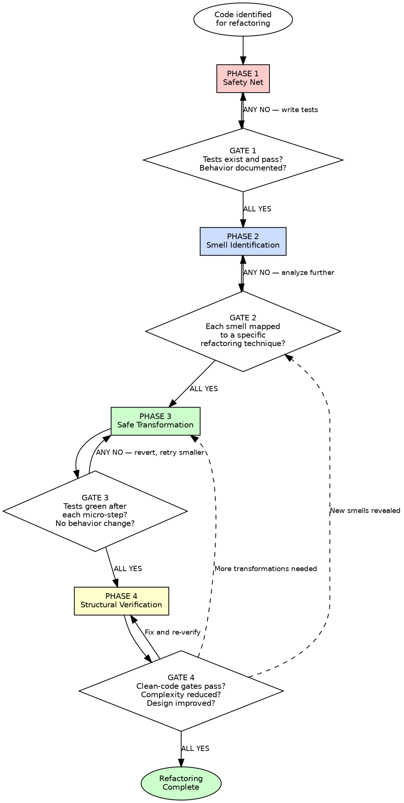

# Refactoring

## Overview

Improve the design of existing code without changing its observable behavior. Every structural change must be small, tested, and reversible.

**Core principle:** Refactoring is not rewriting. It is a disciplined sequence of behavior-preserving transformations, each verified by tests, that moves code from a worse design to a better one.

**About this skill:** This skill serves as both an AI enforcement guide (with mandatory gates and verification checks) and a human reference for safe refactoring techniques. AI agents follow the phased gates during code transformation. Humans can use it as a checklist, learning guide, or team onboarding reference.

**Violating the letter of these rules is violating the spirit of refactoring.**

## Quick Reference — Phases at a Glance

| Phase | What You Do | Gate Question |
|---|---|---|
| 1 — Safety Net | Establish test coverage before any structural change; write characterization tests if none exist | All tests pass? Current behavior documented? |
| 2 — Smell Identification | Name every smell using catalog terminology, map each to a named refactoring technique | Every smell named and mapped to a technique? Sequence planned? |
| 3 — Safe Transformation | Execute in smallest verified steps: transform → test → green → continue; red → revert | All tests green? Exactly one named technique applied per step? |
| 4 — Structural Verification | Verify the refactoring improved the design; must pass clean-code gates | Complexity reduced? Passes Beck's Four Rules? Zero new smells? |

**Each phase has a mandatory gate. ALL gate checks must pass before proceeding to the next phase.**

## Key Concepts

- **Code Smell** — A surface-level indicator of a deeper structural problem. Smells are not bugs — the code works — but they signal design issues that will cause pain later. Each smell maps to specific refactoring techniques. (Fowler, Refactoring Ch. 3)
- **Characterization Test** — A test written to capture the existing behavior of legacy code, even if that behavior is buggy. The purpose is to document what the code does now, so you can verify that refactoring preserves it. (Feathers, Working Effectively with Legacy Code)
- **Technical Debt** — The accumulated cost of shortcuts, deferred improvements, and suboptimal designs in a codebase. Like financial debt, it accrues interest — the longer it remains, the more expensive changes become.
- **Seam** — A place in code where behavior can be changed without editing the code itself. Seams are the insertion points that make legacy code testable. Three types: object seams (override via subclass), preprocessing seams (macros/imports), and link seams (swap at build time). (Feathers, Working Effectively with Legacy Code)
- **Fowler's Smell Categories** — Bloaters (code that's grown too large), OO Abusers (misused object-oriented features), Change Preventers (changes ripple across many files), Dispensables (unnecessary code), Couplers (excessive interdependency between classes). (Fowler, Refactoring Ch. 3)

## The Iron Law

```
EVERY STRUCTURAL CHANGE MUST PRESERVE OBSERVABLE BEHAVIOR, VERIFIED BY TESTS, BEFORE AND AFTER
```

If tests do not exist before you start, write characterization tests first — you cannot verify preservation of behavior you have not documented. (Fowler, Refactoring Ch. 2; Feathers, Working Effectively with Legacy Code Ch. 13)

If a transformation changes what the code does, it is not refactoring — it is rewriting. Stop, revert, and separate the behavioral change from the structural change. (Fowler, Refactoring Ch. 2)

If you cannot run tests after each micro-step, your steps are too large. Make them smaller. (Beck, Extreme Programming Explained)

**This gate is falsifiable at every step.** Run the tests. Green means behavior preserved. Red means behavior changed — revert immediately. No ambiguity.

## When to Use

**Always:**
- Improving existing code structure before adding new features
- Cleaning up code after getting a feature working ("red, green, refactor")
- Reducing complexity in code you need to modify
- Paying down technical debt

**Especially when:**
- You cannot understand existing code well enough to modify it safely
- Adding a feature requires changing existing structure first — refactor to make the change easy, then make the easy change (Beck, quoted in Fowler, Refactoring Ch. 2)
- Code smells are actively impeding development velocity
- Working with legacy code that has no tests (start with Phase 1)
- Duplication is spreading because the current structure does not accommodate variation

**Exceptions (require explicit human approval):**
- Code scheduled for complete replacement within the current sprint
- Performance-critical code where structural changes may affect performance characteristics (profile before and after)
- Generated code that will be regenerated (refactor the generator instead)

## Process Flow



Announce at the start: **"Using refactoring skill — running 4-phase enforcement."**

---

## Phase 1: Safety Net

**Purpose:** Establish a verified safety net of tests before making any structural change. You cannot prove behavior is preserved if behavior is not documented. If no tests exist, write characterization tests that capture the current behavior — even if that behavior is buggy.

### Rules

**1. Never Refactor Without Tests** — This is Fowler's Rule 1 of refactoring. If the code has no tests, you do not have permission to change its structure. Write tests first. No exceptions.
*(Fowler, Refactoring Ch. 2; Feathers, Working Effectively with Legacy Code Ch. 2)*

**2. Write Characterization Tests for Legacy Code** — A characterization test documents what the code actually does, not what it should do. Call the code, observe the output, assert on the observed output. The existing behavior is the specification until a deliberate behavioral change is made separately from the refactoring.
*(Feathers, Working Effectively with Legacy Code Ch. 13)*

```
APPROACH:
  1. Call the code with known inputs
  2. Observe actual outputs (even if "wrong")
  3. Write assertions that pin the current behavior
  4. You now have a safety net
```

**3. Identify the Change Points** — Before touching anything, identify what you intend to change and what should remain stable. Map the dependencies flowing into and out of the code you will refactor. Every dependency is a potential breakage point.
*(Feathers, Working Effectively with Legacy Code Ch. 3)*

**4. Find Seams** — A seam is a place where you can alter behavior without editing the code at that point. Object seams, link seams, and preprocessing seams let you test code in isolation. If you cannot find a seam, you cannot test safely — find one before proceeding.
*(Feathers, Working Effectively with Legacy Code Ch. 4)*

**5. Run the Full Test Suite** — Before your first structural change, run every test that could possibly be affected. Record the results. This is your baseline. Every subsequent step is verified against this baseline.
*(Fowler, Refactoring Ch. 2)*

**6. Establish the Behavioral Contract** — Document explicitly what "behavior preserved" means for this refactoring. What are the inputs? What are the outputs? What are the side effects? What are the error cases? If you cannot enumerate these, you do not understand the code well enough to refactor it.
*(Fowler, Refactoring Ch. 2; Feathers, Working Effectively with Legacy Code Ch. 13)*

**7. Preserve Buggy Behavior During Refactoring** — If the existing code has a bug, document it but do NOT fix it during the refactoring. Fixing a bug is a behavioral change. Refactoring is structural change. These are two separate operations. Fix the bug in a separate commit after the refactoring is complete.
*(Fowler, Refactoring Ch. 2)*

### Gate 1 — Mandatory Checkpoint

```
Before making ANY structural change:
  1. Do tests exist that cover the code being refactored?                 YES/NO
  2. Do all tests pass right now?                                         YES/NO
  3. Is the current behavior documented (by tests or characterization)?   YES/NO
  4. Can you enumerate what "behavior preserved" means?                   YES/NO
  ALL YES → proceed to Phase 2
  ANY NO  → write tests / characterization tests until all pass
```

**How to verify:** Run the test suite. If tests exist and are green, proceed. If tests do not exist, write characterization tests until you can demonstrate what the code currently does. Do not guess — observe and assert.

---

## Phase 2: Smell Identification

**Purpose:** Systematically identify every code smell in the target code and map each smell to a specific, named refactoring technique. No guessing. No vague "clean this up." Every smell gets a precise prescription.

### Rules

**1. Use the Smell Catalog Systematically** — Walk through Fowler's smell catalog methodically. Check each one against the target code:

| Category | Smells |
|----------|--------|
| **Bloaters** | Long Method, Large Class, Long Parameter List, Primitive Obsession, Data Clumps |
| **OO Abusers** | Switch Statements, Parallel Inheritance Hierarchies, Refused Bequest, Alternative Classes with Different Interfaces, Temporary Field |
| **Change Preventers** | Divergent Change, Shotgun Surgery |
| **Dispensables** | Lazy Class, Speculative Generality, Dead Code, Duplicated Code, Comments-as-Deodorant |
| **Couplers** | Feature Envy, Inappropriate Intimacy, Message Chains, Middle Man, Incomplete Library Class |

*(Fowler, Refactoring Ch. 3)*

**2. Map Each Smell to a Named Technique** — Every identified smell must be paired with a specific refactoring from Fowler's catalog. The technique name is the prescription. No unnamed "improvements."

| Common Smell | Primary Technique |
|-------------|-------------------|
| Long Method | Extract Function |
| Large Class | Extract Class |
| Long Parameter List | Introduce Parameter Object, Preserve Whole Object |
| Duplicated Code | Extract Function, Pull Up Method |
| Feature Envy | Move Function |
| Data Clumps | Extract Class, Introduce Parameter Object |
| Primitive Obsession | Replace Primitive with Object |
| Switch Statements | Replace Conditional with Polymorphism |
| Message Chains | Hide Delegate |
| Middle Man | Remove Middle Man |
| Divergent Change | Extract Class (split by responsibility) |
| Shotgun Surgery | Move Function, Move Field (consolidate) |
| Speculative Generality | Collapse Hierarchy, Remove Dead Code |
| Temporary Field | Extract Class |
| Comments-as-Deodorant | Extract Function, Rename (make the comment unnecessary) |

*(Fowler, Refactoring Ch. 6-12)*

**3. Cross-Reference with Martin's Heuristics** — Check against Martin's Chapter 17 smells and heuristics: names at wrong abstraction level, function does more than one thing, dead code, vertical separation of related concepts, inconsistency, misplaced responsibility. These catch what Fowler's catalog may miss.
*(Martin, Clean Code Ch. 17)*

**4. Identify Pattern Opportunities** — Some refactoring sequences lead naturally to design patterns. Repeated conditionals may indicate Replace Conditional with Strategy/State. Parallel hierarchies may indicate Bridge. Recognize when a series of small refactorings is converging toward a known pattern.
*(Kerievsky, Refactoring to Patterns)*

**5. Prioritize by Impact and Risk** — Not all smells are equal. Rank by: (1) how much the smell impedes current work, (2) how risky the refactoring is, (3) how many other smells it resolves. Start with high-impact, low-risk.
*(Fowler, Refactoring Ch. 2; Feathers, Working Effectively with Legacy Code Ch. 25)*

**6. Distinguish Refactoring from Rewriting** — If the "fix" for a smell requires changing what the code does (not just how it is structured), that is not a refactoring. Separate it. Behavioral changes go in separate commits with separate test changes. This distinction must be explicit in your plan.
*(Fowler, Refactoring Ch. 2)*

**7. Check for Dependency Tangles** — Before planning transformations, map which smells depend on each other. A Data Clump may need to be resolved before Feature Envy can be fixed. Extract Class may need to happen before Move Method makes sense. Sequence your plan accordingly.
*(Martin, Agile Software Development Ch. 7-12; Fowler, Refactoring Ch. 12)*

**8. Name the Target Design** — Before starting transformations, describe what the code should look like after refactoring. What responsibilities go where? What are the module boundaries? This is not speculative design — it is a target informed by the smells you identified and the techniques you selected.
*(Metz, Practical Object-Oriented Design Ch. 1-3; Ousterhout, A Philosophy of Software Design Ch. 2)*

### Gate 2 — Mandatory Checkpoint

```
Before starting ANY transformation:
  1. Is every identified smell named using catalog terminology?                  YES/NO
  2. Is each smell mapped to a specific named refactoring technique?             YES/NO
  3. Are the transformations sequenced by dependency and priority?               YES/NO
  4. Is the target design articulated (what the code should look like after)?    YES/NO
  ALL YES → proceed to Phase 3
  ANY NO  → analyze further until all pass
```

**How to verify:** List every smell. Next to each, write the technique name. If you cannot name the technique, you do not understand the smell well enough. Study the catalog.

---

## Phase 3: Safe Transformation

**Purpose:** Execute the planned refactoring in the smallest possible verified steps. Each micro-step follows the same rhythm: transform, run tests, green means continue, red means revert immediately. No exceptions. No "I'll fix the test later."

### Rules

**1. One Refactoring at a Time** — Apply exactly one named refactoring technique per step. Do not combine Extract Function with Rename Variable in the same step. Each step is atomic: it either succeeds completely or is reverted completely.
*(Fowler, Refactoring Ch. 4)*

**2. Follow the Published Mechanics** — Every refactoring in Fowler's catalog has numbered mechanics (steps). Follow them. They are engineered to preserve behavior at each sub-step. Skipping a mechanic step is how refactorings introduce bugs.
*(Fowler, Refactoring Ch. 6-12)*

```
EXAMPLE — Extract Function mechanics (Fowler, Ch. 6):
  1. Create a new function, name it by what it does (not how)
  2. Copy the extracted code into the new function
  3. Scan for references to variables local to the source
     — pass as parameters or declare locally
  4. Compile / check for syntax errors
  5. Replace extracted code with a call to the new function
  6. Run tests — green? Continue. Red? Revert.
```

**3. Run Tests After Every Micro-Step** — Not after every refactoring — after every sub-step within each refactoring's mechanics. If you moved a function, run tests before renaming it. If you extracted a variable, run tests before using it elsewhere. The feedback loop must be as tight as possible.
*(Fowler, Refactoring Ch. 2; Beck, Extreme Programming Explained)*

**4. Red Means Revert, Not Debug** — If tests go red after a transformation step, do not debug. Revert to the last green state. The step was too large or the mechanics were applied incorrectly. Make the step smaller and try again. Debugging during refactoring means you lost control of the process.
*(Fowler, Refactoring Ch. 2; Beck, Extreme Programming Explained)*

**5. Use Dependency-Breaking Techniques for Legacy Code** — When the code under refactoring has hard dependencies (global state, static calls, deep coupling), use Feathers' dependency-breaking techniques: Extract Interface, Parameterize Constructor, Subclass and Override Method, Replace Global Reference with Getter. Break one dependency at a time, test after each.
*(Feathers, Working Effectively with Legacy Code Ch. 9, 25)*

**6. Sprout Method/Class for New Behavior** — If you must add new behavior to legacy code that you are refactoring, do not weave it into the existing mess. Sprout a new method or class with its own tests, then call it from the existing code. The new code is born clean; the legacy code is touched minimally.
*(Feathers, Working Effectively with Legacy Code Ch. 6-7)*

```
SPROUT METHOD:
  1. Identify where the new code needs to be called
  2. Write the new method with TDD (test first, then implement)
  3. Call the new method from the existing code
  4. The change to existing code is one line — minimal risk
```

**7. Commit After Each Green Step** — Every time the tests are green after a transformation, that is a commit point. The commit message names the refactoring applied (e.g., "Extract Function: validate_order from process_order"). This creates a revertible history and documents the transformation sequence.
*(Fowler, Refactoring Ch. 2; Hunt/Thomas, The Pragmatic Programmer)*

**8. Preserve the Public Interface** — Unless the refactoring explicitly changes the API (and this is communicated to all consumers), the public interface must remain identical. Parameter order, return types, error behavior — all unchanged. Internal structure changes; external contract holds.
*(Fowler, Refactoring Ch. 2; Metz, Practical Object-Oriented Design Ch. 4)*

**9. Keep Behavioral Changes Separate** — If you discover a bug during refactoring, note it, but do not fix it in the same step. If a refactoring reveals that the behavior should change, stop the refactoring, commit what you have, then make the behavioral change in a separate commit with its own test changes.
*(Fowler, Refactoring Ch. 2)*

### Gate 3 — Mandatory Checkpoint

```
After EVERY transformation step:
  1. Are all tests green?                                               YES/NO
  2. Is observable behavior identical to before this step?               YES/NO
  3. Was exactly one named refactoring technique applied?                YES/NO
  4. Was the step committed with a descriptive message?                  YES/NO
  ALL YES → continue to next step, or proceed to Phase 4 when plan is complete
  ANY NO  → revert to last green state, make step smaller, retry
```

**How to verify:** Run the full test suite. Compare outputs against the baseline from Phase 1. If any test changed status (pass to fail, or fail to pass), behavior changed — revert.

---

## Phase 4: Structural Verification

**Purpose:** Verify that the refactoring actually improved the design. A refactoring that moves code around without reducing complexity is wasted effort. The refactored code must pass clean-code skill gates.

### Rules

**1. Invoke Clean-Code Skill Gates** — Run the refactored code through all four gates of the `clean-code` skill (Naming & Intent, Function Discipline, Structure & Abstraction, Smell Detection). The refactored code must pass every gate. If the code was not clean before, it must be cleaner now. If it was clean before, it must still be clean.
*(All clean-code authorities apply)*

**2. Verify Complexity Reduction** — The refactoring must demonstrably reduce complexity. Measure by: fewer lines of duplicated code, shorter functions, fewer parameters, clearer names, simpler control flow, fewer dependencies between modules. If none of these improved, the refactoring was not worth doing.
*(Ousterhout, A Philosophy of Software Design Ch. 2)*

**3. Check Beck's Four Rules of Simple Design** — In priority order: (1) Passes all tests, (2) Reveals intent, (3) No duplication, (4) Fewest elements. The refactored code must score better on these rules than the original.
*(Beck, quoted in Martin, Clean Code Ch. 12)*

**4. Verify Single Responsibility** — Each class and module touched by the refactoring must have exactly one reason to change. If the refactoring created new classes, each must have a clear, singular purpose. If it merged classes, the result must not have acquired multiple responsibilities.
*(Metz, Practical Object-Oriented Design Ch. 2; Martin, Clean Code Ch. 10)*

**5. Verify Deep Modules** — The refactored modules must have interfaces simpler than their implementations. If the refactoring created shallow modules (complex interface, trivial implementation), the abstraction boundaries are wrong. Reconsider.
*(Ousterhout, A Philosophy of Software Design Ch. 4)*

**6. Check for Introduced Smells** — Refactoring can introduce new smells. Extract Function can create Feature Envy if the extracted function uses data from the wrong class. Move Method can create Message Chains. Check every transformation for secondary smells introduced by the transformation itself.
*(Fowler, Refactoring Ch. 3; Kerievsky, Refactoring to Patterns Ch. 1)*

**7. Verify Dependency Direction** — Dependencies should point toward stability and abstraction. If the refactoring introduced dependencies from stable modules toward volatile modules, the direction is wrong. Dependencies flow inward toward the domain, not outward toward infrastructure.
*(Martin, Agile Software Development; Metz, Practical Object-Oriented Design Ch. 3)*

**8. Run the Full Test Suite One Final Time** — Not just the tests for the refactored code. The full suite. Refactoring can have surprising effects on distant code through shared dependencies. One final green run confirms nothing was broken.
*(Fowler, Refactoring Ch. 2)*

### Gate 4 — Mandatory Checkpoint

```
Final verification of ALL refactored code:
  1. Does the refactored code pass all clean-code skill gates?          YES/NO
  2. Is complexity measurably reduced (fewer smells, simpler structure)? YES/NO
  3. Does it pass Beck's Four Rules of Simple Design?                    YES/NO
  4. Does the full test suite pass?                                      YES/NO
  5. Were zero new smells introduced by the refactoring itself?          YES/NO
  ALL YES → refactoring complete
  ANY NO  → return to Phase 2 (new smells) or Phase 3 (more transformations needed)
```

**How to verify:** Run the clean-code skill gates against every changed file. Run the full test suite. Compare the before/after design: is it demonstrably simpler, more cohesive, less coupled? If you cannot articulate what improved, the refactoring failed.

---

## Red Flags — STOP and Revisit

If you see any of these, STOP. Return to the indicated phase and fix before proceeding.

**Phase 1 (Safety Net):**
- Starting to change structure without running tests first
- "The tests are too slow, I'll run them at the end" — run them now, every step
- No characterization tests for legacy code — you are flying blind
- Assuming you know what the code does without verifying with tests

**Phase 2 (Smell Identification):**
- Vague improvement goals: "clean this up" or "make this better" without naming specific smells
- Cannot name the refactoring technique for a smell — you are guessing, not refactoring
- Planning to change behavior and structure in the same step
- Skipping the smell catalog and going straight to "I know what to do"

**Phase 3 (Safe Transformation):**
- Tests went red and you are debugging instead of reverting
- Applying multiple refactorings in a single step
- Not committing after each green state
- Skipping steps in the published mechanics of a refactoring
- "I'll fix the tests to match the new behavior" — that is rewriting, not refactoring
- Changing the public interface without explicit communication

**Phase 4 (Structural Verification):**
- Cannot articulate what the refactoring improved
- New smells introduced by the refactoring itself
- The refactored code is more complex than the original
- Skipping the clean-code gates because "it's just a refactoring"

**Universal — ALL PHASES:**
- **"I'll add tests after the refactoring"** — No. Tests come first. Always. This is the foundational rule.
- **"This refactoring is simple enough to do without tests"** — Every broken refactoring started with that sentence.
- **"I need to change the behavior to make it cleaner"** — Then stop refactoring. Make the behavioral change separately.
- **"The steps are too small, this is taking too long"** — Small steps are faster. Large steps require debugging. Debugging during refactoring means you lost control.

**All of these mean: return to the indicated phase, fix the violation, re-verify the gate.**

---

## Rationalization Table

| Excuse | Reality | Phase |
|--------|---------|-------|
| "The code has no tests, but this refactoring is straightforward" | Every broken refactoring started with confidence and no tests. Write characterization tests first. You cannot verify what you have not documented. (Feathers, Ch. 2) | 1 |
| "Writing tests for this legacy code is too hard" | That is exactly why Feathers wrote an entire book about it. Find a seam. Write a characterization test. It does not have to be pretty — it has to pin behavior. (Feathers, Ch. 4, 13) | 1 |
| "I know what this code does, I don't need tests to prove it" | You know what you think it does. Tests prove what it actually does. These are often different, especially in legacy code. (Feathers, Ch. 13) | 1 |
| "The smell is obvious, I don't need to catalog it formally" | Naming the smell precisely forces you to select the right technique. "This is messy" is not a diagnosis. "This is Feature Envy" is a diagnosis. Precision prevents wrong moves. (Fowler, Ch. 3) | 2 |
| "I'll just clean it up, I don't need a specific technique" | Unnamed improvements are undisciplined changes. Name the smell, name the technique, follow the mechanics. That is what separates refactoring from hacking. (Fowler, Ch. 2) | 2 |
| "This needs a complete rewrite, not refactoring" | Rewrites fail far more often than incremental refactoring. Refactor in small steps toward the target design. The code improves continuously instead of gambling on a big bang. (Fowler, Ch. 2; Feathers, Ch. 1) | 2 |
| "I'll combine these two refactorings into one step to save time" | Combined steps are harder to verify and harder to revert. When they fail — and they will — you will not know which refactoring caused the failure. One step at a time. (Fowler, Ch. 4) | 3 |
| "The tests are red, but I can see the problem — let me fix it" | Red means revert, not debug. You lost the behavior-preservation guarantee. Go back to green, make a smaller step. Debugging during refactoring is a sign of lost control. (Fowler, Ch. 2; Beck, XP) | 3 |
| "I don't need to commit after every step" | Each commit is a save point. Without it, a failure ten steps later forces you to revert ten steps instead of one. Commit after every green. (Fowler, Ch. 2) | 3 |
| "The tests need to change because the refactoring changes the interface" | If the public interface changed, that is not refactoring — it is an API change. Make it explicit, communicate it, and separate it from the structural refactoring. (Fowler, Ch. 2) | 3 |
| "I found a bug — let me fix it while I'm in here" | Fixing a bug changes behavior. Refactoring preserves behavior. These are two separate operations. Commit the refactoring, then fix the bug separately. (Fowler, Ch. 2) | 3 |
| "The refactored code is cleaner, I can feel it" | Feelings are not verification. Run the clean-code gates. Measure: fewer smells? Shorter functions? Fewer dependencies? If you cannot point to a specific improvement, the refactoring was cosmetic. (Ousterhout, Ch. 2) | 4 |
| "It's not perfect yet, but it's better" — as justification for stopping | Better is good. But did you introduce new smells? Did you leave the transformation half-done? A partially-applied refactoring can be worse than the original. Finish or revert. (Fowler, Ch. 2) | 4 |
| "This refactoring is too small to bother with verification" | Small refactorings compound. Unverified small refactorings compound into unverified large changes. Every step gets verified. (Fowler, Ch. 2) | All |
| "We're under time pressure, just move the code around" | Unverified structural changes under pressure create the bugs you will debug under even more pressure tomorrow. Small verified steps are faster than large unverified ones. (Beck, XP) | All |
| "The original code had no structure, so any change is an improvement" | Unstructured change to unstructured code creates differently-unstructured code. Name the smells, name the techniques, follow the mechanics. Discipline is the difference between refactoring and shuffling. (Fowler, Ch. 2) | All |

---

## Verification Checklist

Before marking refactoring complete, every box must be checked:

- [ ] Tests existed (or characterization tests were written) before any structural change (Gate 1)
- [ ] All tests were green before the first transformation (Gate 1)
- [ ] Every smell was named using catalog terminology (Gate 2)
- [ ] Every smell was mapped to a specific named refactoring technique (Gate 2)
- [ ] Transformations were sequenced by dependency and priority (Gate 2)
- [ ] Each transformation applied exactly one refactoring at a time (Gate 3)
- [ ] Tests were run after every micro-step (Gate 3)
- [ ] Every red test result was handled by reverting, not debugging (Gate 3)
- [ ] No behavioral changes were mixed with structural changes (Gate 3)
- [ ] Refactored code passes all clean-code skill gates (Gate 4)
- [ ] Complexity is measurably reduced (Gate 4)
- [ ] Full test suite passes (Gate 4)

**Cannot check all boxes? Return to the failing gate. Fix before proceeding. No exceptions.**

---

## Related Skills

- **clean-code** — Gate 4 requires the refactored code to pass all clean-code gates. Clean-code is about writing new code cleanly; refactoring is about improving existing code to meet that standard.
- **superpowers:test-driven-development** — Gate 1 may require writing characterization tests or new tests. Use TDD for writing them.
- **superpowers:systematic-debugging** — If a refactoring reveals a deeper bug, debug it systematically — but in a separate commit.
- **superpowers:verification-before-completion** — Final verification after Gate 4 passes. Run it.

**Reading order:** This is skill 3 of 8. Prerequisites: clean-code. Next: design-patterns. See `skills/READING_ORDER.md` for the full path.
