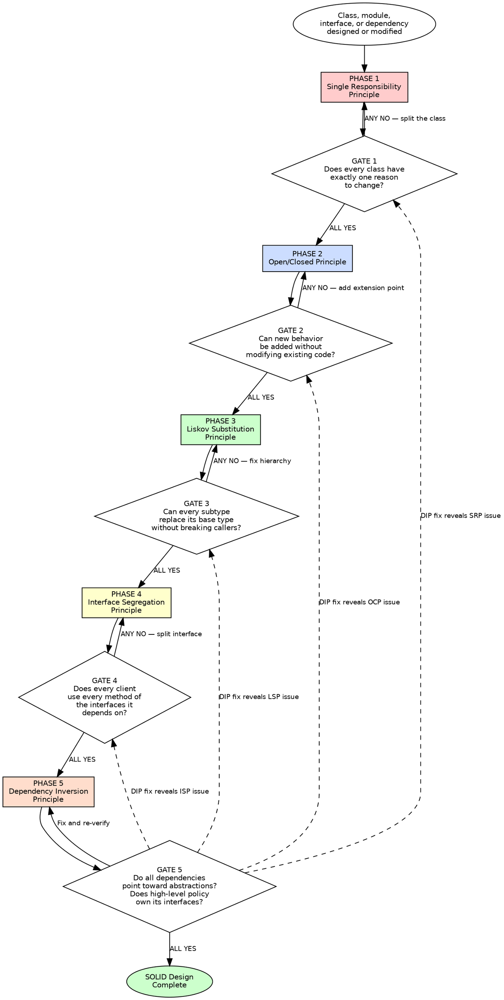

# SOLID Principles

## Overview

Design systems where every class has one reason to change, new behavior arrives through new code, subtypes honor their contracts, interfaces serve their clients, and dependencies point toward abstractions.

**Core principle:** The five SOLID principles exist to make software tolerant of change, safe to extend, and honest about its contracts. Each principle addresses a different axis of design failure. All five are enforced here.

**About this skill:** This skill serves as both an AI enforcement guide (with mandatory gates and verification checks) and a human reference for SOLID design principles. AI agents follow the phased gates during class and module design. Humans can use it as a checklist, learning guide, or team onboarding reference.

**Violating the letter of these rules is violating the spirit of SOLID design.**

## Quick Reference — Phases at a Glance

| Phase | Principle | Gate Question |
|---|---|---|
| 1 — SRP | Single Responsibility: one class, one reason to change | Describe responsibility in one sentence without "and"? |
| 2 — OCP | Open/Closed: extend by writing new code, not modifying old | New behavior added without modifying existing tested code? |
| 3 — LSP | Liskov Substitution: subtypes substitutable for base types | Every subtype replaces base type without breaking callers? |
| 4 — ISP | Interface Segregation: no client forced to depend on unused methods | Every client uses every method of its interfaces? |
| 5 — DIP | Dependency Inversion: depend on abstractions, not concretions | All dependencies point toward abstractions owned by high-level modules? |

**Each phase has a mandatory gate. ALL gate checks must pass before proceeding to the next phase.**

## Key Concepts

- **Behavioral Contract** — The set of preconditions (what must be true before a call), postconditions (what is guaranteed after), and invariants (what is always true) that define what a type promises to its callers. Subtypes must honor the contract of their base type. (Liskov & Wing, 1994)
- **Polymorphism** — The ability to treat different types uniformly through a shared interface. A caller holds a base type reference and does not know or care which concrete subtype it actually holds. This is how OCP and LSP work in practice.
- **Abstraction (ABC)** — A simplified interface that hides implementation complexity. In Python, abstractions are expressed as Abstract Base Classes (ABCs) with `@abstractmethod`. The abstraction is owned by the high-level module, not the low-level one.
- **Design by Contract** — A discipline where every method specifies what it requires (preconditions) and what it guarantees (postconditions). The caller is responsible for meeting preconditions; the method is responsible for meeting postconditions. (Meyer, Object-Oriented Software Construction)
- **Composition Over Inheritance** — Prefer assembling behavior from smaller, focused objects rather than building deep inheritance hierarchies. Inheritance creates tight coupling; composition creates flexibility. Use inheritance only when a true "is-a" relationship exists with full LSP compliance.

## The Iron Law

```
EVERY CLASS MUST HAVE EXACTLY ONE REASON TO CHANGE,
EVERY NEW BEHAVIOR MUST BE ADDABLE WITHOUT MODIFYING EXISTING CODE,
EVERY SUBTYPE MUST BE SUBSTITUTABLE FOR ITS BASE TYPE,
EVERY INTERFACE MUST CONTAIN ONLY WHAT ITS CLIENTS USE,
AND EVERY DEPENDENCY MUST POINT TOWARD AN ABSTRACTION
```

If a class changes for two different reasons — it has two responsibilities. Split it. (Martin, Agile Software Development Ch. 8)
If adding a feature requires modifying existing, tested code — the extension point is missing. Add it. (Martin, Agile Software Development Ch. 9)
If substituting a subtype for its base type surprises a caller — the contract is broken. Fix the subtype or fix the hierarchy. (Liskov & Wing, "A Behavioral Notion of Subtyping" 1994)
If a client depends on methods it never calls — the interface is too fat. Split it. (Martin, "The Interface Segregation Principle" 1996)
If a high-level module imports a low-level module by name — the dependency is inverted. Introduce an abstraction owned by the high-level module. (Martin, Agile Software Development Ch. 11)

**This gate is falsifiable at every boundary.** Point at any class, hierarchy, interface, or import and ask the five questions. Yes or No. No ambiguity.

## When to Use

**Always:**

- Designing classes, modules, or their responsibilities
- Designing class hierarchies or inheritance relationships
- Creating or modifying interfaces or abstract base classes
- Adding new behavior to existing systems
- Reviewing dependency direction between modules

**Especially when:**

- A class is growing large because it handles multiple concerns — SRP violation
- A new feature requires modifying a switch/case or if/elif chain — OCP violation
- Subclass behavior "almost works" but requires special-casing in callers — LSP is broken
- A class implements an interface but stubs out half the methods — ISP violation
- High-level business logic imports database drivers, HTTP clients, or file system modules directly — DIP violation
- "God classes" or "god interfaces" are accumulating unrelated responsibilities

**Exceptions (require explicit human approval):**

- Simple scripts under 200 lines with no class hierarchies
- Performance-critical inner loops where abstraction overhead is measured and unacceptable (profile first)
- Prototypes explicitly marked for deletion before production

## Process Flow



Announce at the start: **"Using solid-principles skill — running 5-phase enforcement (SRP, OCP, LSP, ISP, DIP)."**

---

## Phase 1: Single Responsibility Principle (SRP)

**Purpose:** A class or module should have one, and only one, reason to change. If two different stakeholders would request changes to the same class for different reasons, it has two responsibilities and must be split.

### Rules

**1. One Reason to Change** — A class has exactly one responsibility, defined by one stakeholder or one axis of change. If you can think of two independent reasons to modify a class, it violates SRP. The CFO and the CTO should not both require changes to the same class.
_(Martin, Agile Software Development Ch. 8; Martin, Clean Architecture Ch. 7)_

```
BAD:
  class Employee:
      def calculate_pay(self) -> Decimal: ...       # CFO cares about this
      def generate_report(self) -> str: ...          # CEO cares about this
      def save_to_database(self) -> None: ...        # CTO cares about this

GOOD:
  class PayCalculator:
      def calculate_pay(self, employee: Employee) -> Decimal: ...

  class EmployeeReporter:
      def generate_report(self, employee: Employee) -> str: ...

  class EmployeeRepository:
      def save(self, employee: Employee) -> None: ...
```

**2. Describe the Responsibility in One Sentence** — If you cannot describe what a class does in a single sentence without using "and", "or", or "also", it has multiple responsibilities. The sentence test is the simplest SRP diagnostic.
_(Martin, Clean Code Ch. 10)_

**3. Gather What Changes Together** — Code that changes for the same reason should live in the same class. Code that changes for different reasons should be in separate classes. Common Closure Principle: things that change together belong together.
_(Martin, Agile Software Development Ch. 8; Hunt/Thomas, The Pragmatic Programmer: DRY)_

**4. Separate Policy from Mechanism** — Business rules (policy) and technical implementation (mechanism) change for different reasons. A class that computes discounts should not also know how to serialize JSON or query a database. Policy classes depend on mechanism interfaces, never on mechanism implementations directly.
_(Martin, Agile Software Development Ch. 8; Martin, Clean Architecture Ch. 22)_

**5. Watch for God Classes** — A class with 10+ methods, 5+ dependencies, or 200+ lines is almost certainly doing too much. God classes are the most common SRP violation. They accumulate responsibilities because "it's easier to add here" — until it is not.
_(Fowler, Refactoring Ch. 3: Large Class; Martin, Agile Software Development Ch. 8)_

**6. Actors Define Responsibilities** — A responsibility is defined by who requests the change, not by what the code does. If different actors (users, stakeholders, teams) would request changes for different reasons, those are different responsibilities — even if the code looks cohesive.
_(Martin, Clean Architecture Ch. 7)_

**7. Cohesion Over Convenience** — Do not merge responsibilities because it is "convenient" to have them together. Convenience creates coupling. If a helper method serves a responsibility different from the class's primary purpose, move it to its own class. High cohesion means every method in a class serves the same stakeholder.
_(Martin, Agile Software Development Ch. 8; McConnell, Code Complete Ch. 5)_

### Gate 1 — Mandatory Checkpoint

```
For EVERY new or modified class/module:
  1. Can you describe its responsibility in one sentence without "and"?           YES/NO
  2. Does it have exactly one reason to change (one stakeholder/actor)?           YES/NO
  3. Do all its methods serve the same responsibility?                            YES/NO
  4. Does it have fewer than 5 injected dependencies?                             YES/NO
  ALL YES → proceed to Phase 2
  ANY NO  → split the class by responsibility, re-verify
```

**How to verify:** Name the single actor who would request changes to this class. If you name two actors, the class has two responsibilities. If the class description requires "and", it has multiple responsibilities. Split until each class passes.

---

## Phase 2: Open/Closed Principle (OCP)

**Purpose:** Software entities (classes, modules, functions) should be open for extension but closed for modification. When requirements change, you write new code — you do not change old code that already works.

### Rules

**1. New Behavior Through New Code** — When a new requirement arrives, the correct response is a new class, a new function, or a new module — not a modification to an existing one. If you are editing a working, tested function to add a case, you are violating OCP.
_(Martin, Agile Software Development Ch. 9; Meyer, Object-Oriented Software Construction Ch. 3)_

```
BAD:
  def calculate_discount(customer):
      if customer.type == "regular":
          return 0.0
      elif customer.type == "premium":
          return 0.1
      elif customer.type == "vip":
          return 0.2

GOOD:
  class DiscountStrategy(ABC):
      @abstractmethod
      def calculate(self, customer) -> float: ...

  class RegularDiscount(DiscountStrategy):
      def calculate(self, customer) -> float:
          return 0.0

  class PremiumDiscount(DiscountStrategy):
      def calculate(self, customer) -> float:
          return 0.1

  class VipDiscount(DiscountStrategy):
      def calculate(self, customer) -> float:
          return 0.2
```

**2. Identify Extension Points Proactively** — Every time you write a conditional that switches on type, status, or category, ask: "Will there be a fourth case?" If yes (or even maybe), introduce an extension point now. Strategy, Template Method, Observer, and plugin registration are the primary OCP enablers.
_(Gang of Four, Design Patterns: Strategy, Template Method, Observer; Martin, Agile Software Development Ch. 9)_

**3. Use Strategy Pattern for Behavioral Variation** — When an algorithm varies by type or context, encapsulate each variant behind a common interface. The context delegates to the strategy. New variants require only a new strategy class.
_(Gang of Four, Design Patterns Ch. 5: Strategy; Metz, Practical Object-Oriented Design Ch. 5)_

**4. Use Template Method for Invariant Algorithms with Variable Steps** — When the algorithm skeleton is fixed but individual steps vary, define the skeleton in a base class and let subclasses override specific steps. The skeleton is closed; the steps are open.
_(Gang of Four, Design Patterns Ch. 5: Template Method; Martin, Agile Software Development Ch. 9)_

**5. Prefer Composition Over Inheritance for Extension** — Inheritance creates tight coupling between base and derived. Composition with injected strategies is more flexible, more testable, and more OCP-compliant. Use inheritance only when the "is-a" relationship is genuine and stable.
_(Gang of Four, Design Patterns Ch. 1; Beck, Implementation Patterns Ch. 6; Metz, Practical Object-Oriented Design Ch. 8)_

**6. Guard Against Premature Closure** — OCP does not mean abstracting everything on the first pass. Wait for the first variation, then close against that axis of change. "Take the first bullet" — accept a modification the first time, then design the extension point to prevent the second.
_(Martin, Agile Software Development Ch. 9; Fowler, Refactoring Ch. 2)_

**7. Configuration Over Modification** — External configuration (plugin registries, dependency injection containers, event handlers) lets behavior change without touching source code. Prefer declarative extension points over procedural ones.
_(Martin, Clean Architecture Ch. 15; Gang of Four, Design Patterns: Factory Method)_

### Gate 2 — Mandatory Checkpoint

```
For EVERY class, module, or function that adds behavior to an existing system:
  1. Can the new behavior be added without modifying existing tested code?      YES/NO
  2. Are extension points identified for proven axes of change?                 YES/NO
  3. Do conditional chains switch on type/status/category without polymorphism? NO required
  ALL YES (and Q3 is NO) → proceed to Phase 3
  ANY fail → add extension point, refactor to Strategy/Template Method, re-verify
```

**How to verify:** Imagine the next variant arrives tomorrow. Can you add it by creating a new file and registering it, without opening any existing file? If yes, OCP holds.

---

## Phase 3: Liskov Substitution Principle (LSP)

**Purpose:** Subtypes must be substitutable for their base types without altering the correctness of the program. A caller holding a base type reference must never need to know — or check — which subtype it actually holds.

### Rules

**1. Honor the Behavioral Contract** — A subtype must satisfy the behavioral contract of its base type. This means: same preconditions (or weaker), same postconditions (or stronger), same invariants. If a caller expects behavior X from the base type, every subtype must deliver at least X.
_(Liskov & Wing, "A Behavioral Notion of Subtyping" 1994; Martin, Agile Software Development Ch. 10)_

```
BAD (Rectangle/Square problem):
  class Rectangle:
      def set_width(self, w): self._width = w
      def set_height(self, h): self._height = h
      def area(self) -> int: return self._width * self._height

  class Square(Rectangle):
      def set_width(self, w):
          self._width = w
          self._height = w    # <-- violates caller's expectation
      def set_height(self, h):
          self._width = h     # <-- postcondition violated
          self._height = h

  # Caller code that breaks:
  def test_area(rect: Rectangle):
      rect.set_width(5)
      rect.set_height(4)
      assert rect.area() == 20  # Fails for Square!

GOOD:
  class Shape(ABC):
      @abstractmethod
      def area(self) -> int: ...

  class Rectangle(Shape):
      def __init__(self, width: int, height: int): ...
      def area(self) -> int: return self._width * self._height

  class Square(Shape):
      def __init__(self, side: int): ...
      def area(self) -> int: return self._side ** 2
```

**2. Preconditions Cannot Be Strengthened** — A subtype must accept at least everything the base type accepts. If the base type's method accepts any positive integer, the subtype must not reject even numbers. Strengthening preconditions breaks callers who rely on the base contract.
_(Liskov & Wing, 1994; Meyer, Object-Oriented Software Construction Ch. 16: Design by Contract)_

**3. Postconditions Cannot Be Weakened** — A subtype must deliver at least everything the base type promises. If the base type's method guarantees a sorted result, the subtype must also return a sorted result. Weakening postconditions breaks callers who rely on the base guarantee.
_(Liskov & Wing, 1994; Meyer, Object-Oriented Software Construction Ch. 16)_

**4. Invariants Must Be Preserved** — Class invariants established by the base type must hold in every subtype. If the base type guarantees that `balance >= 0`, no subtype may allow a negative balance. Invariant violations corrupt the object's state contract.
_(Meyer, Object-Oriented Software Construction Ch. 11; Martin, Agile Software Development Ch. 10)_

**5. No Type-Checking in Callers** — If caller code contains `isinstance()`, `typeof`, or type-switch checks to handle different subtypes, LSP is violated. The caller should not need to know the concrete type. If it does, the hierarchy is wrong.
_(Martin, Agile Software Development Ch. 10; Metz, Practical Object-Oriented Design Ch. 5)_

```
BAD:
  def process(shape: Shape):
      if isinstance(shape, Circle):
          # special handling
      elif isinstance(shape, Square):
          # different special handling

GOOD:
  def process(shape: Shape):
      shape.draw()  # all shapes know how to draw themselves
```

**6. Prefer "Has-A" Over Broken "Is-A"** — If a subtype cannot honor the full contract of its base type, the inheritance relationship is wrong. Square is not a behavioral subtype of mutable Rectangle. Use composition or separate the shared interface. A broken "is-a" is worse than no inheritance at all.
_(Metz, Practical Object-Oriented Design Ch. 8; Martin, Agile Software Development Ch. 10)_

**7. Apply the History Constraint** — A subtype must not permit state transitions that the base type would not permit. If the base type is immutable, the subtype must be immutable. If the base type's state machine has three states, the subtype must not add a fourth that callers do not expect.
_(Liskov & Wing, 1994)_

### Gate 3 — Mandatory Checkpoint

```
For EVERY subtype (subclass or interface implementation):
  1. Can every subtype replace its base type in all caller code without breaking?   YES/NO
  2. Are preconditions the same or weaker than the base type?                       YES/NO
  3. Are postconditions the same or stronger than the base type?                    YES/NO
  4. Are base type invariants preserved in every subtype?                           YES/NO
  5. Is the code free of isinstance/typeof checks on the hierarchy?                YES/NO
  ALL YES → proceed to Phase 4
  ANY NO  → fix the hierarchy (compose instead of inherit, fix the contract, or remove the subtype)
```

**How to verify:** For each subtype, mentally (or literally) substitute it into every call site that uses the base type. Does the caller's postcondition still hold? Does any caller need a special case for this subtype? If yes, LSP is violated.

---

## Phase 4: Interface Segregation Principle (ISP)

**Purpose:** No client should be forced to depend on methods it does not use. Fat interfaces create coupling to features that are irrelevant to the client, making the system fragile and hard to change.

### Rules

**1. Split Fat Interfaces Into Role Interfaces** — When an interface has methods used by different clients for different purposes, split it into one interface per role. Each client depends only on the role it actually uses.
_(Martin, "The Interface Segregation Principle" 1996; Martin, Agile Software Development Ch. 12)_

```
BAD:
  class Worker(ABC):
      @abstractmethod
      def work(self) -> None: ...
      @abstractmethod
      def eat(self) -> None: ...
      @abstractmethod
      def sleep(self) -> None: ...

  class Robot(Worker):  # forced to implement eat() and sleep()
      def work(self) -> None: ...
      def eat(self) -> None: raise NotImplementedError  # ISP violation
      def sleep(self) -> None: raise NotImplementedError

GOOD:
  class Workable(ABC):
      @abstractmethod
      def work(self) -> None: ...

  class Feedable(ABC):
      @abstractmethod
      def eat(self) -> None: ...

  class Restable(ABC):
      @abstractmethod
      def sleep(self) -> None: ...

  class Robot(Workable):  # only implements Workable
      def work(self) -> None: ...

  class Human(Workable, Feedable, Restable):  # implements all three
      def work(self) -> None: ...
      def eat(self) -> None: ...
      def sleep(self) -> None: ...
```

**2. No NotImplementedError in Interface Implementations** — If a class must raise `NotImplementedError`, `pass`, or return `None` for interface methods it cannot fulfill, the interface is too fat. Split it until every implementer uses every method.
_(Martin, Agile Software Development Ch. 12; Metz, Practical Object-Oriented Design Ch. 5)_

**3. Measure Cohesion of Interface Methods** — All methods in an interface must be used together by at least one client. If you can partition the methods into two groups where no single client uses both groups, the interface is two interfaces glued together.
_(Martin, "The Interface Segregation Principle" 1996)_

**4. Prefer Small ABCs Over Large Ones** — Keep abstract base classes focused and small. Each ABC should represent a single role or capability. When an ABC grows beyond 3-4 methods, consider whether it is multiple interfaces glued together. Small ABCs are easier to implement, easier to test, and create less coupling.
_(Metz, Practical Object-Oriented Design Ch. 5; Martin, Agile Software Development Ch. 12)_

**5. One Reason to Change Per Interface** — An interface, like a class, should have a single responsibility. If an interface changes for two different reasons (because two different clients need different modifications), it should be two interfaces. ISP and SRP reinforce each other at the interface level.
_(Martin, Agile Software Development Ch. 12)_

**6. Client-Driven Interface Design** — Design interfaces from the client's perspective, not the implementer's. Ask "What does this client need?" rather than "What can this class do?" The client defines the contract; the implementer satisfies it.
_(Martin, "The Interface Segregation Principle" 1996; Metz, Practical Object-Oriented Design Ch. 4)_

**7. Avoid Header Interfaces** — Do not create an interface that mirrors every public method of a single class. That is a header interface — it adds indirection without value. Interfaces should represent roles, not classes.
_(Fowler, Refactoring Ch. 3: Speculative Generality; Martin, Agile Software Development Ch. 12)_

### Gate 4 — Mandatory Checkpoint

```
For EVERY interface or abstract base class:
  1. Does every client use every method of the interfaces it depends on?           YES/NO
  2. Does every implementer meaningfully implement every method (no stubs/throws)? YES/NO
  3. Can the interface's methods be partitioned into groups used by different
     clients?                                                                      NO required
  4. Is the interface designed from the client's needs, not the implementer's?      YES/NO
  ALL YES (and Q3 is NO) → proceed to Phase 5
  ANY fail → split the interface into role interfaces, re-verify
```

**How to verify:** For each interface, list its clients. For each client, check which methods it actually calls. If any client skips methods, or any implementer stubs methods, the interface needs splitting.

---

## Phase 5: Dependency Inversion Principle (DIP)

**Purpose:** High-level modules (business rules, domain logic) must not depend on low-level modules (databases, file systems, HTTP clients). Both should depend on abstractions. The abstractions are owned by the high-level module, not the low-level one.

### Rules

**1. High-Level Policy Owns Its Interfaces** — The interface that a low-level module implements is defined in the high-level module's package, not the low-level module's package. The domain defines `OrderRepository`; the infrastructure implements `PostgresOrderRepository`. The domain never imports from infrastructure.
_(Martin, Agile Software Development Ch. 11; Martin, Clean Architecture Ch. 22)_

```
BAD (dependency direction):
  # domain/order_service.py
  from infrastructure.postgres import PostgresDB  # high imports low

  class OrderService:
      def __init__(self):
          self.db = PostgresDB()  # concrete dependency

GOOD (inverted dependency):
  # domain/ports.py  (owned by domain)
  class OrderRepository(ABC):
      @abstractmethod
      def save(self, order: Order) -> None: ...
      @abstractmethod
      def find_by_id(self, order_id: str) -> Order | None: ...

  # domain/order_service.py
  class OrderService:
      def __init__(self, repository: OrderRepository):  # depends on abstraction
          self.repository = repository

  # infrastructure/postgres_repository.py
  from domain.ports import OrderRepository  # low imports high's interface

  class PostgresOrderRepository(OrderRepository):  # implements the ABC
      def save(self, order: Order) -> None: ...
      def find_by_id(self, order_id: str) -> Order | None: ...
```

**2. Depend on Abstractions, Not Concretions** — No variable should hold a reference to a concrete class when an abstraction exists. No function should import a concrete module when an abstraction would suffice. Constructor parameters, function arguments, and return types should be abstract.
_(Martin, Agile Software Development Ch. 11)_

**3. Use Constructor Injection** — Dependencies are passed in through the constructor, not created internally. This makes dependencies explicit, testable, and replaceable. If a class creates its own dependencies, it owns them — and owns their change schedule.
_(Metz, Practical Object-Oriented Design Ch. 3; Martin, Agile Software Development Ch. 11)_

```
BAD:
  class NotificationService:
      def __init__(self):
          self.sender = SmtpEmailSender()  # creates its own dependency

GOOD:
  class NotificationService:
      def __init__(self, sender: MessageSender):  # injected
          self.sender = sender
```

**4. Apply the Dependency Rule** — Source code dependencies must point inward, toward higher-level policy. Domain depends on nothing. Application depends on domain. Infrastructure depends on application and domain. Never the reverse. This is the organizing principle of Clean Architecture.
_(Martin, Clean Architecture Ch. 22; Ousterhout, A Philosophy of Software Design Ch. 4)_

**5. Ports and Adapters** — Define ports (interfaces) at the boundary of your domain. Adapters (implementations) live in the infrastructure layer and satisfy the ports. The domain is the center; everything else is a plugin. New infrastructure (new database, new message queue) means a new adapter, not a domain change.
_(Martin, Clean Architecture Ch. 22; Cockburn, "Hexagonal Architecture")_

**6. Abstractions Must Not Depend on Details** — An interface must not leak implementation details. `OrderRepository` should not have a method called `execute_sql()`. `MessageSender` should not expose SMTP configuration. If the abstraction reveals the implementation, it is not an abstraction — it is a thin wrapper.
_(Martin, Agile Software Development Ch. 11; Ousterhout, A Philosophy of Software Design Ch. 5: information hiding)_

**7. Stable Dependencies Principle** — Depend in the direction of stability. Volatile modules (UI, frameworks, databases) should depend on stable modules (domain logic, abstractions). A dependency on a volatile module means your module inherits that volatility.
_(Martin, Agile Software Development Ch. 20; Martin, Clean Architecture Ch. 14)_

### Gate 5 — Mandatory Checkpoint

```
For EVERY module boundary and import statement:
  1. Do all dependencies point toward abstractions (not concrete classes)?          YES/NO
  2. Does high-level policy own its interfaces (ports defined in domain)?           YES/NO
  3. Are dependencies injected, not internally created?                             YES/NO
  4. Do source code dependencies point inward (toward domain)?                     YES/NO
  5. Do abstractions hide implementation details (no leaky interfaces)?             YES/NO
  ALL YES → SOLID enforcement complete
  ANY NO  → introduce abstraction, invert dependency, fix ownership, re-verify
```

**How to verify:** Trace every import statement. Draw the dependency graph. Arrows must point inward toward domain/abstractions. If any arrow points from domain to infrastructure, DIP is violated. If any constructor creates its own dependencies, injection is missing.

---

## Red Flags — STOP and Revisit

If you see any of these, STOP. Return to the indicated phase and fix before proceeding.

**Phase 1 (SRP):**

- A class whose description requires "and" or "or"
- A class that changes for two different reasons (different stakeholders)
- A class with 5+ injected dependencies (too many responsibilities)
- A class with 200+ lines or 10+ public methods (god class smell)

**Phase 2 (OCP):**

- Adding an `elif` or `case` to an existing conditional chain to handle a new type
- Modifying a tested function to add a new code path
- A switch/match statement that grows every time a new variant is added
- No extension points in a system that has already changed twice along the same axis

**Phase 3 (LSP):**

- `isinstance()` or `typeof` checks in caller code to handle different subtypes
- A subtype that raises `NotImplementedError` for a base type method
- A subtype that silently changes the meaning of a base type operation
- Unit tests that special-case a specific subtype

**Phase 4 (ISP):**

- An interface with methods that some implementers stub out or throw on
- A class that implements an interface but only uses half its methods
- A change to an interface that forces changes in clients that do not use the changed method
- An interface with more than 5-7 methods (strong smell, not absolute)

**Phase 5 (DIP):**

- Domain code that imports from infrastructure packages
- A constructor that creates its own database connection, HTTP client, or file handle
- An interface defined in the infrastructure layer instead of the domain layer
- An abstraction that exposes implementation details (e.g., `execute_sql` on a repository)

**Universal — ALL PHASES:**

- **"We only have one implementation, we don't need an interface"** — Interfaces are not about multiple implementations. They are about dependency direction and testability. One implementation is fine. The abstraction still matters.
- **"This adds too many files"** — More small, focused files is better than fewer god files. Each file has one reason to change.
- **"SOLID is over-engineering for this project"** — SOLID is not about project size. It is about how much pain future changes will cause. Even small projects change.

**All of these mean: return to the indicated phase, fix the violation, re-verify the gate.**

---

## Rationalization Table

| Excuse                                                            | Reality                                                                                                                                                                                                                         | Phase |
| ----------------------------------------------------------------- | ------------------------------------------------------------------------------------------------------------------------------------------------------------------------------------------------------------------------------- | ----- |
| "This class is small, it can handle one more responsibility"      | That is how every god class started. SRP is a gate, not a guideline. One reason to change, ever. (Martin, Ch. 8)                                                                                                                | 1     |
| "Splitting this class creates too many small classes"             | Many small, focused classes are easier to understand, test, and change than one large class. Each class has one reason to change — that is the point. (Martin, Ch. 8)                                                           | 1     |
| "These responsibilities are closely related"                      | Closely related is not the same as same reason to change. Validation and persistence are closely related but change for different reasons. (Martin, Clean Architecture Ch. 7)                                                   | 1     |
| "It's just one more elif, not worth a whole Strategy"             | That is what the person before you said. And the person before them. Conditionals accrete. The third case is when you close the axis of change. (Martin, Ch. 9)                                                                 | 2     |
| "We'll never need another variant"                                | Requirements always change. The question is not whether but when. Design the extension point when the second variant appears. (Martin, Ch. 9; Meyer, Ch. 3)                                                                     | 2     |
| "The existing tests still pass after my modification"             | Tests passing does not mean OCP holds. OCP is about not needing to modify in the first place. Passing tests prove correctness, not extensibility. (Martin, Ch. 9)                                                               | 2     |
| "Polymorphism is overkill for two cases"                          | Two cases means the axis of change is proven. Close it now. The third case will arrive when you least expect it. (Martin, Ch. 9; GoF, Strategy)                                                                                 | 2     |
| "Square is-a Rectangle in math, so it should inherit"             | Math is not software. In software, substitutability is behavioral, not taxonomic. If the subtype cannot honor the base type's mutable contract, it is not a subtype. (Liskov & Wing, 1994)                                      | 3     |
| "The isinstance check is just for logging/debugging"              | Today. Tomorrow someone adds business logic inside that check. Type-checking in caller code is the gateway to full LSP violation. Remove it. (Martin, Ch. 10)                                                                   | 3     |
| "The subtype's precondition is only slightly stricter"            | "Slightly stricter" breaks callers who satisfy the base precondition but not the subtype's. A contract is a contract — honor it exactly. (Meyer, Ch. 16)                                                                        | 3     |
| "This interface is fine, only one class is stubbing methods"      | One class stubbing means the interface is already too fat for that class. It will be too fat for the next one too. Split now. (Martin, ISP paper 1996)                                                                          | 4     |
| "Splitting interfaces creates too many small files"               | Small, focused interfaces are navigable and changeable. Fat interfaces create coupling between unrelated clients. More files is not more complexity — more coupling is. (Martin, Ch. 12)                                        | 4     |
| "All implementers use all methods today"                          | Today. Tomorrow a new implementer arrives that needs four of seven methods. Design from the client's perspective, not the current implementer count. (Martin, ISP paper 1996)                                                   | 4     |
| "We only have one database, we don't need a repository interface" | DIP is not about multiple implementations. It is about dependency direction and testability. With the interface, your domain is testable without a database. Without it, your domain is chained to PostgreSQL. (Martin, Ch. 11) | 5     |
| "Injecting everything makes the constructor huge"                 | If the constructor has too many dependencies, the class has too many responsibilities. That is an SRP problem, not a DIP problem. Fix the SRP violation first. (Metz, Ch. 3)                                                    | 5     |
| "The abstraction just mirrors the concrete class"                 | Then the abstraction is wrong — it is a header interface. Define the abstraction from the client's needs, not the implementer's capabilities. (Martin, Ch. 11; Fowler, Speculative Generality)                                  | 5     |
| "Adding interfaces for everything is over-engineering"            | Adding interfaces for everything is over-engineering. Adding interfaces at architectural boundaries — where high-level meets low-level — is engineering. Know the difference. (Martin, Clean Architecture Ch. 22)               | 5     |
| "SOLID doesn't apply to our small project"                        | SOLID principles scale down. A 500-line project with inverted dependencies is trivially testable and changeable. A 500-line project with tangled dependencies is not. Size does not excuse design. (Martin, Ch. 9-12)           | All   |
| "We're under time pressure, we'll fix the architecture later"     | Tangled dependencies under pressure become tangled dependencies under more pressure. The cost of inversion is minutes. The cost of not inverting is hours of debugging and testing workarounds. (Martin, Clean Code Ch. 1)      | All   |

---

## Verification Checklist

Before marking design complete, every box must be checked:

- [ ] Every class can be described in one sentence without "and" (Gate 1)
- [ ] Every class has exactly one reason to change — one stakeholder (Gate 1)
- [ ] No god classes (5+ dependencies, 200+ lines, 10+ methods) (Gate 1)
- [ ] New behavior can be added without modifying existing tested code (Gate 2)
- [ ] Extension points exist for proven axes of change — Strategy, Template Method, or plugin (Gate 2)
- [ ] No conditional chains switching on type/status/category without polymorphism (Gate 2)
- [ ] Every subtype is substitutable for its base type without special-casing in callers (Gate 3)
- [ ] Preconditions are not strengthened and postconditions are not weakened in subtypes (Gate 3)
- [ ] No isinstance/typeof checks in caller code for the hierarchy (Gate 3)
- [ ] Every client uses every method of the interfaces it depends on (Gate 4)
- [ ] No implementer stubs, throws, or no-ops on interface methods (Gate 4)
- [ ] All dependencies point toward abstractions, not concretions (Gate 5)
- [ ] High-level policy owns its interfaces; infrastructure implements them (Gate 5)
- [ ] Dependencies are injected, not internally created (Gate 5)

**Cannot check all boxes? Return to the failing gate. Fix before proceeding. No exceptions.**

---

## Related Skills

- **clean-code** — Clean-code gates verify naming, function discipline, and structural clarity that complement SOLID's architectural concerns. SRP is enforced in both skills — clean-code at the function/module level, this skill at the class/design level.
- **refactoring** — When SOLID violations are found in existing code, use the refactoring skill to fix them safely: Extract Class (SRP), Replace Conditional with Polymorphism (OCP), Extract Interface (ISP), Introduce Parameter Object (ISP), Move Function (DIP).
- **superpowers:test-driven-development** — SOLID design is testable design. Use TDD to drive toward interfaces and injection naturally.
- **superpowers:verification-before-completion** — Final verification after Gate 5 passes. Run it.

**Reading order:** This is skill 2 of 8. Prerequisites: clean-code. Next: refactoring. See `skills/READING_ORDER.md` for the full path.
